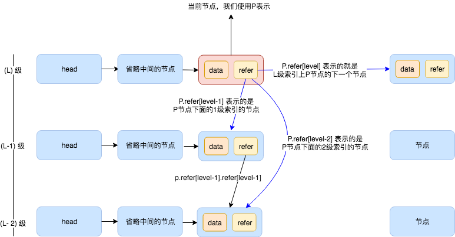
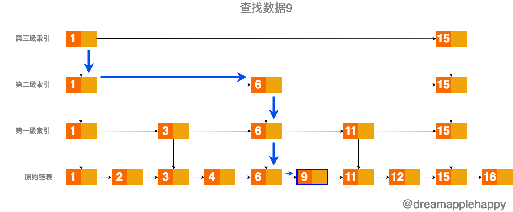
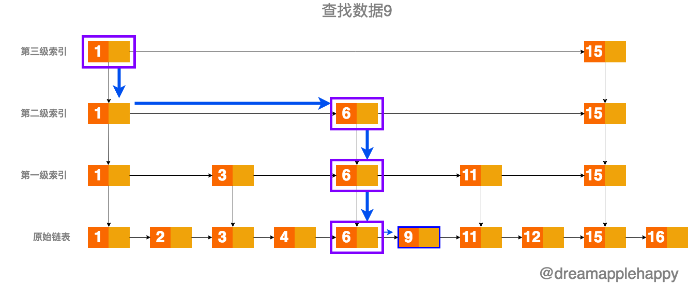
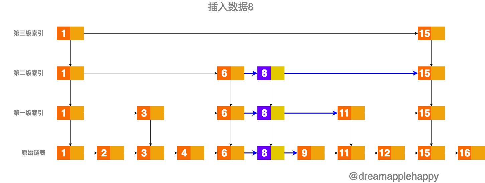
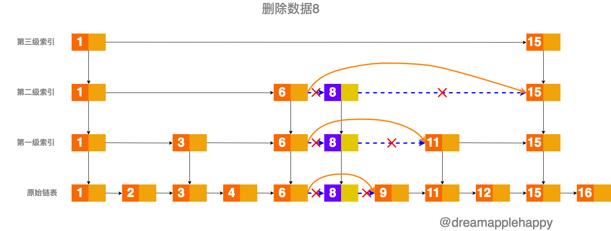

# 使用JavaScript实现SkipList这种数据结构

> 代码的实现参考了[SkipList.java](https://github.com/wangzheng0822/algo/blob/master/java/17_skiplist/SkipList.java)

## 前言
为什么想到使用`JavaScript`把跳表这种数据结构来实现一遍呢？这个主要是因为我女朋友最近在学习数据结构和算法，然后遇到了这个问题；非要拉着我跟她一起
来研究一下，然后，然后就有了下面的文章。这种数据结构在`Redis`中使用的比较多，有兴趣的朋友可以看看。

## SkipList的具体实现

首先我们先粗略的看一下JavaScript版本的代码，具体如下所示：

```javascript
/**
 * author dreamapplehappy
 */

// 代码使用了ES6以及更高版本的JavaScript来表示，需要使用Babel之类的工具处理一下才可以在Node或者浏览器中运行

// 定义了跳表索引的最大级数
const MAX_LEVEL = 16;

/**
 * 定义Node类，用来辅助实现跳表功能
 */
class Node{
  // data属性存放了每个节点的数据
  data = -1;
  // maxLevel属性表明了当前节点处于整个跳表索引的级数
  maxLevel = 0;
  // refer是一个有着MAX_LEVEL大小的数组，refer属性存放着很多个索引
  // 如果用p表示当前节点，用level表示这个节点处于整个跳表索引的级数；那么p[level]表示在level这一层级p节点的下一个节点
  // p[level-n]表示level级下面n级的节点
  refer = new Array(MAX_LEVEL);
}

/**
 * 定义SkipList类
 */
class SkipList{
  // levelCount属性表示了当前跳表索引的总共级数
  levelCount = 1;
  // head属性是一个Node类的实例，指向整个链表的开始
  head = new Node();

  // 在跳里面插入数据的时候，随机生成索引的级数
  static randomLevel() {
	let level = 1;
	for(let i = 1; i < MAX_LEVEL; i++) {
	  if(Math.random() < 0.5) {
		level++;
	  }
	}
	return level;
  }

  /**
   * 向跳表里面插入数据
   * @param value
   */
  insert(value) {
	const level = SkipList.randomLevel();
	const newNode = new Node();
	newNode.data = value;
	newNode.maxLevel = level;
	const update = new Array(level).fill(new Node());
	let p = this.head;
	for(let i = level - 1; i >= 0; i--) {
	  while(p.refer[i] !== undefined && p.refer[i].data < value) {
		p = p.refer[i];
	  }
	  update[i] = p;
	}
	for(let i = 0; i < level; i++) {
	  newNode.refer[i] = update[i].refer[i];
	  update[i].refer[i] = newNode;
	}
	if(this.levelCount < level) {
	  this.levelCount = level;
	}
  }

  /**
   * 查找跳表里面的某个数据节点，并返回
   * @param value
   * @returns {*}
   */
  find(value) {
	if(!value){return null}
	let p = this.head;
	for(let i = this.levelCount - 1; i >= 0; i--) {
	  while(p.refer[i] !== undefined && p.refer[i].data < value) {
		p = p.refer[i];
		// 标记1，此处用于文章的说明
	  }
	}

	if(p.refer[0] !== undefined && p.refer[0].data === value) {
	  return p.refer[0];
	}
	return null;
  }

  /**
   * 移除跳表里面的某个数据节点
   * @param value
   * @returns {*}
   */
  remove(value) {
	let _node;
	let p = this.head;
	const update = new Array(new Node());
	for(let i = this.levelCount - 1; i >= 0; i--) {
	  while(p.refer[i] !== undefined && p.refer[i].data < value){
		p = p.refer[i];
	  }
	  update[i] = p;
	}

	if(p.refer[0] !== undefined && p.refer[0].data === value) {
	  _node = p.refer[0];
	  for(let i = 0; i <= this.levelCount - 1; i++) {
		if(update[i].refer[i] !== undefined && update[i].refer[i].data === value) {
		  update[i].refer[i] = update[i].refer[i].refer[i];
		}
	  }
	  return _node;
	}
	return null;
  }

  // 打印跳表里面的所有数据
  printAll() {
	let p = this.head;
	while(p.refer[0] !== undefined) {
	  // console.log(p.refer[0].data)
	  p = p.refer[0];
	}
  }
}
```
如果你看完上面的代码，感觉还是没有太明白；也不要着急，下面我会仔细的讲解一下上面代码的思路

首先，我们定义了一个`Node`类；这个类生成的实例有三个属性，分别是`data`，`maxLevel`和`refer`；
具体的解释可以看代码里面的注释；这里要注意的是`refer`这个属性，它是一个长度为`MAX_LEVEL`的数组，
数组里面的值是一个指向别的节点的索引。可以大概看下面这张图来加深一下理解：



不知道上面的图大家有没有看得更明白一点，如果没有的话，也没有关系；我们先继续往下面走。

接下来，我们又定义了一个SkipList类，这个类就是我们要实现的跳表类；SkipList的实例属性有`levelCount`和`head`
关于这两个属性的解释可以看代码里面的注释；

我们先来看一下`randomLevel`这个类的静态方法，这个方法用来生成一个不大于`MAX_LEVEL`的值；这个值
可以在我们向SkipList添加元素的时候，生成一个随机的索引级数；**这个随机函数这样设计的原因是为了保证
我们在向SkipList添加元素的时候，每一级索引节点的数量大概能够是上一级索引节点的2倍。**

我们首先来看一下SkipList的`find`方法，如果这个方法你能够理解的话，那么SkipList的`remove`和`insert`
方法你都能够快速的理解；我们来试一试吧。

首先我们把整个链表的头指针赋值给`p`(这里你可能会有疑问，为什么`this.head`就是整个链表的头指针；这个我们会在后面
讲解`insert`方法的时候再给大家讲解一下)。然后是两层循环，外层是一个`for`循环，里面是一个`while`循环；
我们这个时候就可以看下面这张图了：



首先我们需要知道的是，`for`循环是从SkipList的顶层索引开始循环，方向是从上到下的；`while`循环则是从某一层的索引开始，
然后从左到右循环；当然我们说的从上到下和从左到右，都是对照我们上面的那张图来进行说明的。

假设我们的SkipList是上面的那张图表示的那样，我们现在需要查找数值9；我们应该怎么做呢？看一下我们上面的代码。

我们首先从顶层开始遍历，看上面的图我们知道这个时候SkipList的`levelCount`应该是`4`，因为我们是从`0`开始计算索引的级数(**第0级索引也就是我们的原始链表**)，
所以最顶层的索引的级数应该是`levelCount - 1`也就是`3`，然后我们就进入了一个`while`循环，这个`while`循环的终止条件是：
**当前节点在本层级的下一个节点(我们用`p1`表示)不为空(undefined)，并且`p1`的`data`值要小于我们所找的数值**。

我们用`l`表示当前索引的级数，用`p`表示当前遍历到的节点(或者可以理解为一个指针)，
那么当`l=3`的时候，第一次`while`循环，`p.refer[3]`表示的是第三级索引的`Node(1)`，因为满足`while`的循环条件，
我们又进行一次操作，`p = p.refer[i]`，这表明我们此时遍历到了`Node(1)`，或者说是当前的指针指向了`Node(1)`；
然后我们准备进行下一次循环，但是`p.refer[i] !== undefined && p.refer[i].data < value`这个表达式的值不为真；
因为此时`p`表示的是`Node(1)`，`p.refer[i]`表示的是`Node(15)`，因为`p.refer[i].data`大于`9`，所以内部的`while`循环终止。

此时外层的`for`循环让`i`变为了`2`，然后`p.refer[i]`表示的是第二级索引上面的`Node(1)`，满足`while`循环，然后继续进行，
这里就不在继续描述程序的运行了，我们可以知道，当`p`表示的是第0级索引的`Node(6)`的时候，所有的循环都已经结束。

然后我们还需要进行一次判断，那就是我们当前位置的下一个节点是不是我们需要找的值(为什么还需要判断？因为我们循环的条件是当前节点
的下一个节点的`data`值要小于我们查找的`value`，如果循环结束，那说明当前节点的下一个节点的值大于或者等于`value`值，所以还需要进行以此判断)。
如果是的话，就返回`p.refer[i]`，如果不是就返回一个`null`。

我们可以用下面这个表格来表示上面的描述，表格表示的是代码中`find`函数里面注释的**标记1**，这个表格的表示应该更直观一些吧。

| 运行次数 | 当前P指向的节点 | 索引的级数 | 数据的层数 | 运行的循环 |
|:----:|:----:|:----:|:----:| :----: |
| 0 | head | 3 | 4 | - |
| 1 | node(1) | 3 | 4 | [for, while]|
| 2 | node(1) | 2 | 3 | [for, while] |
| 3 | node(6) | 2 | 3 | [while] |
| 4 | node(6) | 1 | 2 | [for, while] |
| 5 | node(6) | 0 | 1 | [for, while] |

如果上面的描述你都理解的话，那么**SkipList**的`insert`和`remove`方法你应该很快就明白了；
这两个方法我们就不再像上面那样详细的讲解了；我们会大概的说明一下实现的原理。

关于`insert`方法，在插入一个数据的时候，我们首先生成一个随机的`level`值，用来表示这个数据索引的级数；
然后我们生成一个新的节点`newNode`，接下来我们创建一个`update`数组，这个数组的长度是`level`；
里面存放的是一些节点。



接下来就是熟悉的两层循环，通过上面的那个表格我们可以看到，`update`数组里面保存的就是
每次`while`循环终止的那个节点，就是上面图片3中紫色线框框起来的节点；然后我们又运行了一个`for`循环，
接下来的代码很有技巧，我们把新的节点的`refer[i]`(**i**表示的是**索引的级数**)指向下一个节点，然后把`update[i]`节点的`refer[i]`指向新的节点
当循环完成的时候，我们就把这个数据插入到了原来的**SkipList**当中。更清晰直观的过程可以看下面的图片。



然后，我们还需要看一下当前的`level`是否大于**SkipList**的最大级数也就是`levelCount`，如果大于当前的`levelCount`，
我们还需要更新**SkipList**的`levelCount`。

关于`remove`方法，这个方法其实和`remove`方法很相似了；不同点在于，我们首先需要找到要删除的元素；
如果这个元素在**SkipList**中不存在的话，我们不能够进行删除的操作；
只有这个元素在**SkipList**中存在的话，我们才能够进行删除操作；
所谓的删除也就是把`P(pre)`的索引指向`P(next)`
(其中`P(pre)`表示位于同一级别索引的`P`节点的上一个节点，`P(next)`表示位于同一级别索引的`P`节点的下一个节点)，
这样我们就把这个节点删除掉了；下面的图形象地表示了这一个过程。



最后说一下`printAll`方法，这个方法就是打印出我们在**SkipList**存储的所有数据；因为第0级索引存放的就是
我们的原始数据。到这里为止，关于代码部分我们已经讲解完毕了。

## 测试**SkipList**相关操作的效率

接下来我们来测试一下**SkipList**相关操作的效率，具体的代码可以看这个文件，我们直接把测试的结果用下面的表格来进行表示：

浏览器环境下：

| 操作数据的样本数量 | 查找操作 | 插入操作 | 删除操作 |
| :---: | :---: | :---: | :---: |
| 100 | 0.08203125ms | 0.016845703125ms | 0.155029296875ms |
| 1000 | 0.10302734375ms | 0.027099609375ms | 0.19189453125ms |
| 10000 | 0.123046875ms | 0.06396484375ms | 0.203857421875ms |
| 100000 | 0.19189453125ms | 3.96923828125ms | 0.481689453125ms |

Node环境下：

| 操作数据的样本数量 | 查找操作 | 插入操作 | 删除操作 |
| :---: | :---: | :---: | :---: |
| 100 | 0.097ms | 0.018ms | 0.087ms |
| 1000 | 0.150ms | 0.019ms | 0.095ms |
| 10000 | 0.125ms | 0.099ms | 0.095ms |
| 100000 | 0.195ms | 1.342ms | 0.172ms |

*如果大家要进行测试的话，要注意一点；当操作的数据样本数量为100000的时候，因为生成SkipList需要比较长的时间，所以可能要稍稍等一下。*

通过上面的表格我们可以看到，使用**SKipList**的效率是很高的。到这里整篇文章也就算结束啦，文章中可能会有不严谨的地方，也欢迎大家指出来，我们一起共同进步。

如果你有什么想说的，可以在[这里](https://github.com/dreamapplehappy/blog/issues/1)发表评论.
