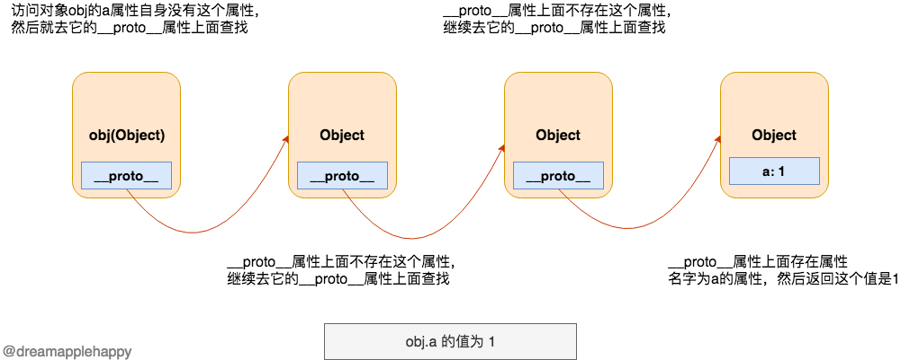
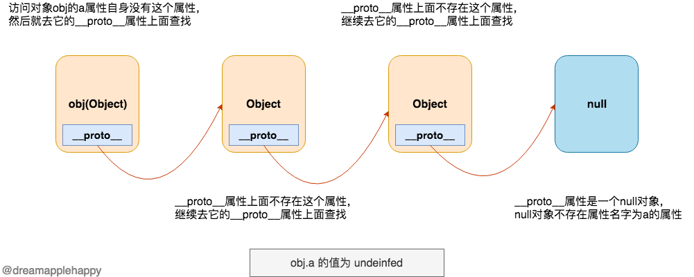
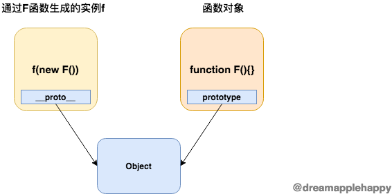
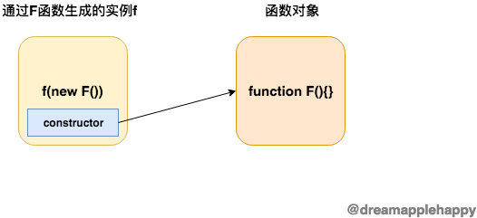

## JavaScript原型与继承的秘密

作者：[dreamapplehappy](https://github.com/dreamapplehappy)

日期: 2018-12-30

标签: `JavaScript`


> 我们最想夸耀的事物，就是我们所未拥有的事物
《罗生门》- 芥川龙之介

JavaScript的原型与继承是每一个学习JavaScript的同学都会面对的一个问题，也是很对面试的必考题目；
但是经常会有一些同学对此一知半解，或者是浅尝辄止；这是因为很多讲解原型与继承的文章写的不是那么通俗易懂，
而本文的目的就是一次性的帮助大家把这一系列的知识点梳理清楚；希望我这次能够做一个好的投球手。

首先我们需要知道的是，JavaScript是一种动态语言，本质上说它是没有`Class`(类)的；但是它也需要一种继承的方式，
那就是原型继承；JavaScript对象的一些属性和方法都是继承自别的对象。

很多同学对JavaScript的原型和继承不是很理解，一个重要的原因就是大家没有理解`__proto__`和`prototype`这两个属性的意思。
接下来我们先来好好梳理一下这两个属性，看看它们存在哪里，代表了什么意义，又有什么作用；

首先来说一下`__proto__`这个属性吧，我们需要知道的是，除了`null`和`undefined`，JavaScript中的所有数据类型都有这个属性；
它表示的意义是：当我们访问一个对象的某个属性的时候，如果这个对象自身不存在这个属性，
那么就从这个对象的`__proto__`(*为了方便下面描述，这里暂且把这个属性称作`p0`*)属性上面
继续查找这个属性，如果`p0`上面还存在`__proto__`(p1)属性的话，那么就会继续在`p1`上面查找响应的属性，
直到查找到这个属性，或者没有`__proto__`属性为止。我们可以用下面这两幅图来表示：



上面这幅图表示在`obj`的`原型链`上面找到了属性名字是`a`的值



上面这幅图表示在`obj`的`原型链`上面没有找到属性名字是`a`的值

**我们把一个对象的`__proto__`属性所指向的对象，叫做这个对象的`原型`；我们可以修改一个对象的`原型`来让这个对象拥有某种属性，或者某个方法。**
```javascript
// 修改一个Number类型的值的原型
const num = 1;
num.__proto__.name = "My name is 1";
console.log(num.name); // My name is 1

// 修改一个对象的原型
const obj = {};
obj.__proto__.name = "dreamapple";
console.log(obj.name); // dreamapple
```

**这里需要特别注意的是，`__proto__`这个属性虽然被大多数的浏览器支持，但是其实它仅在`ECMAScript 2015 规范`中被准确的定义，
目的是为了给这个传统的功能定制一个标准，以确保浏览器之间的兼容性。**通过使用`__proto__`属性来修改一个对象的**原型**是非常慢且影响性能的一种操作。
**所以，现在如果我们想要获取一个对象的原型，推荐使用`Object.getPrototypeOf`
或者`Reflect.getPrototypeOf`，设置一个对象的原型推荐使用`Object.setPrototypeOf`或者是`Reflect.setPrototypeOf`。**

到这里为止，我们来对`__proto__`属性做一个总结：
+ **存在哪里？** 除了`null`和`undefined`所有其他的JavaScript对象或者原始类型都有这个属性
+ **代表了什么？** 表示了一个对象的**原型**
+ **有什么作用？** 可以获取和修改一个对象的**原型**

说完`__proto__`属性，接下来我们就要好好的来理解一下`prototype`属性了；首先我们需要记住的是，这个属性一般只存在于**函数对象**上面；
只要是能够作为**构造器**的函数，他们都包含这个属性。也就是说，只要这个函数能够通过使用`new`操作符来生成一个新的对象，
那么这个函数肯定具有`prototype`属性；因为我们自定义的函数都可以通过`new`操作符生成一个对象，所以我们自定义的函数都有`prototype`
这个属性。

```javascript
// 函数字面量
console.log((function(){}).prototype); // {constructor: ƒ}

// Date构造器
console.log(Date.prototype); // {constructor: ƒ, toString: ƒ, toDateString: ƒ, toTimeString: ƒ, toISOString: ƒ, …}

// Math.abs 不是构造器，不能通过new操作符生成一个新的对象，所以不含有prototype属性
console.log(Math.abs.prototype); // undefined
```

那这个`prototype`属性有什么作用呢？这个`prototype`属性的作用就是：**函数通过使用`new`操作符生成的一个对象，
这个对象的原型(也就是`__proto__`)指向该函数的`prototype`属性。** 那么一个比较简洁的表示`__proto__`和`prototype`
属性之间关系的等式也就出来了，如下所示：

```javascript
// 其中F表示一个自定义的函数或者是含有prototype属性的内置函数
new F().__proto__ === F.prototype // true
```

我们可以使用下面这张图来更加形象的表示上面这种关系：



看到上面等式，我想大家对于`__proto__`和`prototype`之间关系的理解应该会更深一层了。

好，接下来我们对`prototype`属性也做一个总结：
+ **存在哪里？** 自定义的函数，或者能够通过`new`操作符生成一个对象的内置函数
+ **代表了什么？** 它表示了某个函数通过`new`操作符生成的对象的原型
+ **有什么作用？** 可以让一个函数通过`new`操作符生成的许多对象共享一些方法和属性

其实到这里为止，关于JavaScript的原型和继承已经讲得差不多了；下面的内容是一些基于上面的一些拓展，
可以让你更好地理解我们上面所说的。

当我们理解了上面的知识点之后，我们就可以对下面的表达式做一个判断了：
```javascript
// 因为Object是一个函数，函数的构造器都是Function
Object.__proto__ === Function.prototype // true

// 通过函数字面量定义的函数的__proto__属性都指向Function.prototype
(function(){}).__proto__ === Function.prototype // true

// 通过对象字面量定义的对象的__proto__属性都是指向Object.prototype
({}).__proto__ === Object.prototype // true

// Object函数的原型的__proto__属性指向null
Object.prototype.__proto__ === null // true

// 因为Function本身也是一个函数，所以Function函数的__proto__属性指向它自身的prototype
Function.__proto__ === Function.prototype // true

// 因为Function的prototype是一个对象，所以Function.prototype的__proto__属性指向Object.prototype
Function.prototype.__proto__ === Object.prototype // true
```

如果你能够把上面的表达式都梳理清楚的话，那么说明你对这部分知识掌握的还是不错的；

谈及JavaScript的原型和继承，那么我们还需要知道另一个概念；那就是`constructor`，那什么是`constructor`呢？
`constructor`表示一个对象的构造函数，除了`null`和`undefined`以外，JavaScript中的所有数据类型都有这个属性；
我们可以通过下面的代码来验证一下：
```javascript
null.constructor // Uncaught TypeError: Cannot read property 'constructor' of null ...
undefined.constructor // Uncaught TypeError: Cannot read property 'constructor' of undefined ...

(true).constructor // ƒ Boolean() { [native code] }
(1).constructor // ƒ Number() { [native code] }
"hello".constructor // ƒ String() { [native code] }
```

我们还可以使用下面的图来更加具体的表现：



但是其实上面这张图的表示并不算准确，因为一个对象的`constructor`属性确切地说并不是存在这个对象上面的；
而是存在这个对象的**原型**上面的(*如果是多级继承需要手动修改原型的`constructor`属性，见文章末尾的代码*)，我们可以使用下面的代码来解释一下：
```javascript
const F = function() {};
// 当我们定义一个函数的时候，这个函数的prototype属性上面的constructor属性指向自己本身
F.prototype.constructor === F; // true
```

下面的图片形象的展示了上面的代码所表示的内容：


关于`constructor`还有一些需要注意的问题，对与JavaScript的[原始类型](https://developer.mozilla.org/en-US/docs/Glossary/Primitive)来说，它们的`constructor`属性是只读的，不可以修改。
我们可以通过下面的代码来验证一下：
```javascript
(1).constructor = "something";
console.log((1).constructor); // 输出 ƒ Number() { [native code] }
```

当然，如果你真的想更改这些原始类型的`constructor`属性的话，也不是不可以，你可以通过下面的方式来进行修改：
```javascript
Number.prototype.constructor = "number constructor";
(1).constructor = 1;
console.log((1).constructor); // 输出 number constructor
```
当然上面的方式我们是不推荐你在真实的开发中去使用的，如果你想要了解更多关于`constructor`的内容，可以看看[Object.prototype.constructor
](https://developer.mozilla.org/en-US/docs/Web/JavaScript/Reference/Global_Objects/Object/constructor)。

接下来，我会使用一些代码来把今天讲解的知识再大致的回顾一下：
```javascript
function Animal(name) {
  this.name = name;
}

Animal.prototype.setName = function(name) {
  this.name = name;
};
Animal.prototype.getName = function(name) {
  return this.name;
};

function Dog(name, breed) {
  Animal.call(this, name);
  this.breed = breed;
}

Dog.prototype = Object.create(Animal.prototype);

// 因为上面的语句将我们原来的prototype的指向修改了，所以我们要重新定义Dog的prototype属性的constructor属性
Reflect.defineProperty(Dog.prototype, "constructor", {
  value: Dog,
  enumerable: false, // 不可枚举
  writable: true
});

const animal = new Animal("potato");
console.log(animal.__proto__ === Animal.prototype); // true
console.log(animal.constructor === Animal); // true
console.log(animal.name); // potato

const dog = new Dog("potato", "labrador");
console.log(dog.name); // potato
console.log(dog.breed); // labrador
console.log(dog.__proto__ === Dog.prototype); // true
console.log(dog.constructor === Dog); // true
```

这篇文章到这里基本上可以告一段落了，但是其实关于JavaScript的原型与继承还有许多内容，也还有许多可以研究的地方；但是这篇文章到这里就算是结束了。
我后面还会写一些关于JavaScript原型与继承的内容，如果大家有兴趣的话，可以关注一下。点击[这里](https://github.com/dreamapplehappy/blog/issues/3)可以发表留言。

版权声明：[](http://creativecommons.org/licenses/by-nc-nd/3.0/) [共享-保持署名-非商业性使用-禁止演绎](http://creativecommons.org/licenses/by-nc-nd/3.0/)