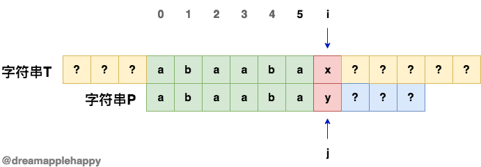
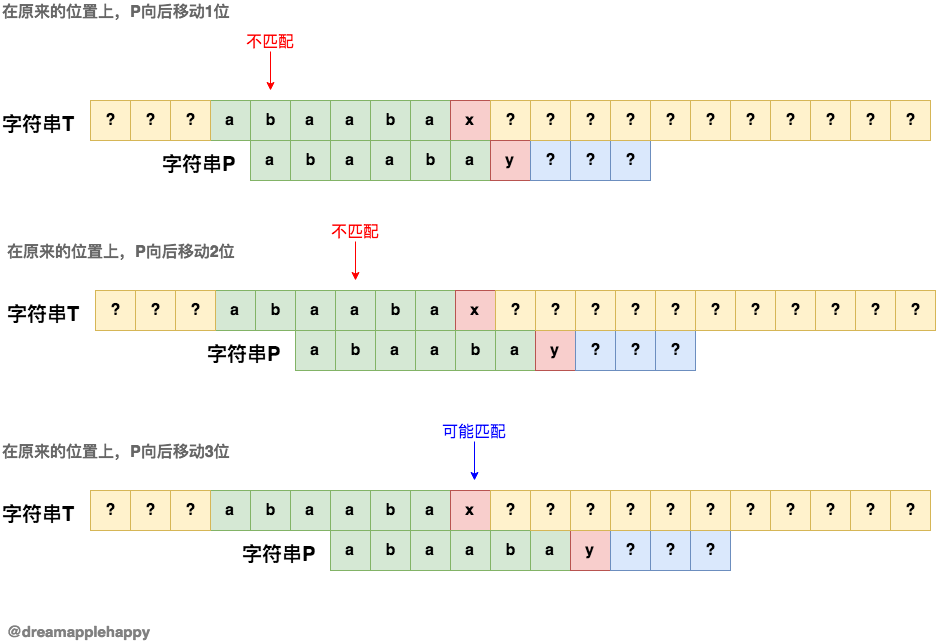
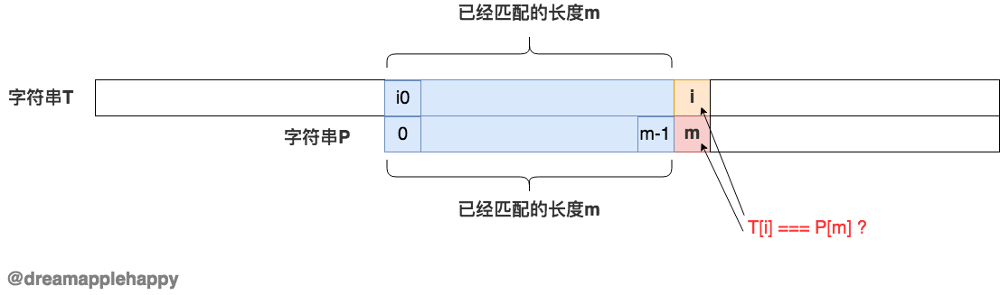
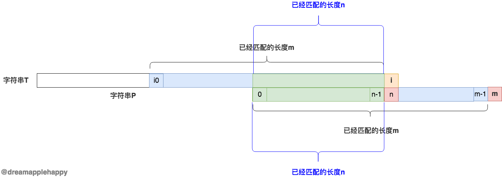

## 通俗易懂的讲解字符串匹配的**KMP**算法

作者: [**dreamapplehappy**](https://github.com/dreamapplehappy)

日期: **2019-03-23**


---

前言：其实关于这篇文章早就应该写完的，但是由于自己的拖延症，一直迟迟没有没有下笔；由于工作上一直也挺忙的，博客也好久没有更新了。最近刚好有时间就赶紧把
这篇文章完成了，不然估计又要拖好久。

关于**KMP**算法的讲解，网上其实已经有很多资料了；但是我觉得很多讲的都不是那么通俗易懂，让大家看起来很费劲；我试图用最方便大家理解的方式，来给大家讲解一下
这个算法的原理。

让我们直接进入主题，字符串的检索匹配应该是我们开发的过程中经常遇到的问题了。假如现在有这么一个需求：
```
有两个字符串T和P；需要我们从T中找出与P字符串匹配的下标的位置
```

当然，如果不考虑效率的话，我们会很快的写出下面的代码：
```javascript
// JavaScript 版本代码
function searchPatternIndex(T, P) {
  // 计算T和P的长度
  const tLen = T.length;
  const pLen = P.length;

  // 要查找的位置，默认是0
  let i0 = 0;

  // T和P字符串查找比对的位置
  let i = 0;
  let j = 0;

  while (i < tLen) {
    // T和P当前位置的字符相等
    if (T[i] === P[j]) {
      i++;
      j++;
      // 找到P的位置
      if (j === pLen) {
        return i0;
      }
    } else {
      // 如果不相等的话，i0的位置向后移动一位
      i0++;
      // 从新的位置开始对比
      i = i0;
      // 再次从P字符串的开始进行比对
      j = 0;
    }
  }
  // 没有找到的话返回-1
  return -1;
}

// 测试代码
console.log(searchPatternIndex("jkajsdiuuqiwenasdjhababanbajhsdyqbhjabduagd", "ababa")); // 19
```

上面的代码虽然能够达到我们的目的，但是在字符串T和P的长度比较大的情况下，上面的代码的效率就很低。那么我们应该如何改进上面的算法呢？

我们不妨这样想一下，假设在我们发现`T[i]`和`P[j]`不相同的时候，我们已经有`k0`个相同的字符了；就如下图这样：



我们知道`T[i]`和`P[j]`不相同也就是上图中的`x`和`y`不相同，但是我们还不知道`x`和`y`表示的具体的值；这个时候我们可不可以将
字符串`P`向后移动多个位置，但是还是可以确保我们没有漏掉相应的匹配呢？我们可以尝试将`P`向后一位一位的移动，然后在分析比较；我把这个过程
用下图表示：



由上图我们可知，当将`P`向后移动3位的时候，T和P才有可能在当前位置匹配；也就是说，如果我们在刚开始遇到不匹配的`x`和`y`的时候，
我们可以直接将`P`向后移动**3**个位置，并且保证没有漏掉相应的匹配位置。

上面的**3**是我们自己靠实践得出来的数字，我们不可能每进行一次比较，都这样操作；我们需要找出其中的规律，然后把这个规律用代码表示出来。
**KMP**算法的核心就是找出这个值来。我们接下来就来讲解如何通过编程来获取这个值。

首先我们需要知道的是，已经匹配的字符串的长度是不固定的；它的**下标**取值范围是[0, pLen-2]，其中`pLen`表示`P`的长度；
我们可以根据`P`提前计算出不同匹配长度情况下我们需要向后移动的数值。

这里用到了一些数学的知识，当然也不是特别复杂；首先我们把这个结果放在一个数组中，数组的名字为`f`；我们知道当匹配的长度
是`1`，也就是匹配的下标是`0`的时候，我们不能够向后进行移动，所以`f[0] = 0`；然后我们可以根据这个值，然后再找出
`f[k-1]`与`f[k]`的关系，我们不就可以计算出所有位置可以向后移动的值了。

我们先找出`f[k-1]`与`f[k]`的关系，我们假设`f[k-1]`的值是`m`，然后看看可不可以找出`f[k]`的值；看下图的描述：



如上图所示，在这时候，如果`T[i]`与`P[m]`相等的话，那么`f[k]`
的值就是`m+1`了。这个好理解，但是如果`T[i]`与`P[j]`不相同的话，我们应该如何处理呢？
**这个时候就需要我们找出在已经匹配字符串的长度中，需要向后移动的的值。**

如下图所示：



我们假设在已经匹配的字符串`m`中，它需要向后移动的数值是`n`，那么`f[m-1]`的值就是`n`，
然后我们再次比较`T[i]`与`P[n]`是否相等，如果相等的话`f[k]`的值就是`f[m-1] + 1`
也就是`f[k] = f[m-1] + 1`；如果不相等的话，继续上面的步骤，直到`m-1`的值小于`0`就结束了。

到现在为止，我们已经找到了`f[k]`与`f[k-1]`的关系，也知道了`f[0] = 0`；接下来就是把我们上面的推导过程用函数来表示。

求不同匹配长度情况下向后移动位数的函数如下所示：

```javascript
function computeMoveSteps(P) {
  // 计算P的长度
  const pLen = P.length;
  // 不同匹配长度下需要移动的值
  const f = [];
  // 初始值f[0] = 0
  f[0] = 0;

  // 当前位置下已经匹配的字符串的最后一个字符的下标
  let k0;
  // 当前位置下，如果后面的字符不匹配；已经匹配的字符串需要向后移动的值
  let kLen;

  for (let k = 1; k < pLen; k++) {
    // 获取最后一个字符的下标
    k0 = k - 1;
    kLen = f[k0];

    while (P[k] !== P[kLen]) {
      // k0是匹配长度是kLen情况下的最后一个字符的下标
      k0 = kLen - 1;
      // 终止条件
      if (k0 < 0) {
        break;
      }
      // 获取匹配长度是kLen情况下可以移动的数值
      kLen = f[k0];
    }

    // 如果k0小于0 说明在一直没有找到匹配
    if (k0 < 0) {
      f[k] = 0;
    } else {
      // 说明在已经匹配了k0长度的情况下 找到了匹配
      f[k] = f[k0] + 1;
    }
  }

  return f;
}

// 测试
console.log(computeMoveSteps("abababa")); // [ 0, 0, 1, 2, 3, 4, 5 ]
```

上面代码中的注释，也也把需要大家理解的东西都进行了说明；这样一来，我们整个**KMP**算法已经呼之欲出了；
下面的代码就是完整的**KMP**算法了。

```javascript
function findPatternIndex(T, P) {
  // 计算T和P的长度
  const tLen = T.length;
  const pLen = P.length;
  // 不同匹配长度下可以向后移动的位数数组
  const f = computeMoveSteps(P); // computeMoveSteps函数上面已经有了
  // T中匹配P的位置
  let index = 0;
  // 用i和j分别表示T和P要比较的字符的下标，初始值都为0
  let i = 0;
  let j = 0;
  // P可以向后移动的位置
  let step;

  while(i < tLen) {
    // 如果T[i]和P[j]的值相等，那么i和j都各自加1
	if(T[i] === P[j]) {
	  i++;
	  j++;
	  // 如果j的值等于pLen那就说明已经找到了
	  if(j === pLen) {
	    return index;
	  }
	} else {
	  // 如果j等于0 那么说明刚开始就不匹配
	  if(j === 0) {
	    // index的值加1
	    index++;
	    // 重新初始化i和j的值
	    i = index;
	    j = 0;
	  } else {
	    // 这个时候我们有可能直接将j向后移动几个位置
		step = f[j-1];
		j = step;
		index = i - step;
	  }
	}
  }

  // 如果中途没有返回值，那么就是没有找到，返回-1
  return -1;
}

// 测试
console.log(findPatternIndex("njhjhasuduadhjababajkjasduiuiqwehjnb", "ababa")); // 14
```

完整版的代码在[这里](kmp.js)

点击[这里](https://github.com/dreamapplehappy/blog/issues/4)可以发表留言。如果本文对你有帮助，可以赞赏一下：


版权声明：[](http://creativecommons.org/licenses/by-nc-nd/3.0/) [共享-保持署名-非商业性使用-禁止演绎](http://creativecommons.org/licenses/by-nc-nd/3.0/)


