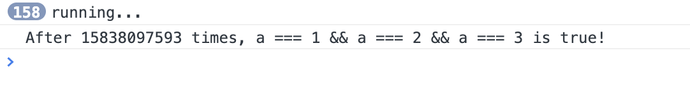
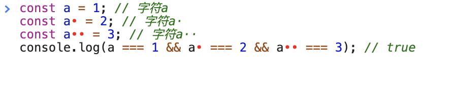

# (a == 1 && a == 2 && a == 3)为true，你所不知道的那些答案

看到这个标题，一部分同学的第一反应可能是，又是这个老套的问题，人家都讲过好多遍了你还讲。同学，你想错啦。我可不是在炒冷饭。今天我们要从这个问题，延伸出更多的知识，保证超出你的预期。让我们开始吧。

我记得我第一次看到这个题目的时候，感觉很吃惊，也很好奇；wow，还可以这样吗？这激起了我很大的兴趣去了解这个问题。我就迫不及待的想着怎么解决这个问题。后来使用了隐式转换这个比较常用的方法算是达到了题目的要求。当然，解题的方法还有很多，让我们一起来探索一下吧。

### 解题的基本思路
> 副作用 side effect 

当我们看到`a == 1 && a == 2 && a == 3`的时候，我们首先要明白以下几点

+ 这个表达式中含有`&&`，当`&&`左边的表达式的值为`false`的时候，那么`&&`右边的表达式就不再计算了。
+ `a == 1`在这个比较的过程，首先需要获取`a`的值，这涉及到对`a`的读取。如果`a`的类型不是一个数字类型的值，这又会涉及到数据的类型转换相关的知识。
+ 这个表达式是从左到右进行运算的，所以我们可以在`a == 1`计算之后对`a`的值进行更新，使`a == 2`能够继续成立

#### 使用一个对象，进行隐式类型转换
```javascript
const a = (function() {
    let i = 1;
    return {
        valueOf: function() {
            return i++;
        }
    }
})();

console.log(a == 1 && a == 2 && a == 3); // true
```
上面这种解决方案应该是最容易想到的方案了，我们通过一个立即执行的函数，返回一个对象。这个对象的`valueOf`方法的返回值是`i++`，也就是说在返回i值之前，会将`i`的值增加`1`，然后返回之前`i`的值。我们在计算`a == 1 && a == 2 && a == 3`的过程中其实进行的步骤是这样的。

+ 计算`a == 1`的值，在比较的过程中对象`a`会转换为数字`1`，然后和`==`右边的数值进行比较，结果为`true`。此时`i`的值为`2`。
+ 计算`a == 2`的值，在比较的过程中对象`a`会转换为数字`2`，然后和`==`右边的数值进行比较，结果为`true`。此时`i`的值为`3`。
+ 计算`a == 3`的值，在比较的过程中对象`a`会转换为数字`3`，然后和`==`右边的数值进行比较，结果为`true`。此时`i`的值为`4`。
+ `true && true && true`表达式的结果为`true`，所以输出结果为`true`。
大家如果对对象的隐式类型转换不是很熟悉的话，可以参考我之前写的一篇文章[深入理解JS对象隐式类型转换的过程](https://github.com/dreamapplehappy/blog/tree/master/2020/05/24)。

#### 定义一个全局的属性
```javascript
let i = 1;

Reflect.defineProperty(this, 'a', {
    get() {
        return i++;
    }
});

console.log(a === 1 && a === 2 && a === 3);
```
我们还可以通过`Reflect.defineProperty`定义一个全局的属性`a`，当属性`a`被访问的时候就会调用上面定义的`getter`方法，所以和上面对象的隐式类型转换过程是一样的。每次比较之后，`i`的值会增加`1`。这个方案的好处是，我们可以使用`===`而不是`==`，因为不需要进行类型转换，直接返回的就是相应的数字值。

#### 在比较过程中修改获取属性的方法
```javascript
Reflect.defineProperty(this, 'a', {
    configurable: true,
   get() {
      Reflect.defineProperty(this, 'a', {
            configurable: true,
         get() {
            Reflect.defineProperty(this, 'a', {
               get() {
                  return 3;
               },
            });
            return 2;
         },
      });
      return 1;
   },
});

console.log(a === 1 && a === 2 && a === 3);
```
上面这个方法，在每次获取属性`a`值的时候，都会设置它下一次读取的值。因为属性的`descriptor`默认的`configurable`是`false`。所以我们需要在前两次将其设置为`true`以便我们接下来能够对其进行修改。这个方法不经可以让我们使用`===`，而且我们其实还可以改变比较的顺序。比如`a === 1 && a === 3 && a === 2`，只需要在对应的位置修改为相应的值就可以了。这个方法在目前来说是比较好的一种方案。

#### 其它类似的方案
```javascript
const a = {
   reg: /\d/g,
   valueOf: function() {
      return this.reg.exec(123)[0];
   },
};

console.log(a == 1 && a == 2 && a == 3);
```
上面也使用了对象的隐式类型转换，只不过`valueOf`函数的返回值是通过执行正则表达式的`exec`方法后的返回值。需要注意的是正则表达式`/\d/g`需要带有`g`修饰符，这样正则表达式可以记住上次匹配的位置。还有需要注意的是，正则表达式匹配的结果是一个数组或者`null`。在上述的情境中，我们需要获取匹配结果数组的第一个值。当然上面的方法也可以更改比较的顺序。

```javascript
const a = [1, 2, 3];
a.join = a.shift;
console.log(a == 1 && a == 2 && a == 3);
```
这个方法也比较巧妙，而且代码量最少。数组`a`在比较的过程中涉及对象的隐式类型转换，会调用`a`的`toString`方法，而`toString`方法会在内部调用它自己的`join`方法，所以也能够让上面的表达式的值为`true`。

上面的这些方法我们可以把它们都归类为**副作用**，因为它们大都利用了**相等比较的副作用**或者**读取属性的副作用**。我们在平时的开发中要尽量避免这样的操作。

### 硬核方法，竞态条件
虽然上面说了这么多，但是其实我真正想要正式介绍给大家的却是另一个方法，那就是`Race Condition`，也就是**竞态条件**。

为什么说这个方法比较硬核呢，是因为它是在底层的内存上修改一个变量的值，而不是通过一些所谓的技巧去让上面的表达式成立。而且这在现实的开发中是可能会出现的一种情况。在进入下面的讲解之前，我们需要先了解一些前置的知识点。

+ `SharedArrayBuffer`

`SharedArrayBuffer`对象用来表示一个通用的，固定长度的原始二进制数据缓冲区，类似于 `ArrayBuffer`对象，它们都可以用来在共享内存上创建视图。与`ArrayBuffer`不同的是`SharedArrayBuffer`不能被分离。详情可以参考[SharedArrayBuffer](https://developer.mozilla.org/en-US/docs/Web/JavaScript/Reference/Global_Objects/SharedArrayBuffer)。

+ `Web Worker`

`Web Worker`为`Web`内容在后台线程中运行脚本提供了一种简单的方法。线程可以执行任务而不干扰用户界面。此外，他们可以使用XMLHttpRequest执行 I/O  (尽管responseXML和channel属性总是为空)。一旦创建， 一个worker 可以将消息发送到创建它的JavaScript代码, 通过将消息发布到该代码指定的事件处理程序（反之亦然）。详情可以参考[使用 Web Workers](https://developer.mozilla.org/zh-CN/docs/Web/API/Web_Workers_API/Using_web_workers)。

了解了前置的知识我们直接看接下来的代码实现吧。
+ index.js
```javascript
// index.js
const worker = new Worker('./worker.js');
const competitors = [
   new Worker('./competitor.js'),
   new Worker('./competitor.js'),
];
const sab = new SharedArrayBuffer(1);
worker.postMessage(sab);
competitors.forEach(w => {
   w.postMessage(sab);
});
```

+ worker.js
```javascript
// worker.js
self.onmessage = ({ data }) => {
   const arr = new Uint8Array(data);
   Reflect.defineProperty(self, 'a', {
      get() {
         return arr[0];
      },
   });
   let count = 0;
   while (!(a === 1 && a === 2 && a === 3)) {
      count++;
      if (count % 1e8 === 0) console.log('running...');
   }
   console.log(`After ${count} times, a === 1 && a === 2 && a === 3 is true!`);
};
```

+ competitor.js
```javascript
// competitor.js
self.onmessage = ({ data }) => {
   const arr = new Uint8Array(data);
   setInterval(() => {
      arr[0] = Math.floor(Math.random() * 3) + 1;
   });
};
```


在开始深入上面的代码之前，你可以在本地运行一下上面的代码，在看到结果之前可能需要等上一小会。或者直接在[这里](https://combinatronics.com/dreamapplehappy/blog/master/demo/20200611/index.html)打开浏览器的控制台看一下运行的结果。需要注意的是，因为`SharedArrayBuffer`现在仅在**Chrome浏览器**中被支持，所以需要我们使用Chrome浏览器来运行这个程序。

运行之后你会在控制台看到类似如下的结果：
```bash
158 running...
After 15838097593 times, a === 1 && a === 2 && a === 3 is true!
```
我们可以看到，运行了`15838097593`次才出现一次相等。不同的电脑运行这个程序所需要的时间是不一样的，就算同一台机器每次运行的结果也是不一样的。在我的电脑上运行的结果如下图所示：


下面我们来深入的讲解一下上面的代码，首先我们在`index.js`中创建了三个`worker`，其中一个`worker`用来进行获取`a`的值，并且一直循环进行比较。直到`a === 1 && a === 2 && a === 3`成立，才退出循环。另外两个`worker`用来制造`Race Condition`，这两个`worker`一直在对同一个地址的数据进行修改。

在`index.js`中，我们使用`SharedArrayBuffer`申请了一个字节大小的一段连续的共享内存。然后我们通过`worker`的`postMessage`方法将这个内存的地址传递给了3个`worker`。

在这里我们需要注意，一般情况下，通过**Worker**的**postMessage**传递的数据要么是可以由**结构化克隆算法处理的值**（这种情况下是值的复制），要么是**Transferable**类型的对象（这种情况下，一个对象的所有权被转移，在发送它的上下文中将变为不可用，并且只有在它被发送到的worker中可用）。更多详细内容可以参考[Worker.postMessage()](https://developer.mozilla.org/zh-CN/docs/Web/API/Worker/postMessage) 。但是如果我们传递的对象是`SharedArrayBuffer`类型的对象，那么这个对象的代表的是一段共享的内存，是可以在**主线程**和接收这个对象的**Worker**中共享的。

在`competitor.js`中，我们获取到了传递过来的`SharedArrayBuffer`对象，因为我们不可以直接操作这段内存，需要在这段内存上创建一个视图，然后才能够对这段内存做处理。我们使用`Uint8Array`创建了一个数组，然后设置了一个定时器一直对数组中的第一个元素进行赋值操作，赋值是随机的，可以是1，2，3中的任何一个值。因为我们有两个**worker**同时在做这个操作，所以就形成了`Race Condition`。

在`worker.js`中，我们同样在传递过来的`SharedArrayBuffer`对象上创建了一个`Uint8Array`的视图。然后在全局定义了一个属性`a`，`a`的值是读取`Uint8Array`数组的第一个元素值。
然后是一个`while`循环，一直在对表达式`a === 1 && a === 2 && a === 3`进行求值，直到这个表达式的值为`true`，就退出循环。

这种方法涉及到的知识点比较多，大家可以在看后自己在实践一下，加深自己的理解。因为我们在实际的开发有可能会遇到这种情况，但是这种情况对于我们的应用程序来说并不是一个好事情，所以我们需要避免这种情况的发生。那么如何避免这种情况的发生呢？我们可以使用`Atomics`对象来进行相应的操作。`Atomics`对象提供了一组静态方法用来对 `SharedArrayBuffer`对象进行原子操作。如果你很有兴趣的话，可以点击[Atomics](https://developer.mozilla.org/zh-CN/docs/Web/JavaScript/Reference/Global_Objects/Atomics)继续深入的探究，在这篇文章中就不再过多的讲解了。

### 解题的其它思路

> 字符编码

```javascript
const a = 1; // 字符a
const a‍ = 2; // 字符a·
const a‍‍ = 3; // 字符a··
console.log(a === 1 && a‍ === 2 && a‍‍ === 3); // true
```
当你看到上面代码的时候，你的第一反应肯定是怀疑我是不是写错了。怎么可以重复使用`const`声明同一个变量呢？我们肯定不能够使用`const`声明同一个变量，所以你看到的`a`其实是不同的`a`，第一个`a`是`ASCII`中的`a`，第二个`a`是在后面添加了一个零宽的字符，第三个`a`是在后面添加了两个零宽的字符。所以其实它们是不一样的变量，那么表达式`a === 1 && a‍ === 2 && a‍‍ === 3`为`true`就没有什么疑问了。

这个方法其实是利用了[零宽字符](https://en.wikipedia.org/wiki/Zero_width)，创建了三个我们肉眼看着一样的变量。但是它们在程序中属于三个变量。如果你把上面的代码复制到Chrome的控制台中，控制台就会给出很显眼的提示，提示的图片如下所示。


如果你把上面的代码复制到**WebStrom**中，后两个变量的背景是黄色的，当你鼠标悬浮在上面的时候，**WebStrom**会给你一些提示，提示你对应的变量使用了不同语言的字符。
```bash
Identifier contains symbols from different languages: [LATIN, INHERITED]
Name contains both ASCII and non-ASCII symbols: a‍
Non-ASCII characters in an identifier
```
我们有时在开发中也会遇到这种情况，肉眼看明明是相等的两个值，比较的结果却是不相等的，这个时候可以考虑一下是不是出现了上面这种情况。


关于让**a == 1 && a == 2 && a == 3为true**，这篇文章涵盖了大部分的解决方法。每一个方法的背后都代表了一些知识点，**我们的目的不是记住这些方法，而是需要了解这些方法背后的知识和原理。这样以后我们遇到了类似的问题才知道如何去解决，才能够做到举一反三。**

这篇文章到这里就结束了，如果大家对这篇文章有什么建议和意见都可以在[这里](https://github.com/dreamapplehappy/blog/issues/6)反馈给我，文章如有更新，会第一时间更新在[我的博客dreamapplehappy/blog](https://github.com/dreamapplehappy/blog)，关注我学习更多实用有趣的前端知识哟~

参考链接：
+ [https://stackoverflow.com/questions/48270127/can-a-1-a-2-a-3-ever-evaluate-to-true](https://stackoverflow.com/questions/48270127/can-a-1-a-2-a-3-ever-evaluate-to-true)
+ [https://developer.mozilla.org/zh-CN/docs/Web/JavaScript/Reference/Global_Objects/SharedArrayBuffer](https://developer.mozilla.org/zh-CN/docs/Web/JavaScript/Reference/Global_Objects/SharedArrayBuffer)
+ [https://developer.mozilla.org/zh-CN/docs/Web/API/Web_Workers_API/Using_web_workers](https://developer.mozilla.org/zh-CN/docs/Web/API/Web_Workers_API/Using_web_workers)

