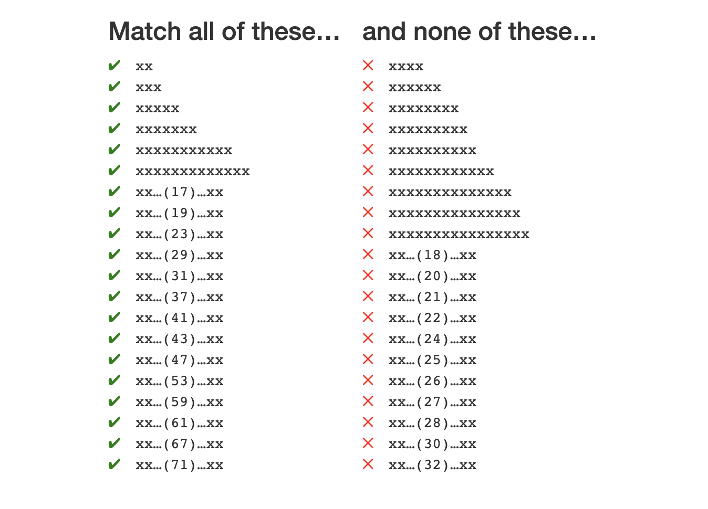

# 正则表达式匹配素数的原理讲解

为什么要写这么一篇文章呢？是因为自己最近在研究和学习正则表达式，然后在**RegexGolf**上练习技能的时候遇到了这么一道题目，觉得很有趣。我当时虽然也解决了这个问题，但是正则表达式写的有点长，而且也只算是一种取巧的解决方案。因为如果测试用例再多一点可能我写的这个正则表达式就不能够满足需求了。

后来在复盘这道题目的解决方案的时候，查阅了很多相关的资料。发现了更简洁，更准确的答案。当我看到答案的那一瞬间，我忽然发现自己当初距离这个答案其实也不远，如果自己当时再好好研究一下，有可能就想出了更简洁的答案了。当然，也许最终还是没有想出来，那里有那么多的如果呢😂。

说了这么多，让我们来看一下这道题目吧。如下图所示：



我们需要匹配左边的这些字符串，同时排除右边的这些字符串。不知道大家之前有没有做过类似的题目，现在大家就可以测试一下自己的正则的水平。个人感觉如果这道题目可以做出来的话，那么你的正则水平至少是中等偏上的水平啦。没有做出来也没有关系，毕竟在平时的开发过程中我们很难会遇到这种需求，不过也可以学习一下。加深一下自己对正则匹配过程的理解。

我当时看了题目的提示，知道是**匹配素数**，但是对于如何匹配一个素数我却是不知道的。于是我就取了个巧，在测试用例不是很多的情况下，可以进行穷举呀。于是我就写下了下面的答案：
```
^(?!(?:(x{2}){2,}|(x{3}){2,}|(x{5}){2,})$)
```
虽然有点长，但是好歹也算是通过了测试用例。

对正则表达式学习的比较深入的一些同学，看到了上面的正则应该很快就知道是什么意思了。我可以先简单的给大家讲解一下。上面的正则表达式匹配的过程是这样的：

+ `^`：匹配一行的开始。
+ `(?!...)`：**否定的顺序环视**，匹配一个位置，后面紧跟着的是需要排除的条件。
+ `(?:)`：**非捕获型括号**，在这里用来限制多选结构的作用范围，当然在这里也可以使用捕获型的括号。
+ `(x{2}){2,}`：首先`{2,}`限定了前面的表达式`(x{2})`出现的次数只能是两次或者两次以上。`(x{2})`表示需要匹配两个`x`。
+ `(x{3}){2,}`和`(x{5}){2,}`：这两个部分跟上面的正则片段是类似的意思。
+ `$`：匹配一行的结尾。

所以上面的正则表达式表示的意思就是**匹配一个字符串的开始，然后紧接着字符串中x的个数不能是2个x的2倍或者以上，不能是3个x的2倍或者以上，不能是5个x的2倍或者以上；直到字符串的结尾**。

接下来，我们针对这个问题深入的研究一下。首先我们需要知道什么是**素数**，素数就是除了1和它本身之外不能够被其他整数整除的数，不包括1。那么我们怎么判断一个数字是不是素数呢？我们假设这个数字是N，然后我们用N去除以2，看一下是否能够整除，不能够整除的话，我们再用N去除以3，如果还不可以就除以4，一直除到N/2（N/2如果不能够整除，需要取整）。**如果都不可以的话，我们就可以判定N是一个素数**。

如果我们可以把上面这个过程使用正则表达式表示出来，那么我们就能够匹配一个素数了。但是想要一下子解决这个问题可能有点难，我们需要按照刚才的思路一步一步来构造我们的正则表达式。首先我们可以转换一下思路，直接匹配一个素数有点难度，我们可以先匹配一个合数，然后排除掉匹配的这个合数就可以了。

首先我们需要匹配能够被2整除的数，按照上面题目的要求的话，我们需要匹配一个字符串，这个字符串中`x`出现的次数需要是偶数次。对于这个问题，我们很容易想到这样一个表达式`/(xx)+/`；如果需要匹配能够被3整除的数的话，按照上面题目的要求，我们很容易想到正则表达式`/(xxx)+/`，于是到这里你可能会觉得我好像知道了匹配能够被大于等于2整除的数的答案，那就是`/(xx+)+/`。你可以自己试一下这个正则表达式，结果并不是你所想的那样。

为什么呢？因为正则表达式`/(xx+)+/`的意思是，`(xx+)`可以出现至少一次，但是`(xx+)`可能是2个`x`，也可能是3个`x`或者4个`x`。**上面的正则表达式不能够满足在同一次的匹配过程中`(xx+)`都表示相同个数的`x`**。那么我们应该如何解决这个问题呢？这个时候我们就要思考，在正则表达式中什么可以表示**已经匹配了的内容**呢？没错，就是**捕获与反向引用**。如果我们需要在匹配的过程中继续匹配相同的次数的话，我们需要使用反向引用表示前面已经匹配的结果。那么到这里，这个正则表达式就呼之欲出了。这个正则表达式就是：
```javascript
/(xx+)\1/
```

我来解释一下上面的这个正则表达式，首先`(xx+)`会匹配足够多的`x`，至少可以匹配2个也可能是3个或者4个或者更多，具体匹配的个数会根据待匹配的字符串中`x`的个数来决定。然后正则表达式会记住括号中的匹配结果。接下来的`\1`表示反向引用，代表的值就是前面括号中匹配的值。所以这个正则表达式表示的意思就是匹配`x`的个数是偶数次的字符串，也就是`x`的个数能够被2整除，且结果需要大于等于2。

上面的正则表达式表示了字符串的长度能够被二等分，我们还要更进一步；我们需要字符串的长度还可以被三等分，四等分甚至更多。那我们应该怎么做呢？答案似乎已经很明显了，我们只需要在`\1`后面添加一个`+`就可以了。

```javascript
/(xx+)\1+/
```

这样，上面的正则表达式表示的意思就是，首先匹配足够多的`x`，然后记住匹配的结果。接下来需要将这个匹配结果重复至少1次以上。在这里需要注意的是`+`是贪婪匹配，它会把它作用的那个匹配匹配尽可能多的次数。

所以到目前为止我们已经可以成功的匹配字符串的长度是合数的这些字符串了，但是还不满足题目的需求。我们要做的是需要排除上面匹配到的这些结果。遇到这种情况，我们首先想到的应该就是**顺序环视**了，当然我们在这里需要使用**否定的顺序环视**`(?!...)`，它表示当前位置的后面不能够出现匹配`...`的情况。

所以这个正则表达式的完整结果就是：

```javascript
/^(?!(xx+)\1+$)/
```

其中`^`和`$`也是必须的，对于这里的`^`的意思是，**匹配字符串的开头**，然后接下来整个`(?!(xx+)\1+$)`匹配的也**是一个位置**，它表示在这个位置的后面字符串中`x`的长度不能够是一个合数，**直到字符串的结尾**。

到这里为止，关于上面题目的讲解就算完成啦。但是我们还没有解决如何匹配一个真正的素数而不是一个字符串的问题。当然有了上面上面的经验，我想这对大家来说应该也不是一个难题了。**我们可以把这个素数N，转换成一个字符串，这个字符串中的所有字符都是相同的，并且长度为N**。那么我们马上就可以写出一个这样的函数。在这里我们使用JavaScript语言来表示这样一个函数。如下所示：

```javascript
const isPrime = (n) => /^(?!(11+)\1+$)/.test(new Array(n).fill(1).join(''));
console.log(isPrime(2)); // true
console.log(isPrime(3)); // true
console.log(isPrime(4)); // false
console.log(isPrime(5)); // true
```

在这里给大家推荐几个学习和练习正则表达式的网站：

+ [https://regex101.com/](https://regex101.com/)  
+ [https://regexone.com/](https://regexone.com/)
+ [https://regexcrossword.com/](https://regexcrossword.com/)

关于正则表达式匹配一个素数的原理到这里就结束啦，如果大家有什么疑问和建议都可以在[这里](https://github.com/dreamapplehappy/blog/issues/7)提出来。欢迎大家关注我的公众号「关山不难越」，我们一起学习更多有用的正则知识，一起进步。

