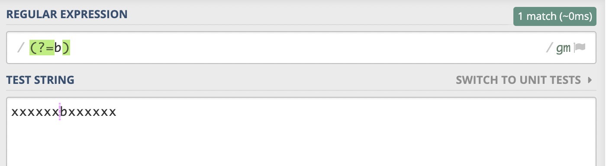
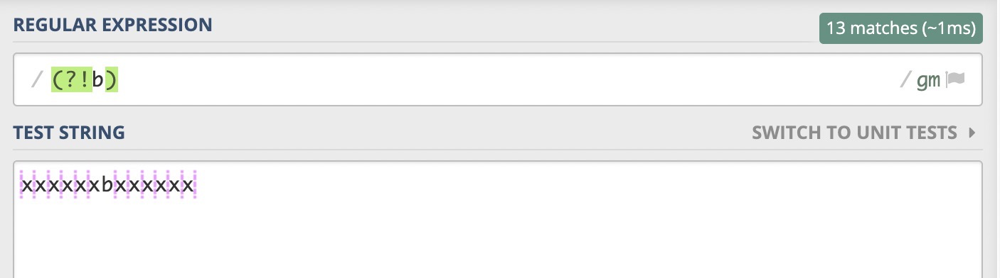
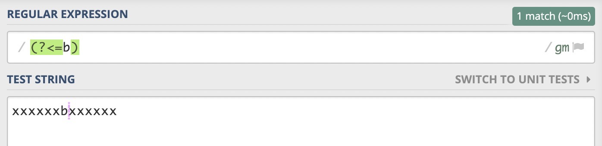
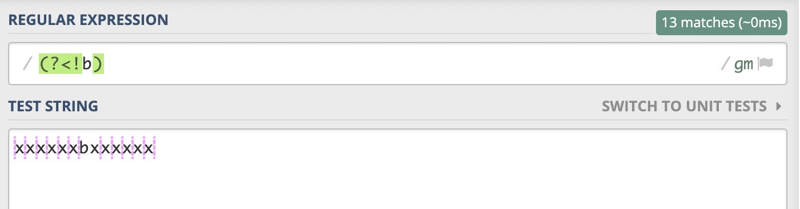
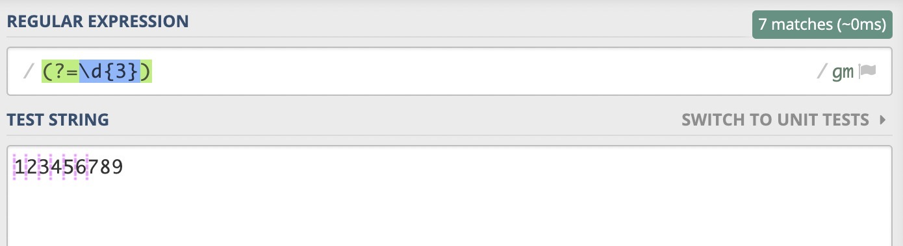
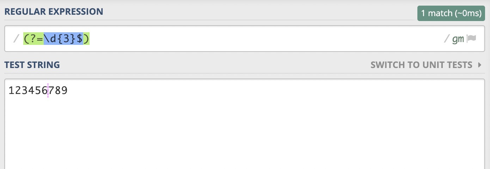
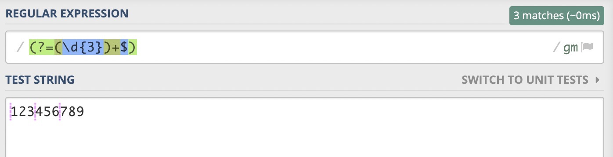
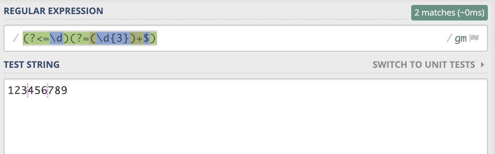

# 距离弄懂正则的环视，你只差这一篇文章

上一篇文章《[正则表达式匹配素数的原理讲解](https://github.com/dreamapplehappy/blog/tree/master/2020/06/25)》写完之后，一些同学给我留言说对于正则表达式的**环视**不是很理解；希望我能够讲解一下关于环视部分的内容。那么这篇文章的目的就是帮助大家理解什么是环视，环视有什么作用，以及在实际的开发中的一些例子。**相信阅读本文之后，大家对于正则的环视会有更深入的理解。**

## 正则表达式的环视是什么
环视顾名思义就是**环顾四周，向左看看向看看，找一个合适的位置**。环视**匹配的是一个位置而不是字符，这点尤为重要。**

那么我们是怎么找到这个合适的位置的呢？当然是根据环视里面包含的条件去寻找这个位置。接下来我会用生活中的一些场景来解释每一种环视。

### 肯定的顺序环视
假如你现在是一名叫张三的学生，现在是体育课需要大家排个队，你记性不好忘记了自己之前的位置，但是你还记得你的后面是李四。所以这个时候你肯定**先找到李四，然后站在他的前面就可以了**。所以你这个选择背后的逻辑是，**我站的这个位置后面需要是李四才可以**，我们可以用下面这个图来表示你的选择。

如果我们使用正则表达式来表示这个位置的话，那就是`(?=李四)`，这就表示了你想要找的位置。

首先解释一下什么是**顺序环视**，什么是**逆序环视**。因为正则表达式的匹配过程是从左到右的，所以如果我们要**判断一个位置的右边满不满足某个条件，这就叫顺序环视**。如果我们**判断一个位置的左边满不满足某种条件的话，这就叫做逆序环视。**

你可能会觉得上面这个正则表达式有点难记，首先我们需要知道**环视都是以`(?`作为开头的，然后接下来的一到两个符号表明是那种环视，再然后就是需要满足的条件，最后是一个`)`表示结束。`(?=条件)`可以这样理解，`?`表示疑问，`=`表示是否满足匹配。也就是当前位置是否满足给出的条件。**

我们来实践一下吧，假如b表示李四，你能否找出张三需要站的位置呢？

### 否定的顺序环视
假如你现在是一名叫张三的学生，现在是体育课需要大家排个队，但是你不想让李四站在你的后面，因为他总是喜欢用中性笔在你的后背上乱涂乱画😂。所以这个时候你会怎么选择位置呢？你肯定先看一个位置，只要这个位置的后面不是李四就可以了。**因为就算李四在你前面也无所谓，毕竟他不能画你的后背了。**

所以你做这个选择背后的逻辑是，**只有你站的这个位置后面不是李四才可以**。我们可以用下面这个图来表示你的选择。

上面这个位置可以用正则表达式`(?!李四)`来表示，作为程序开发者，我们对`!`很熟悉，在这里也是同样的意思。**表示不能够满足后面的条件。**

我们来实践一下吧，假如b表示李四，你能否找出张三需要站的位置。

### 肯定的逆序环视
假如你现在是一名叫张三的学生，现在是体育课需要大家排个队，你记性还是很不好忘记了自己之前的位置，但是你还记得你前面是李四。所以这个时候你肯定先找到李四，然后站在他的后面就可以了。所以你这个选择背后的逻辑是，**我站的这个位置前面需要是李四才可以**。
我们可以用下面这个图来表示你的选择。

如果我们使用正则表达式来表示这个位置的话，那就是`(?<=李四)`，这就表示了你想要找的位置。**`(?<=条件)`可以这样理解，`?`表示疑问，`<`表示方向是当前位置的左边，`=`表示是否满足匹配。也就是当前位置的左边是否满足给出的条件。**

我们来实践一下吧，假如b表示李四，你能否找出张三需要站的位置。

### 否定的逆序环视
假如你现在是一名叫张三的学生，现在是体育课需要大家排个队，你是一个比较调皮的孩子，总喜欢在李四的后背上乱涂轮画😂。现在老师说你站在那里都可以，但是就是不可以让李四站在你的前面。

这时候你该如何选择，你肯定先找一个位置，然后确定你前面不是李四就可以了。**哪怕李四在你的后面，你也不能够在李四的后背上乱涂乱画了**。

所以你这个选择背后的逻辑是，**我站的这个位置前面不能够是李四才可以**。我们可以用下面这个图来表示你的选择。

如果我们使用正则表达式来表示这个位置的话，那就是`(?<!李四)`，这就表示了你想要找的位置。`(?<!条件)`可以这样理解，`?`表示疑问，`<`表示方向是当前位置的左边，`!`表示不匹配。**也就是当前位置的左边不能够匹配给出的条件。**

我们来实践一下吧，假如b表示李四，你能否找出张三需要站的位置。

如果你看到得了到这里，那么你应该知道了这四种环视的表示方法，和它们表示的含义了。接下来我们来看一下环视在实际开发中的应用吧。

## 环视在实际开发中的应用

### 数字千分位的处理

在实际的开发中，作为一个前端，经常需要把原始数据处理的美观一些，然后再展示给用户，数字的千分位添加逗号就是一个很常见的需求。

这个问题的解决方案有很多种，使用正则表达式来解决这个问题是个很不错的方案。而且这个正则表达式要使用到我们今天学习的环视。那么我们该怎么使用环视去解决这个问题呢？

当我们使用正则表达式去解决问题的时候，第一件事情就是需要明确解决的是一个什么问题。对于这个问题来说，我们要解决的问题是匹配一些位置。什么位置？就是一个数字，**从后向前数，每隔三个数字的位置，并且每个位置的左边都需要有数字。**

当我们明确了我们需要解决的问题之后，我们就可以写我们的正则表达式。首先写一个能够匹配每隔三个数字的位置。这个比较容易我们可以使用**肯定的顺序环视**，`(?=\d{3})`应该是我们比较容易想到的。这个正则表示的意思就是**匹配一个位置，这个位置的后面需要是三个数字**。我们可以看一下我们匹配的结果。

满足上面条件的位置有好几个，但是有一些不是我们想要的。比如5和6之间的位置就不是我们想要的，但是因为这个位置后面是`678`，也满足我们上面的正则表达式，所以是能够匹配的。那么我们应该如何排除这些不想要的位置呢？

还有一个隐藏的条件，那就是我们还需要**匹配字符串的结尾**。如果我们把上面的正则表达式修改为`(?=\d{3}$)`，这样就限定了我们匹配的位置，**这个位置的后面是三个数字，然后就是字符串的结尾**。我们看一下这个表达式的匹配结果。

当我们限定了最开始匹配的位置之后，现在就找到了一个正确的位置。但是还没有达到我们的要求，我们还需要找到3和4之间的位置。这个时候我们可以使用量词来解决这个问题，我们知道3和4之间的位置距离字符串的结尾有6个数字，是3的倍数，所以我们需要能够匹配数字的个数是3、6、9等，只要是3的倍数就可以。所以我们可以将上面的表达式修改为`(?=(\d{3})+$)`，**`+`作用于前面括号括起来的`\d{3}`，表示至少需要有一个`\d{3}`**。我们来看一下这次表达式的匹配结果。

这次的匹配结果好像还有点问题，那就是数字的开头也被匹配了，但是这不是我们想要的结果。那么我们应该怎么处理呢？一些同学可能会说，我们只要保证每一个的位置左边至少有一个数字就可以了。嗯，这个方法也是可以的，按照这个思路，我们会写出下面的正则表达式`(?<=\d)(?=(\d{3})+$)`。**`(?<=\d)`是肯定的逆序环视，表示当前位置的左边需要是一个数字**。我们来看一下这个正则表达式的匹配结果。

这次这个正则表达式终于满足了我们的需求，匹配出了正确的位置。如果你觉得上面的正则表达式有点长的话，我们还可以使用`\B`来替换掉`(?<=\d)`。结果也是一样的，聪明的你知道为什么吗？在文章下面留言跟大家一起分享你的见解吧。

关于正则表达式的**环视**到这里就结束啦，如果大家有什么疑问和建议都可以在[这里](https://github.com/dreamapplehappy/blog/issues/8)提出来。欢迎大家关注我的公众号「关山不难越」，我们一起学习更多有用的正则知识，一起进步。

