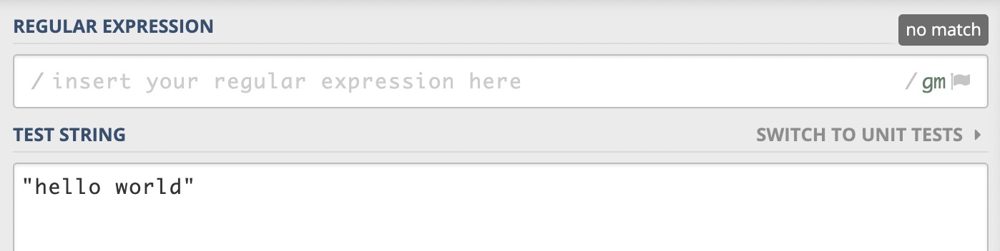
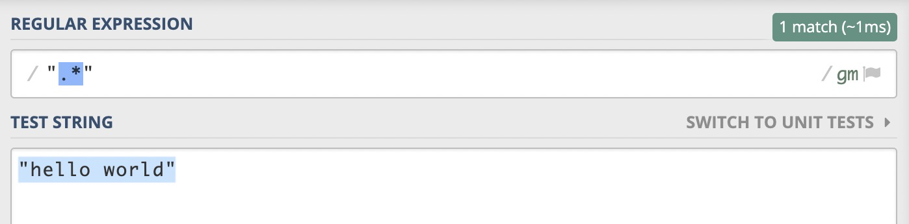
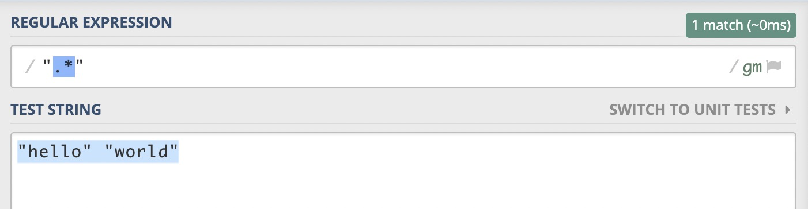
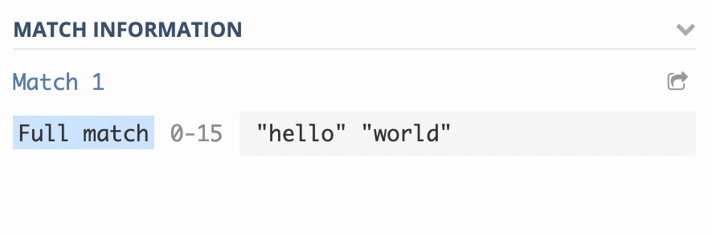
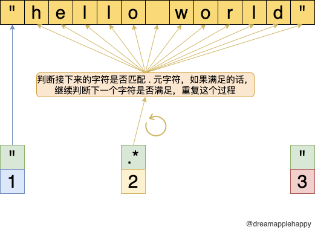
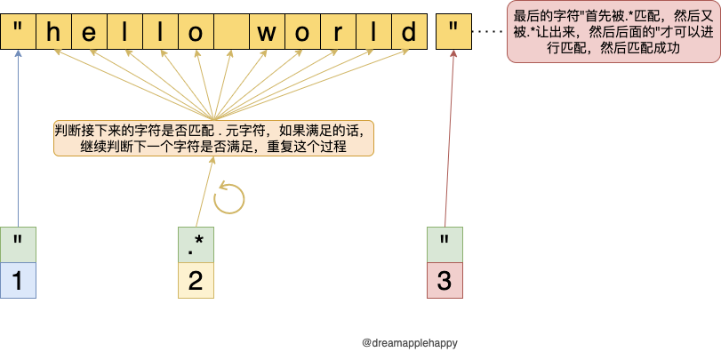
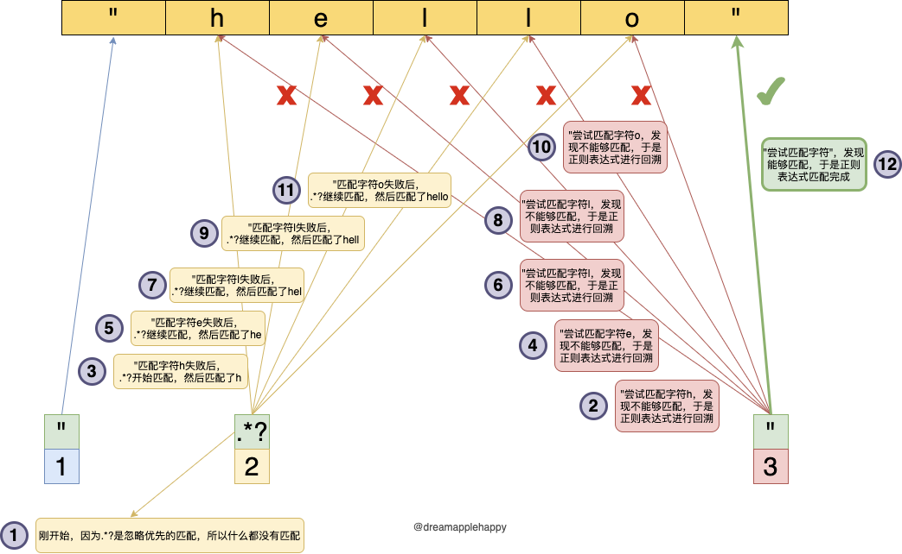
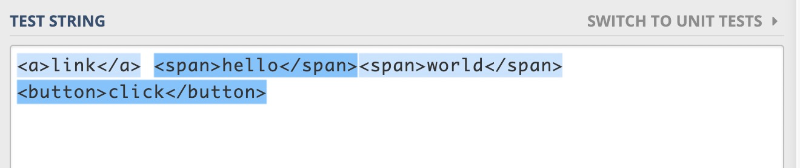
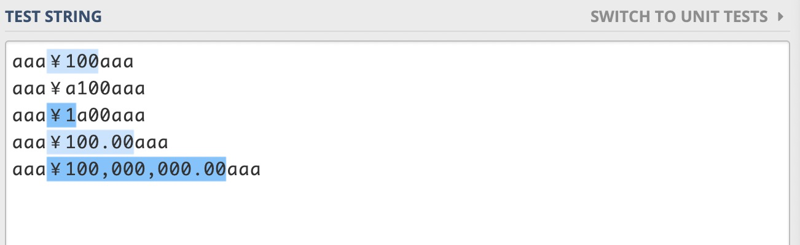

# 正则表达式量词匹配方式的讲解（上篇）

如果想要系统的学习正则表达式的话，那么关于量词的匹配方式是必须要掌握好的内容。量词的匹配方式有三种，分别是**匹配优先**，**忽略优先**以及**占有优先**。今天这篇文章先来讲解一下匹配优先和忽略优先，什么，你觉得很难？相信我，读完这篇文章你肯定可以掌握的很好。不相信？那就让我来带着你试一试吧。

在继续下面的文章之前，我们先来做个小练习题。那就是使用量词匹配一个简单的字符串，我们现在假设这个字符串是`"hello world"`，如下图所示：



有点正则表达式基础的同学很快就可以写出`".*"`，很好，完美地匹配了我们的测试字符串。



那如果我将测试用例变为`"hello" "world"`，我们会发现上面的正则表达式还是可以匹配整个测试用例，但是却不是我们想要的结果。我们希望的是能够分别匹配`"hello"`和`"world"`而不是这个整体。





那这个时候我们需要如何修改上面的正则表达式，才可以达到我们想要的目的呢？其实很简单，只需要在`*`后面添加一个`?`就可以了。是不是很神奇呢？


好，是时候展示真正的技术了。哦不，是时候跟大家解释一下什么是匹配优先，什么是忽略优先了。

## 匹配方式的介绍：

首先我们需要知道量词都有哪些？基本的量词有`?`（可以匹配1次或者0次）,`*`（可以匹配无数次或者0次）,`+`（至少需要匹配1次）。还有由大括号括起来的量词，比如`{2}`（匹配2次）, `{2, 6}`（匹配2到6次）, `{2, }`（匹配至少2次）。
**量词默认是匹配优先的**，如果在上面量词（需要是能够表示范围的量词）的后面再添加一个`?`，那么上面的量词就变成了忽略优先的量词，比如`??`，`*?`，`+?`。

### 匹配优先：

匹配优先又叫做**贪婪匹配**，它的特点是，**在量词作用下的表达式会尽可能尝试匹配满足条件的字符，直到后面的字符串不满足这个表达式或者到达字符串的结尾**。 只有在正则表达式整体在尝试匹配却没有匹配成功的情况下，匹配优先的这部分才会**归还已经匹配的部分字符，好让整体能够匹配成功。**

对于`".*"`来说，它的匹配过程如下图所示：



+ 第一步：正则表达式的`"`开始匹配测试用例的第一个字符，发现测试用例的第一个字符也是`"`，于是正则表达式中的`"`部分匹配成功。然后开始继续下面的匹配。

+ 第二步：正则表达式的`.*`是一个整体，表示`.`可以匹配无数次，或者0次。`.`是一个元字符可以匹配任何字符（除了行的结束符），所以在遇到行结束符之前，这部分表达式对于接下来的字符都是可以匹配成功的，就像上图表示的那样，一直匹配到这一行的结束。

+ 第三步：正则表达式的第三部分`"`需要在测试用例中能够匹配到`"`，但是因为`.*`已经匹配到测试用例这一行的结尾了，**所以为了正则表达式的整体能够匹配成功，`.*`需要归还已经匹配到的字符**。在这个例子中，需要把最后匹配的`"`字符让出来。让正则后面的`"`这部分尝试匹配，然后发现`"`可以匹配让出来的`"`字符，至此，整个匹配过程完成。



我们发现，`.*`在匹配的过程中让出了一部分已经匹配的字符；这个过程我们称之为**回溯**，这个会在以后的文章中跟大家详细的讲解一下。

关于匹配优先我们其实可以拿生活中的一些场景作类比。好比夏天到了，你比较喜欢喝啤酒，然后你会把你的冰箱里面塞满啤酒，虽然你很想再塞进去一些，**但是冰箱的容积就那么大（类比匹配到了字符串的结尾）**，所以你没办法再放更多的啤酒进去。这时候你想到只喝啤酒还不够过瘾，你还想吃点肉。**所以你买了卤鸡腿，然后把冰箱中的一些啤酒拿了出来（类比正则中的回溯，归还已经匹配的字符）**，省出的空间用来放鸡腿，然后这样你觉得比较完美了（类比正则表达式匹配成功）。


### 忽略优先：

忽略优先又叫做**懒惰匹配**，它的特点是，**在量词作用下的表达式会尽可能忽略掉满足条件的字符**，只有在正则表达式整体在尝试匹配却没有匹配成功的情况下，忽略优先的这部分才会去**匹配满足条件的那些字符，好让整体能够匹配成功。**

对于`".*?"`，它的匹配过程如下所示

+ 第一步：正则表达式的`"`开始匹配测试用例的第一个字符，发现测试用例的第一个字符也是`"`，于是正则表达式中的`"`部分匹配成功。然后开始继续下面的匹配。

+ 第二步：正则表达式的`.*?`是一个整体，表示`.`可以匹配0次或者无数次，**但是尽量不匹配**。于是，刚开始，**`.*?`就什么也没有匹配**。

+ 第三步：正则表达式的`"`开始进行匹配，发现`h`不满足匹配，于是需要进行回溯。也就是`.*?`要尝试匹配满足条件的字符，为了后面的`"`能够匹配成功。于是`.*?`匹配了`h`，后面的`"`发现下一个字符是`e`，还是不可以匹配成功，然后再次进行回溯。一直到`.*?`匹配了`hello`，正则表达式的`"`发现此时后面的`"`是可以匹配成功的，至此整个表达式匹配成功了一次。

+ 第四步：在接下来的字符串中，重复上述的1-3步骤，一直到字符串的结尾。

我们可以通过下面的图来直观的感受一下。



关于忽略优先，我们也可以拿生活中的一些场景作类比。比如你现在是一个在外地上大学的学生，你放假在家，现在开学了，你准备回到学校。这时候你的妈妈会让你带很多吃的用的和穿的。你虽然可以带这些东西，**但是你不想带这些大包小包的东西（类比懒惰匹配）**，感觉很麻烦。但是你知道，如果你不带一些去学校的话，**你妈妈会生气的（后面的`"`需要成功匹配）**。所以你就拿了一些比较方便携带的，剩下的就不带走了。这样至少不会让你妈妈生气，你也不用带那么多东西，**达到了双方都还算满意的结果（正则表达式匹配成功）**。


## 自测的练习题目

关于正则表达式量词的匹配方式，我们讲解了匹配优先，和忽略优先的匹配方式。相信大家看过上面的文章之后，应该能够很好地掌握了。那我们接下来就来做一些关于这两种匹配方式的练习题。

+ 第一题：匹配一些简单的HTML标签

给出的测试用例如下：
```
<a>link</a> <span>hello</span><span>world</span> <button>click</button>
```
匹配的结果如下图所示：



+ 第二题：匹配字符串中带有¥前缀的格式化数字

给出的测试用例如下：
```
aaa￥100aaa
aaa￥a100aaa
aaa￥1a00aaa
aaa￥100.00aaa
aaa￥100,000,000.00aaa
```

匹配的结果如下图所示：



如果你知道这两道题目的答案的话，也欢迎在文章下面留言。大家可以一起探讨一下，加深对本篇文章知识的掌握和理解程度。

关于正则表达式量词匹配方式讲解的上篇到这里就结束啦，如果你觉得这篇文章对你有帮助的话，不要忘记点赞和转发哟。如果大家有什么疑问和建议都可以在[这里](https://github.com/dreamapplehappy/blog/issues/9)提出来。欢迎大家关注我的公众号**关山不难越**，我们一起学习更多有用的正则知识，一起进步。


