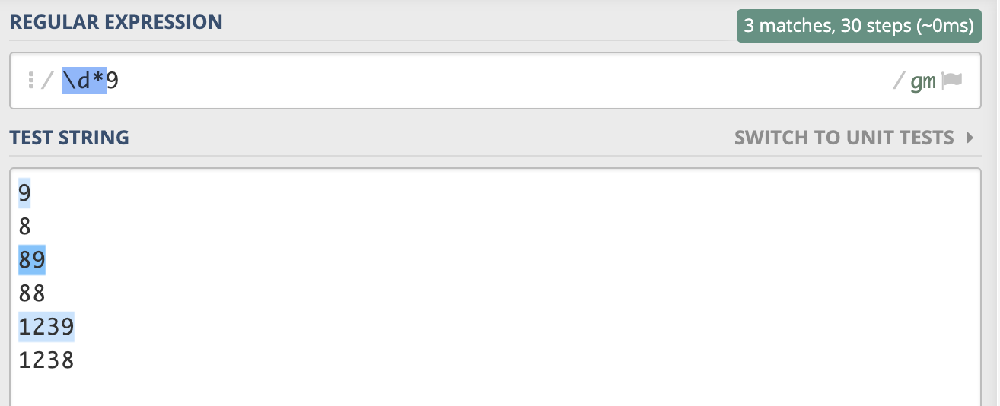
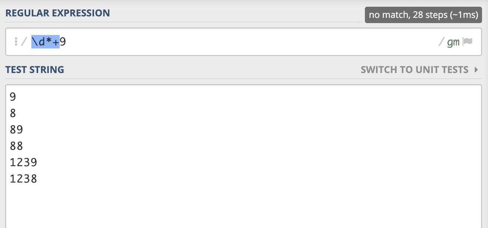
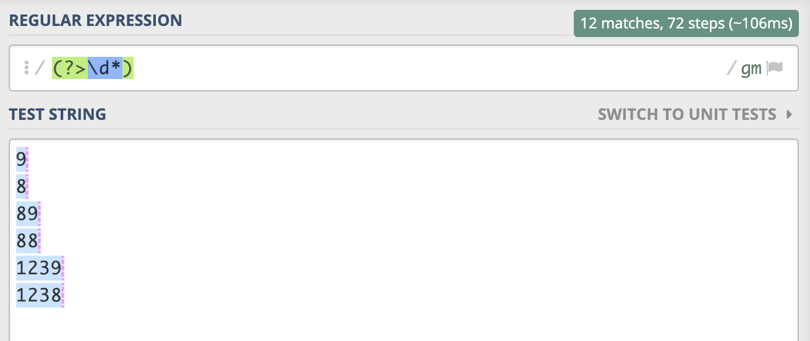
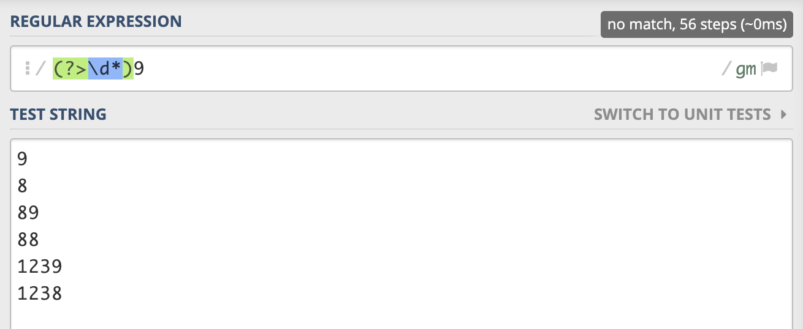
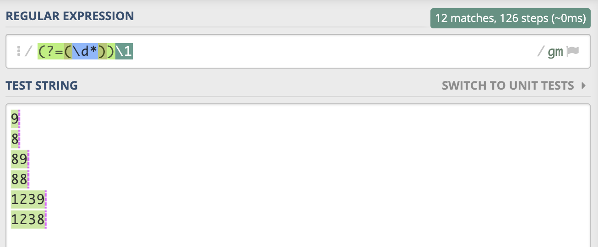
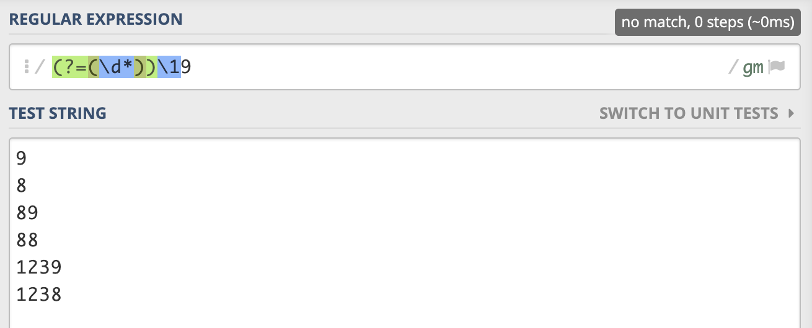

# 正则表达式量词匹配方式的讲解（下篇）

上次我们讲解了正则表达式量词匹配方式的[**贪婪匹配和懒惰匹配**](https://mp.weixin.qq.com/s/AxTuXvKINhX6qLzj6Q9UJw)之后，一些同学给我的公众号留言说希望能够快点把量词匹配方式的下篇也写了。那么，这次我们就来学习一下量词的另外一种匹配方式，那就是**占有优先**的匹配方式。当然我们这篇文章还讲解了跟占有优先匹配功能一样的**固化分组**，以及**使用肯定的顺序环视来模拟占有优先的匹配方式以及固化分组**。准备好了吗，快来给自己的技能树上再添加一些技能吧。

我们如果可以掌握这种匹配方式的原理的话，那么我们就有能力写出**效率更高**的正则表达式。在进行深入的学习之前，希望你至少对正则表达式的**贪婪匹配**有所了解，如果还不怎么了解的话，可以花费几分钟的时间看一下我上一篇关于[**贪婪匹配和懒惰匹配**](https://mp.weixin.qq.com/s/AxTuXvKINhX6qLzj6Q9UJw)的文章。

### 占有优先的匹配方式：(表达式)*+

首先，占有优先的匹配方式跟贪婪匹配的方式很像。它们之间的区别就是**占有优先的匹配方式，不会归还已经匹配的字符**，这点很重要。这也是为什么**占有优先的匹配方式效率比较高的原因。因为它作用的表达式在匹配结束之后，不会保留备用的状态，也就是不会进行回溯**。但是，贪婪匹配会保留备用的状态，如果之前的匹配没有成功的话，它会回退到最近一次的保留状态，也就是进行回溯，**以便正则表达式整体能够匹配成功**。
那么占有优先的表示方式是怎样的？**占有优先匹配就是在原来的量词的后面添加一个+**，像下面展示的这样。

```
.?+
.*+
.++
.{3, 6}+
.{3,}+
```

因为正则表达式有很多流派，有一些流派是不支持占有优先这种匹配方式的，比如**JavaScript**就不支持这种匹配的方式（前端同学表示不是很开心😂），但是我们可以使用**肯定的顺序环视**来模拟占有优先的匹配。**PHP**就支持这种匹配方式。所以接下来我们一些正则的演示，就会选择使用PHP流派进行演示。

我们来写一个简单的例子来加深一下大家对于占有优先匹配方式的了解。有这么一个需求，你需要写一个正则表达式来匹配以数字**9**结尾的数字。你会怎么写呢？当然，对于已经有正则表达式基础的同学来说，这应该是很容易的事情。我们会写出这么一个正则表达式`\d*9`，这样就满足了上面所说的需求了。




让我们把上面的**贪婪匹配**方式修改为**占有优先**的匹配方式，你觉得我们还能够匹配相同的结果吗？来让我们看一下修改后的匹配结果。



答案是**不能**，你也许会好奇，为什么就不可以了。让我来好好给大家解释一下为什么不能够匹配了。

我们知道正则表达式是从左向右匹配的，对于`\d*+`这个整体，我们在进行匹配的时候可以先把`\d*+`看作是`\d*`进行匹配。对于`\d*+`这部分表达式来说它在开始匹配的时候会匹配尽可能多的数字，**对于我们给出的测试用例，`\d*+`都是可以匹配的，所以`\d*+`直接匹配到了每一行数字的结尾处**。然后因为`\d*+`是一个整体，表示占有优先的匹配。所以**当`\d*+`匹配完成之后，这个整体便不再归还已经匹配的字符了**。但是我们正则表达式的后面还需要匹配一个字符`9`，但是前面已经匹配到字符串的结尾了，再没有字符给`9`去匹配，所以上面的测试用例都匹配失败了。

在开始匹配的过程中**我们可以把占有优先当做贪婪匹配来进行匹配，但是一旦匹配完成就跟贪婪匹配不一样了，因为它不再归还匹配到的字符**。所以对于占有优先的匹配方式，我们只需要牢记**占有优先匹配方式匹配到的字符不再归还**就可以了。

### 固化分组：(?>表达式)

我们了解了占有优先的匹配之后，再来看看跟占有优先匹配作用一样的**固化分组**。那什么是固化分组呢？固化分组的意思是这样的，**当固化分组里面的表达式匹配完成之后，不再归还已经匹配到的字符**。固话分组的表示方式是`(?>表达式)`，其中里面的表达式就是我们要进行匹配的表达式。比如`(?>\d*)`里面的表达式就是`\d*`，表示的意思就是当`\d*`这部分匹配完成之后，不再归还`\d*`已经匹配到的字符。

所以，对于`\d*+`来说，我们如果使用固化分组的话可以表示为`(?>\d*)`。其实，**占有优先**是**固化分组**的一种简便的表示方式，如果固化分组里面的表达式是一个很简单的表达式的话。那么使用占有优先量词，比使用固话分组更加的直观。

我们将上面使用占有优先的表达式替换为使用**固化分组**的方式表示，下面两张图片展示了使用固化分组后的匹配结果。





还有一些需要注意的是，**支持占有优先量词的正则流派也支持固化分组**，但是**对于支持固化分组的正则流派来说，不一定支持占有优先量词**。所以在使用占有优先量词的时候，要确保你使用的那个流派是支持的。

### 使用肯定顺序环视模拟固化分组：(?=(表达式))\1

对于不支持固化分组的流派来说，如果这些流派支持**肯定的顺序环视**和**捕获的括号**的话，我们可以使用肯定的顺序环视来模拟固化分组。如果对于正则表达式的**环视**还不熟悉的话，可以花几分钟的时间看一下我之前写的这篇文章[**距离弄懂正则的环视，你只差这一篇文章**](https://mp.weixin.qq.com/s/VqiZ6fVL20sJ8NUoQJjm2g)，保证你可以快速的理解正则的环视。

看到这里，你可能要问，为什么肯定的顺序环视可以模拟固化分组呢？我们要知道固化分组的特性就是匹配完成之后，丢弃了固化分组内表达式的备用状态，然后不会进行回溯。又因为**环视一旦匹配成功之后也是不会进行回溯的**，所以我们可以利用肯定的顺序环视来模拟固化分组。

我们可以使用`(?=(表达式))\1`这个表达式来模拟固化分组`(?>表达式)`。我来解释一下上面这个模拟的正则表达式，首先是一个肯定的顺序环视，需要在当前位置的后面找到满足`表达式`的匹配，如果找到的话，接下来`\1`会匹配环视中已经匹配到的那部分字符。因为在顺序环视中的正则表达式不会受到顺序环视后面表达式的影响，所以顺序环视内部的表达式在匹配完成之后不会进行回溯。然后后面的`\1`再次匹配环视里面`表达式`匹配到的内容，这样就模拟了一个固化分组。

我们再将上面的表达式替换为使用**模拟固化分组**的方式表示，下面两张图片展示了使用模拟固化分组后的匹配结果。





**模拟的固化分组在效率上要比真正的固化分组慢一些**，因为`\1`的匹配也是需要花费时间的。不过对于贪婪匹配所造成的的回溯来说，这点匹配的时间一般还是很短的。

### 贪婪匹配和占有优先效率的比较

我们上面说过，因为占有优先不会回溯，所以在一些情况下，使用占有优先的匹配要比使用匹配优先的匹配效率高很多。那么下面我们就使用代码来验证一下贪婪匹配和占有优先匹配的效率是怎样的。

代码如下所示：
```javascript
// 匹配优先（贪婪匹配）匹配一行中的数字，后面紧跟着字符b
const greedy_reg = /\d*b/;
// 占有优先（使用肯定顺序环视模拟）
const possessive_reg = /(?=(\d*))\1b/;
// 测试的字符串 000...(共有1000个0)...000a
const str = `${new Array(1000).fill(0).join('')}a`;

console.time('匹配优先');
greedy_reg.test(str);
console.timeEnd('匹配优先');

console.time('模拟的占有优先');
possessive_reg.test(str);
console.timeEnd('模拟的占有优先');
```
在上面的测试代码中，我们生成了一个长度为1001的字符串，最后一位是一个小写字母`a`。因为贪婪匹配在匹配到最后一个数字后，发现最后一个字符是`a`，不能够满足`b`的匹配，所以开始进行回溯。**虽然我们知道就算进行了回溯也不会匹配成功了，但是运行的程序是不知道的**，所以程序会不断的回溯，一直回溯到`\d*`什么也不匹配，然后再次检查`b`，发现还是不可以匹配。最终报告匹配失败。中间进行了大量的回溯，所以匹配的效率降低了。

对于占有优先的匹配，在第一次`\d*`匹配成功后，发现后面的`a`不能够满足`b`的匹配，所以立即报告失败，匹配效率比较高。但是因为**JavaScript**不支持**占有优先**和**固化分组**，所以我们使用了肯定的顺序环视来替代，但是因为`\1`需要进行接下来的匹配，也会消耗一些时间。所以这个测试的结果不能够严格意义上表明**占有优先**比**贪婪匹配**在这种情况下的效率高，但是如果模拟的占有优先消耗的时间比较短，那就可以说明占有优先确实比贪婪匹配在这种情况下的效率高。

我首先在`node.js`环境中运行，我本地的node.js版本为`v12.16.1`，系统为`macOS`。程序运行的结果如下：
```
匹配优先: 1.080ms
模拟的占有优先: 0.702ms
```
这个结果只是其中一次的运行结果，运行很多次后发现匹配优先的耗时要比我们模拟的占有优先多一些，但也有几次的运行时间是小于模拟的占有优先的。我把相同的代码也放在了**Chrome**浏览器中运行了多次，发现匹配优先的耗时有时比模拟占有优先高，有时比模拟占有优先低，不是很好做判断。

在**JavaScript**中不能够很好地反应这两种匹配方式的效率高低，所以我们需要在**PHP**中再次进行试验。因为PHP是原生的支持**占有优先**匹配的，所以比较的结果是有说服力的。我们使用PHP的代码实现上面相同的逻辑，代码如下：
```php
// 贪婪匹配
$greedy_reg     = '/\d*b/';
// 占有优先
$possessive_reg = '/\d*+b/';

// 待测试字符串
$str = implode(array_fill(0, 1000, 0)) . 'a';

// 计算贪婪匹配花费的时间
$t1 = microtime(true);
preg_match($greedy_reg, $str);
$t2 = microtime(true);
echo '贪婪匹配运行的时间：' . ($t2 - $t1) * 1e3 . 'ms';

echo PHP_EOL;

// 计算占有优先匹配花费的时间
$t3 = microtime(true);
preg_match($possessive_reg, $str);
$t4 = microtime(true);
echo '占有优先匹配运行的时间：' . ($t4 - $t3) * 1e3 . 'ms';
```
可以看到运行的结果如下：
```
贪婪匹配运行的时间：0.025033950805664ms
占有优先匹配运行的时间：0.0071525573730469ms
```
如果你将这段代码运行多次的话，可以看到占有优先匹配所花费的时间的确是比贪婪匹配要少一些的，所以上面的代码可以说明，在这种情况下**占有优先**匹配的效率是比**贪婪匹配**的效率高的。

关于正则表达式的**占有优先**匹配和**固化分组**的讲解到这里就结束啦，如果大家有什么疑问和建议都可以在这里提出来。欢迎大家关注我的公众号**关山不难越**，我们一起学习更多有用的正则知识，一起进步。


参考资料：
+ https://www.regular-expressions.info/possessive.html


