# 报告老板，我们的H5页面在iOS11系统上白屏了！

时间回到一周前，当时刚开发完公司A项目的一个新的版本，等待着测试完成就进行发布。此时的我也准备从连续多日的紧张开发状态中走出来，以为可以稍稍放松一下。而那时的我还不知道，**我即将面临一个强大的Bug选手，更不知道我要跟这个Bug来来回回进行多次的搏斗**。当然，我们能看到这篇文章也就说明了我最终解决了这个Bug，而且这个过程也是相当的精彩的。什么？你不相信，那就让我来带你进入这个“跌宕起伏”的经历中吧。

**友情提示**：接下来的文章也许有一点长，但是希望你能够坚持读下去。我相信我在解决这个Bug的过程中的一些思路会给你带来一些思考。**当然也希望你在这个过程中能够像我一样学习到一些新的知识，为以后排查类似的Bug积累一些经验**。好啦，话不多说，让我们开始吧。

## 项目介绍

先来简单介绍一下A项目，这是一个基于`Vue`框架的项目，项目使用的也是`Vue CLI`这个开发工具。这个项目是需要集成在别的APP中的，也就是页面需要在APP中进浏览和操作。这个项目在我接手之前已经开发过一段时间了。**所以项目中的一些依赖库和工具库版本相对比较低，这也给我后续的调试以及解决Bug的过程增加了一些困难。**

## BUG初现

当时开发完成之后，就交给我们这边的测试和另一个城市的相关同学去验收这次开发的功能。在我们这边一切都很正常，测试这边也没有反馈有什么问题。但是在另一个城市的同学小C的iPhone手机上却发现了**白屏**，打开页面之后什么内容也没有。

发现了这个问题之后，我再次跟我们这边的测试同学确认了一下，看看我们这边测试的iOS系统的iPhone手机有没有这个问题。经过测试的测试，发现我们这边的几台iPhone手机都没有问题。然后就问了小C他使用的测试手机的系统版本是多少，当时感觉应该跟`iOS`的系统版本有关系。

小C反馈说他的iPhone是`6S Plus`，然后系统的版本是`11.1.2`。我问了我们这边测试使用的iPhone版本都是多少，测试反馈说系统的版本都是`12`以上的。所以到这里，**我确定了这个白屏Bug的出现肯定跟iPhone手机的系统有关系**。

## 重现BUG之路

虽然确定了问题出现的环境，但是因为我身边没有系统是`11`的iPhone手机，所以想让这个问题重现就变成了一个难题。询问了身边的同事，大家的系统版本也都普遍高于`12`，所以借用别人的手机进行调试这个方法暂时也不可行。

在平时的开发中，如果网页在`iOS`系统的APP中有一些问题的话，我们一般都会通过`Safari`浏览器进行调试。但是因为这次出现问题的iPhone手机不在我这里，并且我这边也没有相同系统的手机。所以想通过真机进行调试就不太可能了。那怎么办呢？这个问题肯定是要解决的，**我也相信办法总比困难多**。

想要进行调试，最简单的办法就是让我有一个系统是`11`的iPhone手机。所以我就搜索看看有没有什么办法可以给iPhone手机安装`11`的系统。一搜索还真的有，过程也不算是很复杂。但是其中有一个步骤是需要到一些论坛或者第三方的助手网站下载跟自己手机型号相匹配的`iOS`系统，这个步骤让我有点感觉不安全。**毕竟不是官方的，不能够保证安全性。而且也未必有版本是`11`的系统。所以这个方案就暂时作罢**。

在我搜索的过程中，我发现有网友说可以使用`Xcode`安装相应系统版本的iPhone`模拟器`来进行调试。哎，你说我怎么没有想到这个办法呢？这确实是一个不错的办法。因为之前跟公司的同事学习过`Swift`，也了解过`Xcode`的一些操作。**突然感慨，真是技多不压身，你不知道你什么时候就会用上你学过的知识。所以有条件的话，还是多学习一些知识**。额，有点跑题了。

## 安装Xcode

我打开公司的电脑，开始安装`Xcode`，但是发现公司的电脑系统版本太低，安装`Xcode`需要升级系统，所以没办法，先升级系统吧。因为升级的时间比较长，我想到自己家中的Mac电脑上是有安装过`Xcode`，所以决定先回家。留下公司的电脑慢慢升级。

回到家，二话不说就开始准备调试，但是发现我的`Xcode`上面的iPhone模拟器的系统版本也都是`12`以上的，查了一下资料，`Xcode`是可以安装不同系统版本的模拟器的，于是我就安装了系统版本是`11`的模拟器。这个过程需要我们打开`Xcode`的偏好设置，然后在`Components`选项中，选择下载你要安装的对应系统版本的模拟器。

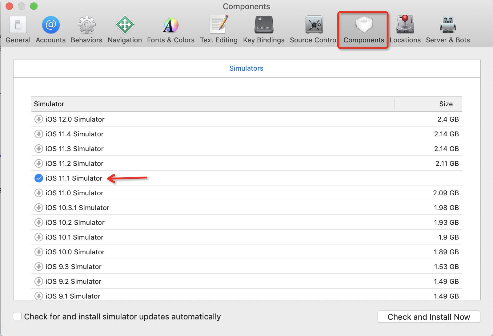

安装成功之后，运行`iPhone 6S Plus`模拟器，使用模拟器的`Safari`打开h5的页面地址，果然是白屏。

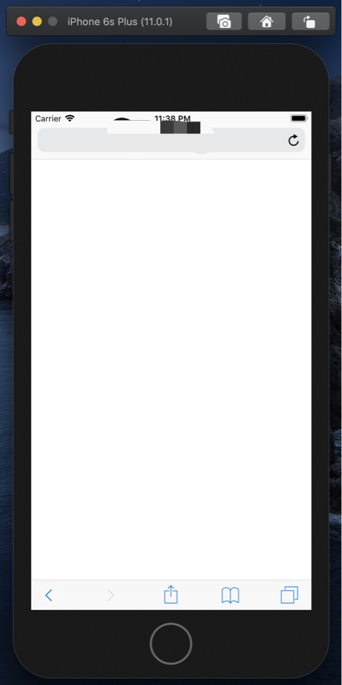

小样，终于把这个问题给复现了，这样就距离解决这个Bug不远了。我打开`Mac`的`Safari`浏览器，进入开发者模式，发现了如下所示的报错

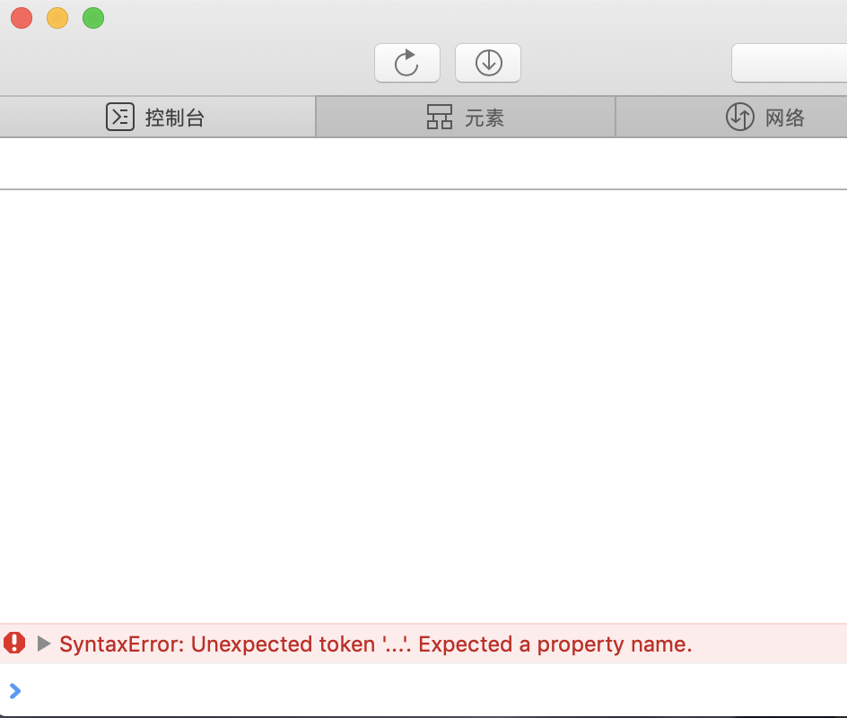

我搜索了一下这个错误，发现是因为项目中使用了`...`ES6扩展运算符，然后`iOS 11`系统不支持这个这个运算符。这么容易就找到问题了，开心。想到这个问题还是比较好解决的，可以通过使用`Babel`的一些插件，很容易就可以将这个问题解决掉。然后我就开心的睡觉去了，心想这个问题也不是什么大问题，明天处理一下就好了。

## 安装Safari Technology Preview

第二天到公司，我就在项目中的`babel`的配置文件中添加了相应的插件

```javascript
{
  ...  // 省略原来的配置内容
  "plugins": ["@babel/plugin-proposal-object-rest-spread"]
}
```

然后发布到测试环境中。告诉了小C同学再次测试一下，我也在等着解决这个Bug的好消息。但是，**出现的却不是好消息**，小C给我回复说还是不可以。什么，不可能呀，我就马上用公司的电脑再次进行测试。当我用公司电脑的`Safari`调试系统是`iOS 11`的`iPhone 6S PLus`模拟器的时候，却发现出现了下面这个情况：`审核警告：“data-custom”太新，无法在此检查的页面上运行`

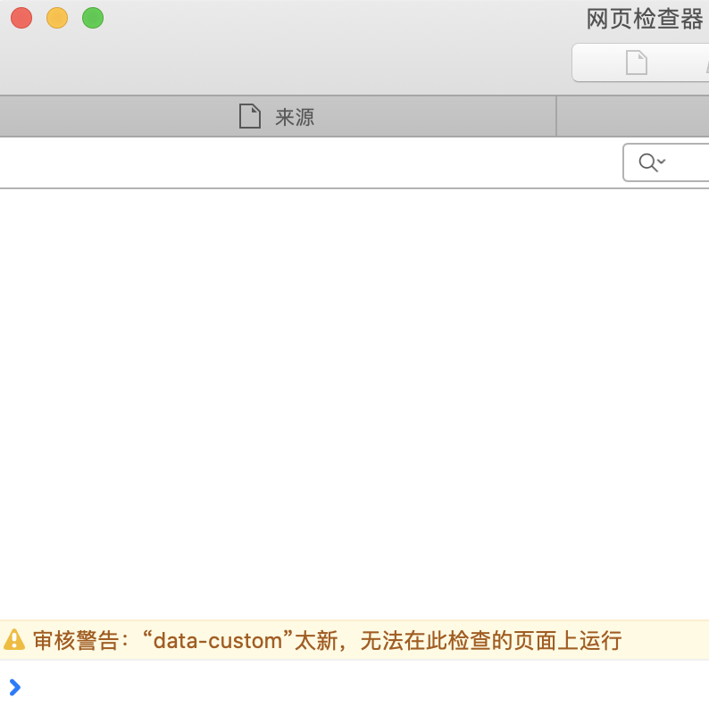

我就又搜索了一下为什么会出现这个问题，终于让我找到了[答案](https://stackoverflow.com/questions/60963057/safari-web-inspector-is-only-showing-sources-console-and-audit)，`Safari`浏览器的`Web Inspector`工程师也说这是一个Bug，不过他们已经修复了，在下个发布的版本中就可以正常使用新的`Safari`浏览器去调试比较老的`iOS`系统的模拟器了。知道现在这个版本的`Safari`调试不了模拟的`iOS 11`系统的页面。我有点沮丧，总不能我现在回家把我的电脑拿过来吧😂？当我想着该如何解决的时候，我发现了上面那个回答中提到了`Safari Technology Preview`，**`Safari`技术预览**。

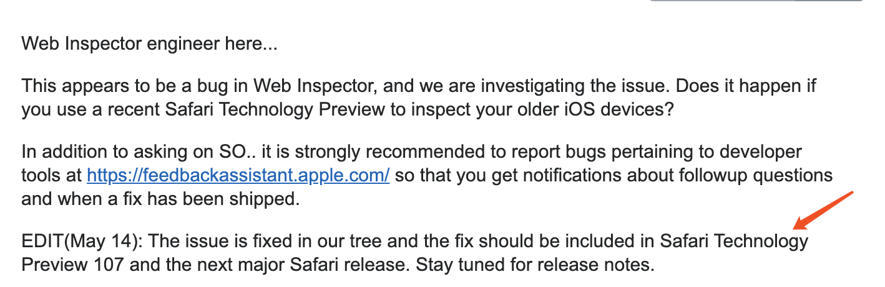

我看这个名字感觉有点希望，然后就搜索了一下`Safari Technology Preview`是什么。然后就发现它相对于`Safari`就跟`Chromium`相对于`Chrome`是一样，都相当于是开发版本的浏览器。

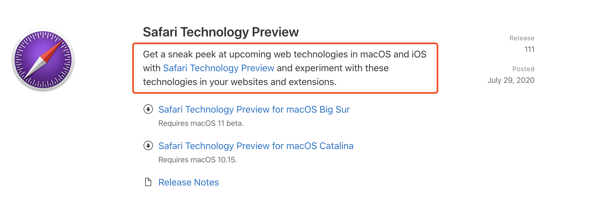

这时，我觉得可以使用`Safari Technology Preview`进行调试。所以就下载了`Safari Technology Preview`，当我打开`Safari Technology Preview`然后进入开发者模式后，发现确实可以调试`iOS 11`系统的页面。然后我就看了一下为什么还是白屏的问题。发现出现的错误还是上次的问题：

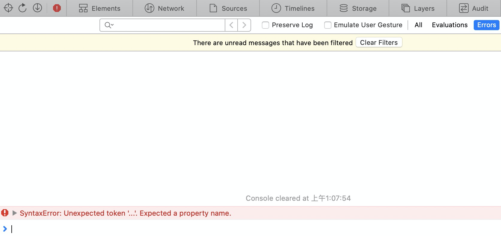

也就是说这个问题还没有解决掉，因为打包后的代码是没有`SourceMap`的，所以要想看更详细的报错信息，需要在本地进行调试。本地的环境中是有`SourceMap`的，可以定位到更详细的错误信息，我在本地运行了项目，然后我打开了控制台的错误详情，发现是使用的一个第三方的库出现了问题。

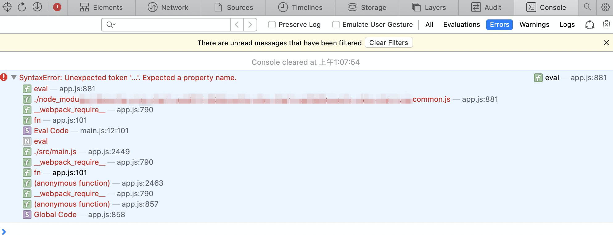

那么到这里为止，可以说明上面我们使用的`Babel`插件没有处理这个第三方的库，所以现在我们的问题就变成了：**如何解决第三方库中出现的`...`扩展运算符没有被编译为ES5语法的问题**。

## 将第三方库中的ES6语法进行编译

### 查看Vue CLI中相关的配置方法

这时我又仔细的看了一下`Vue CLI`的相关文档，发现确实在**浏览器的兼容性**这个章节中，提到了一些处理的方法。原来我们在项目中写的代码默认会帮我们转换为ES5的语法的，但是如果项目中依赖的第三方库需要`polyfill`的话，那需要我们手动进行配置。**一看到这里，我感觉黎明就要来了**。

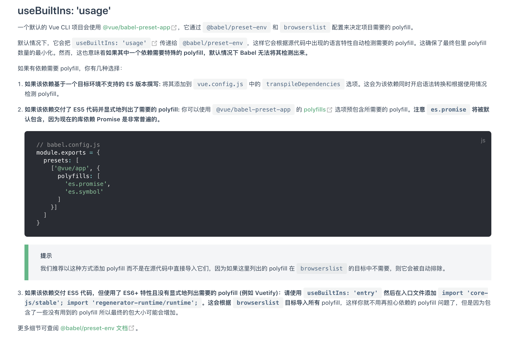

我就开始尝试这三种方法。我发现第一种方法是比较简单的，也很好配置。于是我就尝试了第一种方法。在项目的`vue.config.js`中添加如下的配置：

```javascript
...  // 省略的配置
transpileDependencies: [
  'module-name/library-name' // 出现问题的那个库
],
...  // 省略的配置
```

重新运行项目，当我将要为即将到来的成功欢呼鼓掌时，控制台突然报告了如下的错误：
`Uncaught TypeError: Cannot assign to read only property 'exports' of object '#<Object>'`

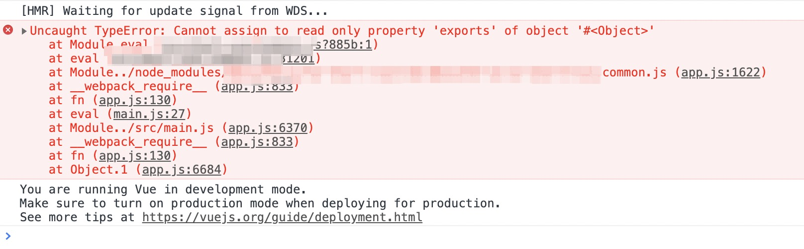

这个报错是在`Chrome`浏览器的控制台出现的，因为项目在本地重新运行之后会首先打开`Chrome`浏览器。真是的，一个问题还没有解决，又出来了一个新的问题。然后再次查询资料后发现，原来是因为这个第三方的库是一个`CommonJS`类型的库，而`Babel`默认处理的是`ES6`的`module`类型的库，所以这里就又出现了新的问题。

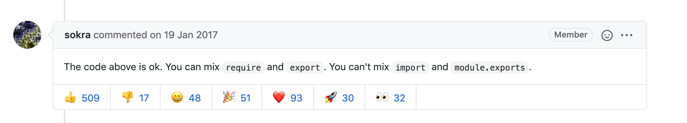

第一种方法遇到了阻碍，先暂停一下。我准备继续尝试下面两种方法。**但是因为后面两种方法对原来的项目改动有点大，所以我直接通过`Vue CLI`创建了一个新的项目，在`package.json`中加入项目中使用的那个第三方包的依赖，使用公司的包管理工具安装了依赖**。然后运行项目，打开控制台确实发现了相同的错误。但是打开详情以后，发现出错的路径跟我原来项目不一致。然后我这次抱着试一试的心态，继续使用了第一种方法尝试看看可不可以。然后复制了出错路径的包名称，在`vue.config.js`文件中的对应位置添加了如下的配置代码：

```javascript
...  // 省略的配置
transpileDependencies: [
  'module-name-new/library-name-new' // 出现问题的那个库
],
...  // 省略的配置
```

然后重新运行项目，发现居然可以了。**啊，居然可以了**。为什么我在原来的项目中这样却不可以呢？**我看了一下原来项目的依赖以及现在新的测试项目的依赖，发现它们的`vue`, `babel`版本差了好多**。我猜测可能是因为这个原因。但是现在肯定不可以贸然升级这些依赖的版本，因为为了解决这个问题再次带来新的问题就得不偿失了。

**还有一个问题就是为什么同样的第三方库，在原来的项目中和现在的项目中报错的路径不一样。而且看着像是使用了两个不一样的第三方库**。这里先留个悬念，我会在后面的文章中进行解释。

接下来，我开始在测试项目中继续尝试剩下的两种方法，对于第二种方法，因为老项目中使用的`presets`是没有`polyfills`这个配置选项的，到现在为止出问题的这个第三方库我不知道除了这个`...`对象扩展操作符之外还有没有别的依赖。所以这个方法我暂时也放弃了。

对于第三个方法，我觉得可以尝试，首先我将测试项目中的一些关键依赖进行了手动降级，然后按照上面的第三个方法的步骤在测试项目中使用。但是发现测试项目运行之后，提示需要安装`core-js`，安装`core-js`之后还报错，再次提示需要安装`es.module.regex.match`等等很多依赖，继续查资料，发现需要把配置中的 `useBuiltIns`修改，但是因为我接手的这个项目是老项目，依赖比较多，不确定修改`useBuiltIns`这个配置选项后会不会出现新的问题。所以也不敢贸然修改这个配置选项，所以也暂时放弃了这个方法。

我后来想了一下，对于`...`扩展运算符来说，这是一个新的语法。是不能够通过一些`polyfills`去解决的。需要`Babel`对这个语法进行编译，然后才可以在低版本的系统中使用，所以解决的办法还是要让`Babel`对这个库再次进行编译。

## 寻找新的突破口

当进行到了这里的时候，似乎没有了出路。一时间我感觉我要被这个Bug打败了，我似乎听到了它无情的嘲笑，“**小伙子，是不是被我折磨的没有脾气啦；放弃吧，你是没办法打倒我的。哈哈哈。。。**”


但是，它看错我了，Bug越是难解决，我对它就越有兴趣。所以我决定好好理一下思路，准备再次扬帆起航。

我发现第一种办法其实是起作用的，只不过是因为一个是`CommonJS`类型的，一个需要是`ES6 module`类型的。所以我决定从这个地方入手，于是我决定查查相关的资料，看看`Babel`有没有办法可以即能够处理`CommonJS`模块，又能够处理`ES6 module`模块呢？**终于，功夫不负有心人，我发现了`Babel`里面有这么一个配置`sourceType`，如果把`sourceType`设置为`unambiguous`就可以解决这个问题**。

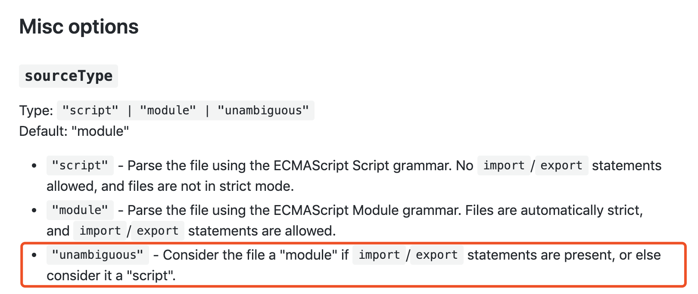

这样`Babel`就会根据模块文件中有没有`import/export`来决定使用哪种解析模块的方式。于是我再次使用了第一种方法，在`vue.config.js`中添加了`transpileDependencies`选项的配置，然后在项目中的`Babel`配置文件中添加了如下的配置：

```javascript
module.exports = {
  ...  // 省略的配置
  sourceType: 'unambiguous',
  ...  // 省略的配置
};
```

发现的确可以，**这一刻成功的喜悦再次降临**。然后我再次打包，再次把代码部署到测试环境，赶忙让小C同学再次测试一下，发现的确可以。欧耶，终于解决这个问题了。我终于可以松一口气了，哈哈哈。。。小样，这怎么会难得到我呢？

但是，当我仔细阅读将这个选项设置为`unambiguous`时，我发现了一些问题。因为这样的话会有一些风险，因为就算不使用`import/export`语句的这些模块也可能是完全有效的`ES6 module`，所以这样的话就有可能会出现一些意外的情况。**怎么办，我似乎在一不留神的时候又被Bug卡住了脖子**。

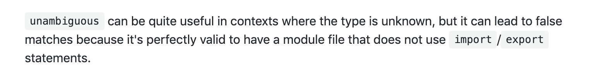

我觉得老天总是给我开玩笑，当我从一个坑里跳出来，以为没有危险的时候。前面突然又多出来一个坑，我一不留心就又掉了进去。我感觉既然都走到了这里，肯定要继续走下去，一定有办法可以优化我现在遇到的问题。我就很仔细的再次看了一下`Babel`的配置说明文档，这个时候就心想如果我对`Babel`再熟悉一些就好了。**没关系，继续努力**。终于，我似乎看到了什么了不得的配置选项。

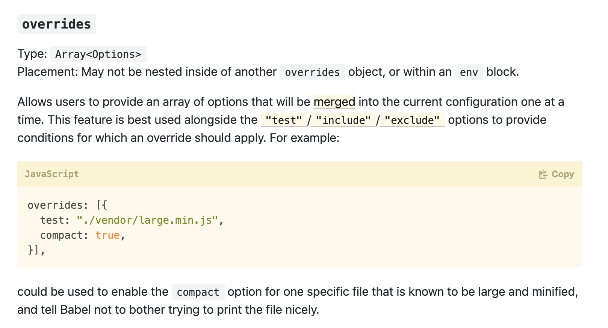

我在`Config Merging options`里发现了`overrides`选项，这个配置选项不正是我需要的吗？我可以利用这个配置选项将我需要的第三方包使用`unambiguous`的处理方式，然后其他的第三方库都按照之前的方式处理不就可以了。哈哈哈，我真是个天才，我心里这样对自己说😂。


所以只需要在项目的`babel.config.js`中写下如下的配置就可以了：

```javascript
module.exports = {
  ...  // 省略的配置
  overrides: [
    {
      include: './node_modules/module-name/library-name/name.common.js',  // 使用的第三方库
      sourceType: 'unambiguous'
    }
  ],
  ...  // 省略的配置
};
```

对了，还有一件事情还没有说，那就是上文提到的关于为什么使用公司自己的包管理工具下载下来的`node_modules`包的名称跟使用官方的`npm`包管理工具下载的包的名称不一致的问题。原因是公司使用的包管理工具是[`cnpm`](https://github.com/cnpm/cnpm)的一个修改版本。又因为`cnpm`为了提高下载的速度，使用了[`cnpm/npminstall`](https://github.com/cnpm/npminstall)，所以才会出现下载的包名比较混乱的情况，详情可以看[这里](https://www.zhihu.com/question/53341824/answer/134683829)。

到此完结撒花，总结一下：**出现白屏的原因是因为使用的第三方库的包中使用了`...`扩展运算符，然后因为第三方的包默认是没有被`Babel`处理过的，所以在不支持`...`的`iOS 11`系统上就出现了白屏。解决的方式就是通过给`vue.config.js`的配置文件中`transpileDependencies`配置选项中添加上出问题的包的名称就可以了**。当然如果项目比较老，可能还需要像文章上面写的那样的处理方式。

解决这个Bug过程就像是升级打怪一样，**不断失败，不断尝试，只要不放弃，终有成功的那一天**。如果你坚持看到了这里，那说明你也很棒呀。在当今这个信息爆炸的时代里，能够坚持看完一篇很长的文章已经很不错了。

**一点反思与思考**：这个过程中我也发现了自己对`Babel`和`Vue CLI`其实没有那么熟练，如果我对它们比较熟练的话，那我解决这个Bug应该会花费更少的时间。当然，现在把它们学习好也不算晚。**要抱着学习的态度，这次解决这个Bug的过程，就是我以后解决其它类似Bug的经验。还有在解决Bug的这个过程中要有耐心，当然在尝试之后也要学会放弃错误的方向**。

写这篇文章也花费了我不少的时间，如果你有所收获或者感悟，不妨**点赞，转发，收藏**走一波，这个要求应该不算过分吧😂？

如果你对本篇文章有什么意见和建议，都可以直接在文章下面留言，也可以在[这里](https://github.com/dreamapplehappy/blog/issues/11)提出来。也欢迎大家关注我的公众号**关山不难越**，学习更多实用的前端知识，让我们一起努力进步吧。
