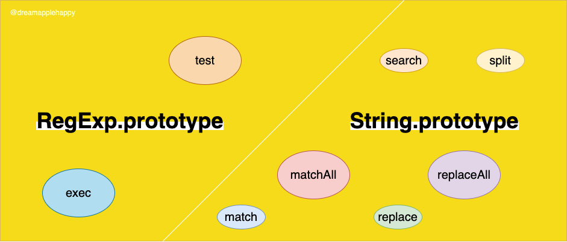

# 想要在JS中把正则玩得飘逸，学会这几个函数的使用必不可少



在之前的一系列文章中，我们讲解了很多关于正则表达式的知识。那么作为一个前端工程师，如果想要把这些知识应用到我们平时的开发中去的话，就需要知道在**JavaScript**中，能够使用正则的函数有哪些？然后它们各自的功能是什么？有哪些需要注意的地方？只有掌握好了每一个方法的使用场景，我们才可能在需要使用的时候能够很快的想起来使用哪个方法效率最高，效果最好。

这些确实是一些基础的知识，但是我相信应该有很多同学还没有系统的把这些知识学习一边。**相信我，如果你能够把这篇文章看完的话，你肯定可以学习到一些新的知识。知道每一个方法的用途，使用场景，学会在合适的场景选择合适的方法**。当然你还能够掌握这些方法需要注意的地方，以防在以后使用的时候陷入了困境。

文章中的代码示例如果没有特别说明的话，都是在`Chrome`浏览器中进行的。本篇文章的内容比较长，建议先收藏起来，可以以后慢慢细看。

在**JavaScript**中，能够使用正则表达式的函数有（排除了过时的方法）：
+ RegExp.prototype
  + [RegExp.prototype.test()](https://developer.mozilla.org/en-US/docs/Web/JavaScript/Reference/Global_Objects/RegExp/test)
  + [RegExp.prototype.exec()](https://developer.mozilla.org/en-US/docs/Web/JavaScript/Reference/Global_Objects/RegExp/exec)
+ String.prototype
  + [String.prototype.match()](https://developer.mozilla.org/en-US/docs/Web/JavaScript/Reference/Global_Objects/String/match)
  + [String.prototype.matchAll()](https://developer.mozilla.org/en-US/docs/Web/JavaScript/Reference/Global_Objects/String/matchAll)
  + [String.prototype.replace()](https://developer.mozilla.org/en-US/docs/Web/JavaScript/Reference/Global_Objects/String/replace)
  + [String.prototype.replaceAll()](https://developer.mozilla.org/en-US/docs/Web/JavaScript/Reference/Global_Objects/String/replaceAll)
  + [String.prototype.search()](https://developer.mozilla.org/en-US/docs/Web/JavaScript/Reference/Global_Objects/String/search)
  + [String.prototype.split()](https://developer.mozilla.org/en-US/docs/Web/JavaScript/Reference/Global_Objects/String/split)

## RegExp.prototype

首先我们要讲解的是**RegExp**对象上的两个方法

### RegExp.prototype.test()
+ **作用**：检测给定的字符串中是否有满足正则的匹配
+ **代码示例**：

简单的匹配，根据匹配的结果确定是否匹配成功。
  
```javascript
const reg = /\d{4}-\d{2}-\d{2}/;
const str1 = '2000-02-22';
const str2 = '20-20-20';
console.log(reg.test(str1)); // true
console.log(reg.test(str2)); // false
```

上面的正则表达式没有设置全局的标志符`g`，如果设置了全局的标志符的话，我们在使用这个方法的时候就要小心一些了。**因为如果正则表达式设置了全局的标识符`g`，那么对于同一个正则表达式来说，在运行`test`方法的时候，如果匹配成功的话，它会修改这个正则对象的`lastIndex`属性，可能会在下次匹配的时候导致一些问题，我们下面来看一个例子**。

```javascript
const reg = /abc/g;
const str1 = 'abcd';
const str2 = 'abcdabcd';

console.log(reg.lastIndex);  // 0
console.log(reg.test(str1));  // true
console.log(reg.lastIndex);  // 3
console.log(reg.test(str1));  // false

console.log(reg.lastIndex);  // 0
console.log(reg.test(str2));  // true
console.log(reg.lastIndex);  // 3
console.log(reg.test(str2));  // true
```

上面的例子很好地说明了这种情况，如果我们设置了全局标识符`g`的话，**只要我们当前的匹配是成功的，那么接下来如果再次使用同样的正则进行匹配的话就可能会出现问题，因为上一个成功的匹配导致正则表达式对象的`lastIndex`属性的值发生了变化，那么下次进行匹配的时候是从`lastIndex`位置开始的，所以就可能会出现一些问题**。

+ **注意事项**：如果在使用`test`方法的时候，需要注意正则表达式是否带有`g`标识符。如果这个正则表达式需要进行多次的匹配的话，最好不要设置`g`标识符。除非你知道自己确实需要这样做。

+ **使用场景**：

假如有这样一个需求，你需要判断用户输入的用户名是否满足需求，需求如下：**（1）用户名长度需要是8-16位。（2）用户名可以包含数字，字母（大小写都可以），下划线。（3）数字和字母是必须包含的**。

当然对于熟悉正则表达式的你来说，这不是一个问题，能用一行代码解决的问题绝不用两行代码去解决。你可以很快可以通过使用`test`方法来解决这个问题。

```javascript
const validNameRE = /^(?=_*(?:\d+_*[a-zA-Z]+|[a-zA-Z]+_*\d+))\w{8,16}$/;
// 假如这是用户输入的用户名
const userInputName = '1234567890';
// 检查用户输入的用户名是否合乎要求
const isValidName = validNameRE.test(userInputName); // false
```

在平时的开发中，**如果需要判断页面所处的宿主环境的话，我们也会使用`test`方法去判断当前页面所处的环境**。例如，你需要判断当前页面所处的环境是不是`iPhone`的话，你可能会写出这样的判断：

```javascript
const iPhoneReg = /iPhone/;
console.log(iPhoneReg.test(navigator.userAgent));  // true
```

### RegExp.prototype.exec()

+ **作用**：这个方法是比较常用的一个方法，**在给定的字符串中进行匹配，返回一个匹配的结果数组或者`null`**。通常情况下我们会使用这个方法来提取字符串中符合匹配的一些字符串。

+ **代码示例**：

**需要注意的是，如果没有符合的匹配，返回的结果是`null`，而不是一个空数组`[]`**。所以当我们需要判断是否有匹配的结果的时候，不能凭感觉觉得返回的是值是一个空的数组`[]`。

```javascript
const reg1 = /(\d{2}):(\d{2}):(\d{2})/;
const str1 = 'Sat Aug 22 2020 17:31:55 GMT+0800 (中国标准时间)';
const str2 = 'Sat Aug 22 2020';

console.log(reg1.exec(str1));  // ["17:31:55", "17", "31", "55", index: 16, input: "Sat Aug 22 2020 17:31:55 GMT+0800 (中国标准时间)", groups: undefined]
console.log(reg1.exec(str2));  // null
```

从上面的代码中我们可以看到，**如果没有匹配结果的话，返回的结果是`null`。如果能够匹配成功的话，返回的结果是一个数组**。在这个结果数组中，第`0`项表示正则表达式匹配的内容。其中第`1..n`项表示的是正则表达式中括号的捕获内容，对于上面的示例来说，第`1..3`项表示的是捕获时间的时分秒。数组还有额外的属性`index`和`input`，其中`index`表示正则表达式匹配到的字符串在原字符串中的位置。`input`表示原始待匹配的字符串。

+ **注意事项**：
  + 注意正则表达式是否设置了`g`标识符，如果设置了`g`标识符，那么我们可以使用这个正则表达式进行全局的搜索。可以看下面的代码示例。
  
  ```javascript
  const reg = /\d/g;
  const str = '654321';
  let result;
  while ((result = reg.exec(str))) {
    console.log(
      `本次匹配到的数字是：${result[0]}, 正则表达式的 lastIndex 的值是：${
        reg.lastIndex
      }`
    );
  }
  ```
  
  输出的结果如下：
  
  ```
  本次匹配到的数字是：6, 正则表达式的 lastIndex 的值是：1
  本次匹配到的数字是：5, 正则表达式的 lastIndex 的值是：2
  本次匹配到的数字是：4, 正则表达式的 lastIndex 的值是：3
  本次匹配到的数字是：3, 正则表达式的 lastIndex 的值是：4
  本次匹配到的数字是：2, 正则表达式的 lastIndex 的值是：5
  本次匹配到的数字是：1, 正则表达式的 lastIndex 的值是：6
  ```
  
  **需要注意的是，如果上面匹配的正则表达式没有设置`g`标识符，或者在`while`循环的条件判断中使用的是正则表达式的字面量的话，都会造成“死循环”。因为那样的话，每次循环开始的时候，正则表达式的`lastIndex`属性都会是`0`，导致`result`一直都是有值的，所以就导致了“死循环”。所以我们在`while`循环中使用`exec`方法的时候一定要小心一些**。

+ **使用场景**：这个方法主要用来在原始文本中提取一些我们想要的关键信息，所以只要是这样的一个需求场景，都可以使用正则表达式的`exec`方法去处理。比如：
  + **对用户输入内容中的链接进行自动识别**，然后对相应的链接内容进行样式和功能上的处理。
  + **可以提取url中的查询参数**，如果我们需要自己把url中的查询参数提取出来的话，使用`exec`方法也是一个选择。
  + 如果你阅读过vue的源码的话，**在编译模块中的[文本解析](https://github.com/vuejs/vue/blob/8f04135dbaa5f5f0500d42c0968beba8043f5363/src/compiler/parser/text-parser.js#L32)使用到了`exec`方法**，有兴趣的话大家可以看一看相关的代码实现。
  
  当然还有很多的场景可以使用`exec`方法去处理的，大家在平时的开发中有没有使用过`exec`方法处理一些问题呢？可以在下面留言，我们大家一起讨论一下，加深一下对这个方法的理解。
  
## String.prototype

接下来我们来讲解一下`String.prototype`上面有关正则的一些方法。

### String.prototype.match()

+ **作用**：这个方法返回字符串匹配正则表达式的结果。

+ **代码示例**：

```javascript
const reg = /\d/;
const str = 'abc123';
console.log(str.match(reg));  // ["1", index: 3, input: "abc123", groups: undefined]
```

+ **注意事项**：

  + 没有匹配到结果的返回结果是`null`。
  
  ```javascript
  const reg = /\d/;
  const str = 'abc';
  console.log(str.match(reg));  // null
  ```
  
  + 是否设置了`g`标识符，如果没有设置`g`的话，`match`的返回结果跟对应的`exec`的返回结果是一样的。如果设置了`g`标识符的话，返回的结果是与正则表达式相匹配的结果的集合。
  
  ```javascript
  const reg = /\d/g;
  const str = 'abc123';
  console.log(str.match(reg));  // ["1", "2", "3"]
  ```
  
  + 如果`match`方法没有传递参数的话，返回的结果是`['']`，一个包含空字符串的数组。
  
  ```javascript
  const str = 'abc123';
  console.log(str.match());  // ["", index: 0, input: "abc123", groups: undefined]
  ```
  
  + 如果`match`方法传递的参数是一个字符串或者数字的话，会在内部隐式调用`new RegExp(regex)`，将传入的参数转变为一个正则表达式。
  
  ```javascript
  const str = 'abc123';
  console.log(str.match('b'));  // ["b", index: 1, input: "abc123", groups: undefined]
  ```

+ **使用场景**：

  简单获取url中的查询参数：
  
  ```javascript
  const query = {};
  // 首先使用带有g标识符的正则，表示全局查找
  const kv = location.search.match(/\w*=\w*/g);
  if (kv) {
    kv.forEach(v => {
        // 使用不带g标识符的正则，需要获取括号中的捕获内容
      const q = v.match(/(\w*)=(\w*)/);
      query[q[1]] = q[2];
    });
  }
  ```
  
### String.prototype.matchAll()

+ **作用**：这个方法返回一个包含所有匹配正则表达式以及正则表达式中括号的捕获内容的迭代器。需要注意的是这个方法存在兼容性，具体内容可以查看[String.prototype.matchAll](https://developer.mozilla.org/en-US/docs/Web/JavaScript/Reference/Global_Objects/String/matchAll)。

+ **代码示例**：

```javascript
const reg = /(\w*)=(\w*)/g;
const str = 'a=1,b=2,c=3';
console.log([...str.matchAll(reg)]);
```


+ **注意事项**：

  + 跟`match`方法相同的地方是，如果传递给`matchAll`方法的参数不是一个正则表达式的话，那么会隐式调用`new RegExp(obj)`将其转换为一个正则表达式对象。
  
  + 传递给`matchAll`的正则表达式需要是设置了`g`标识符的，如果没有设置`g`标识符，那么就会抛出一个错误。
  
  ```javascript
  const reg = /(\w*)=(\w*)/;
  const str = 'a=1,b=2,c=3';
  console.log([...str.matchAll(reg)]);  // Uncaught TypeError: String.prototype.matchAll called with a non-global RegExp argument
  ```
  
  + 在可以使用`matchAll`的情况下，使用`matchAll`比使用`exec`方法更便捷一些。因为在全局需要匹配的情况下，使用`exec`方法需要配合循环来使用，但是使用`matchAll`就可以不使用循环。
  
  + `matchAll`方法在字符串执行匹配的过程中，正则表达式的`lastIndex`属性不会更新。更多详情可以参考[String.prototype.matchAll()](https://developer.mozilla.org/en-US/docs/Web/JavaScript/Reference/Global_Objects/String/matchAll)。

+ **使用场景**：

还是以上面的获取url中的查询参数这个小功能来实践一下：

```javascript
const query = {};
const kvs = location.search.matchAll(/(\w*)=(\w*)/g);
if (kvs) {
	for (let kv of kvs) {
		query[kv[1]] = kv[2];
	}
}
console.log(query);
```

### String.prototype.replace()

+ **作用**：这个方法在平时的开发中应该比较常用，那么它的作用就是使用**替换物**`replacement`替换原字符串中符合某种**模式**`pattern`的字符串。其中**替换物**可以是一个字符串，或者返回值是字符串的函数；**模式**可以是正则表达式或者字符串。

+ **代码示例**：

  因为这个函数的入参可以是不同的类型，所以对每种类型的入参我们都来实践一下吧。

  + **`pattern`是字符串，`replacement`也是字符串**。这种形式在平时的开发中使用的比较多。
  
  ```javascript
  const pattern = 'a';
  const replacement = 'A';
  const str = 'aBCD';
  console.log(str.replace(pattern, replacement));  // ABCD
  ```
  
  + **`pattern`是正则表达式，`replacement`是字符串**。
  
  ```javascript
  const pattern = /__(\d)__/;
  const replacement = "--$$--$&--$`--$'--$1--";
  const str = 'aaa__1__bbb';
  console.log(str.replace(pattern, replacement));  // aaa--$--__1__--aaa--bbb--1--bbb
  ```
  
  如果`replacement`是字符串，那么在这个字符串中可以使用一些特殊的变量，具体可参考[Specifying a string as a parameter](https://developer.mozilla.org/en-US/docs/Web/JavaScript/Reference/Global_Objects/String/replace#Specifying_a_string_as_a_parameter)。
  
  + **`pattern`是正则表达式，`replacement`是函数**。
  
  ```javascript
  const pattern = /__(?<number>\d)__/;
  const replacement = function(match, p1, offset, str, groups) {
    console.log(`匹配到的字符串是：${match}\n捕获到的内容是：${p1}\n匹配的位置是：${offset}\n原始待匹配的字符串是：${str}\n命名的捕获内容是：${JSON.stringify(groups)}`);
    return '======';
  };
  const str = 'aaa__1__bbb';
  console.log(str.replace(pattern, replacement)); // aaa======bbb
  ```
  
  其中控制台的输出如下所示：
  
  ```javascript
  匹配到的字符串是：__1__
  捕获到的内容是：1
  匹配的位置是：3
  原始待匹配的字符串是：aaa__1__bbb
  命名的捕获内容是：{"number":"1"}
  ```
  
  如果你对`replacement`是函数这种情况不是很了解的话可以看看[Specifying a function as a parameter](https://developer.mozilla.org/en-US/docs/Web/JavaScript/Reference/Global_Objects/String/replace#Specifying_a_function_as_a_parameter)，里面会有详细的解释，这里就不在具体解释了。

+ **注意事项**：

  需要注意的地方就是当我们的`pattern`是正则表达式的时候，要注意是否设置了`g`标识符，因为如果没有设置`g`标识符的话，只会进行一次匹配。设置了`g`标识符的话，会进行全局的匹配。

+ **使用场景**：

  对于前端来说，对用户的输入进行校验时很常见的需求。假如我们有一个输入框，只允许用户输入数字，我们可以这样处理：
  
  ```javascript
  const reg = /\D/g;
  const str = 'abc123';
  console.log(str.replace(reg, ''));  // 123
  ```

  这样就能够保证用户的输入只有数字了。
  
### String.prototype.replaceAll()

> As of August 2020 the replaceAll() method is supported by Firefox but not by Chrome. It will become available in Chrome 85.

这个方法和`replace`方法的作用差不多，从名字上就能够知道`replaceAll`是全局的替换。因为这个方法的兼容性问题，我们需要在`Firefox`浏览器上进行试验。

```javascript
const pattern = 'a';
const replacement = 'A';
const str = 'aBCDa';
console.log(str.replace(pattern, replacement));  // ABCDa
console.log(str.replaceAll(pattern, replacement));  // ABCDA
```

+ **注意事项**：如果给函数传递的`pattern`参数是个正则表达式的话，这个正则表达式必须设置了`g`标识符，不然会抛出一个错误。

```javascript
const pattern = /a/;
const replacement = 'A';
const str = 'aBCDa';
console.log(str.replace(pattern, replacement));  // ABCDa
console.log(str.replaceAll(pattern, replacement));  // Uncaught TypeError: replaceAll must be called with a global RegExp
```

### String.prototype.search()

+ **作用**：这个方法用来在字符串中寻找是否含有特定模式的匹配，如果找到对应的模式，返回匹配开始的下标；没有找到的话返回`-1`。

+ **代码示例**：

```javascript
const reg = /\d/;
const str1 = '123';
const str2 = 'abc';
console.log(str1.search(reg));  // 0
console.log(str2.search(reg));  // -1
```

+ **注意事项**：

  + 如果传入的参数不是一个正则表达式的话，会隐式的调用`new RegExp(regexp)`将其转换为一个正则表达式。
  
  + 没有找到相应匹配的时候，返回的值是`-1`；所以大家在使用这个方法做判断的时候要注意，只有返回值是`-1`的时候，才表示没有找到相应的匹配。

+ **使用场景**：

如果你需要找到特定匹配在字符串中的位置的话，那么可以使用`search`方法。

```javascript
const reg = /\d/;
const str = 'abc6def';
console.log(str.search(reg));  // 3
```

### String.prototype.split()

+ **作用**：将一个字符串按照分割器进行分割，将分割后的字符串片段组成一个新的数组，其中**分割器**`separator`可以是一个字符串或者一个正则表达式。

+ **代码示例**：

  + **分割器**`separator`是字符串：
  
  ```javascript
  const str = 'hello, world!';
  console.log(str.split(''));  // ["h", "e", "l", "l", "o", ",", " ", "w", "o", "r", "l", "d", "!"]
  ```
  
  + **分割器**`separator`是正则表达式：

  ```javascript
  const str = 'abc1abc2abc3';
  const separator = /\w(?=\d)/;
  console.log(str.split(separator));  // ["ab", "1ab", "2ab", "3"]
  ```

+ **注意事项**：

  + 如果`split`方法没有传递参数的话，会返回一个包含原字符串的数组：
  
  ```javascript
  const str = 'hello, world!';
  console.log(str.split());  // ["hello, world!"]
  ```
  
  + 因为`JavaScript`的字符串是使用`UTF-16`进行编码的，该编码使用一个16比特的编码单元来表示大部分常见的字符，使用两个编码单元表示不常用的字符。所以对于一些不常用的字符来说，在使用`split`方法进行字符串分割的时候可能会出现一些问题：
  
  ```javascript
  const str = '😀😃😄😁😆😅';
  console.log(str.split(''));  // ["�", "�", "�", "�", "�", "�", "�", "�", "�", "�", "�", "�"]
  ```
  
  如何解决这种类型的问题呢？第一种方法是使用数组的扩展运算符：
  
  ```javascript
  const str = '😀😃😄😁😆😅';
  console.log([...str]);  // ["😀", "😃", "😄", "😁", "😆", "😅"]
  ```
  
  第二种方法是使用设置了`u`标识符的正则表达式：
  
  ```javascript
  const str = '😀😃😄😁😆😅';
  const separator = /(?=[\s\S])/u;
  console.log(str.split(separator)); // ["😀", "😃", "😄", "😁", "😆", "😅"]
  ```
  
  + 如果传入的正则表达参数中含有捕获的括号，那么捕获的内容也会包含在返回的数组中：
  
  ```javascript
  const str = 'abc1abc2abc3';
  const separator = /(\w)(?=\d)/;
  console.log(str.split(separator));  // ["ab", "c", "1ab", "c", "2ab", "c", "3"]
  ```
  
  + `split`方法还可以传入第二个参数，用来控制返回的数组的长度：
  
  ```javascript
  const str = 'hello, world!';
  console.log(str.split('', 3));  // ["h", "e", "l"]
  ```
  
+ **使用场景**：

在实际的开发中，最常用的场景就是将一个字符串转换为一个数组了：

```javascript
const str = 'a/b/c/d/e';
console.log(str.split('/')); // ["a", "b", "c", "d", "e"]
```

## 总结

当我们能够把上面的这些方法都熟练的掌握之后，那么在实际的开发中再结合正则表达式来使用的话，那简直就是如虎添翼，能够在一些场景下提高我们开发的效率。

**当然光靠看看文章是不能够很好地将这些知识点都记牢固的，你需要的是一个一个的实践一下，这样才能够加深自己的记忆，才能够记得更牢固**。

如果大家还想了解更多关于正则表达式的知识点的话，可以看看我之前写的一系列的文章：

+ [正则表达式匹配素数的原理讲解](https://mp.weixin.qq.com/s/cKOkAVcMThmgldI3gJzMbA)
+ [距离弄懂正则的环视，你只差这一篇文章](https://mp.weixin.qq.com/s/VqiZ6fVL20sJ8NUoQJjm2g)
+ [正则表达式量词匹配方式的讲解（上篇）](https://mp.weixin.qq.com/s/AxTuXvKINhX6qLzj6Q9UJw)
+ [想写出效率更高的正则表达式？试试固化分组和占有优先匹配吧](https://mp.weixin.qq.com/s/ezul6Dg4f6_WLHXAkEgd6g)

如果你对本篇文章有什么意见和建议，都可以直接在文章下面留言，也可以在[这里](https://github.com/dreamapplehappy/blog/issues/12)提出来。也欢迎大家关注我的公众号[关山不难越](https://user-gold-cdn.xitu.io/2020/6/25/172eadef8b5f38bc?imageView2/0/w/1280/h/960/format/webp/ignore-error/1)，学习更多实用的前端知识，让我们一起努力进步吧。
