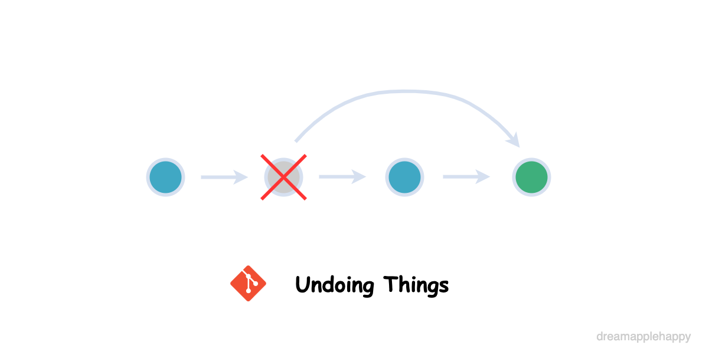

# 糟糕，在错误的分支开发了新功能，该怎么处理呢？

最近在开发项目的一个小需求的时候，发生了一件尴尬的事情。那就是当我把新功能开发完成的时候，忽然发现自己开发使用的分支是错误的分支。不过我记得之前学习`git`的时候有一个`git stash`的命令**可以把当前没有提交的内容存档起来，然后可以在切换分支之后把当前的存档应用到目标分支**。不过因为平时不怎么使用这个命令，所以有点生疏了，需要再次去看看文档。

花了十几分钟，把`git stash`相关的命令又再次温习了一下，接着就顺利地把这个问题给解决掉。因为平时的开发也都是遵循相关的`git`流程，一般不会出现什么错误，而且平时使用的`git`命令也都是一些常用的。这次出现这个问题**有一部分原因是因为这个项目不是一个长期维护的项目，当开发新功能的时候，一打开项目，就以为还在自己的开发分支。也没及时检查一下开发的分支是否正确。更深层次的原因还是因为`git`掌握得不够好。也正好借这个机会，把相关的命令再次好好复习一下，也挺好的**。

其实当你在错误的分支开发了新功能之后，这里会有三种情况：

+ **新功能还没有在本地进行`commit`（提交），也就是我这次遇到的情况**

+ **新功能已经在本地提交了，但是还没有`push`到远程仓库**

+ **新功能已经在本地提交了，且`push`到了远程仓库**

虽然我遇到的是第一种情况，那么当我解决这个问题之后，我很自然的就会想：**如果遇到了另外两种情况我该怎么处理呢？这篇文章就跟大家一起探讨一下针对上述三种情况下，如果你在错误的分支开发了新功能，我们应该怎么做。**

## 新功能还没有在本地进行`commit`（提交）

在这种情况下我们可以在当前分支下使用：

```
git stash
```

这个命令表示**把我们当前修改的内容暂存起来，然后我们的工作区就恢复到在没有开发新功能之前的样子。**

这个时候我们需要切换到正确的工作分支，然后运行命令：

```
git stash apply
```

**这个命令表示把我们之前暂存的内容，应用到当前分支**。这样我们就相当于把修改的内容从一个分支移动到了另一个分支，是不是很简单呢。

上面那两个命令也是我解决这个问题中使用的命令。我觉得不能满足于只解决这个问题，我需要详细的了解一下有关`git stash`的命令，接下来的内容是关于`git stash`的一些深入的内容，**我们不仅要知其然，还要知其所以然。**

首先我们需要知道使用`git stash`命令会把我们工作区和暂存区的修改保存下来，然后将这些修改的内容从当前的文件中移出并保存在存档库里面。所以我们就回到了之前没有修改过内容的干净的工作区。

`git stash`在没有添加任何参数的时候相当于`git stash push`命令，我们使用`git stash`创建一个当前修改的快照的时候，命令运行完会给出如下的信息：

```
Saved working directory and index state WIP on <branchname>: <hash> <commit message>
```

其中`branchname`是你当前所在分支的名字，`hash`是当前分支最近一次提交的hash值，`commit message`就是你最近的一次提交的时候添加的提交信息。

**对于当前只想存储一个快照的情况下使用`git stash`是比较方便直观的，如果你在当前分支想存储多个快照，那么最好给每一个快照添加一些解释信息，以便使用的时候能够知道每一个快照都是干嘛的。**

我们可以使用`git stash push -m message`来给每一个快照添加详细的说明信息，比如：

```
git stash push -m “add feature 1”
```

在这个命令行运行完成之后，在终端上会显示如下的信息：

```
Saved working directory and index state On <branchname>: add feature 1
```

根据终端显示的信息，我们可以知道当前这个快照是在那个分支产生的，并且有了`add feature 1`这个详细的描述，等到以后使用的时候会更加的清楚一点。

当我们有了很多快照的时候，我们可能想看一下当前的快照列表。这个时候我们可以**使用`git stash list`来看一下当前的快照列表**。在终端运行`git stash list`后，如果你在之前添加了一些快照的话，会显示如下的一些信息：

```
stash@{0}: On <branchname>: add feature 1
stash@{1}: On <branchname>: add feature 0
stash@{2}: On <branchname>: <message>
stash@{3}: WIP on <branchname>: 47e52ae <commit message>
stash@{4}: On <branchname>: <message>
```

从上面的信息中我们可以知道最新的快照是排在最上面的，存储快照的是一个栈，所以最新添加的快照是放在最上面的。

**如果我们想查看最近一次快照跟生成快照当时已提交的文件之间的变化情况的话，可以使用命令`git stash show`。这个命令默认展示的是文件的差别统计。如果想展示具体改动的内容的话，可以使用`git stash show -p`**。

因为我们有不止一个快照，所以我们还想要看之前的快照跟产生这个快照当时已提交的版本之间的差异的话，我们可以在上面的命令后面添加快照的索引，比如如果你想看上面`add feature 0`这个快照的文件变动的话，可以使用下面的命令：

```
git stash show stash@{1} # 简略的信息
git stash show -p stash@{1} # 详细的内容更改
```

接下来就到了应用（恢复）快照的时候了，如果这时候你想把某个快照的内容应用于当前的分支的话，只需要运行明令：

```
git stash apply # 将最新的快照内容应用于当前分支
git stash apply stash@{n} # n表示具体的快照索引
```

**这样就可以把之前保留的快照内容应用到当前的版本中了，在应用快照的过程中可能会产生冲突，这时候需要手动把冲突的内容处理一下，然后再次提交就可以了。**

`git stash apply`可以添加`--index`参数，这个参数的作用是在应用快照的时候，会把之前已经添加到暂存区（索引区）的更改依旧保存在暂存区，如果不添加这个参数的话，所有的变更都会变成在工作区的变更（也就是没有保存在索引区的状态）。

我们可以测试一下，对一个文件进行更改，然后把更改添加（使用`git add`）到暂存区，然后再次添加一个更改，这次不添加到暂存区。我们运行`git status`命令会看到如下的内容：

```
On branch dev
Changes to be committed:
  (use "git reset HEAD <file>..." to unstage)

        modified:   20200830/index.html

Changes not staged for commit:
  (use "git add <file>..." to update what will be committed)
  (use "git checkout -- <file>..." to discard changes in working directory)

        modified:   20200830/README.md

```

当我们运行`git stash`命令，然后运行`git stash apply`命令之后，会看到如下信息：

```
On branch dev
Changes not staged for commit:
  (use "git add <file>..." to update what will be committed)
  (use "git checkout -- <file>..." to discard changes in working directory)

        modified:   20200830/README.md
        modified:   20200830/index.html

no changes added to commit (use "git add" and/or "git commit -a")

```

所以当不使用`--index`参数的时候，不会保存之前在暂存区的状态。

关于`git stash`还有一些其它的命令，比如：

+ `git stash drop`：丢弃一个快照
+ `git stash pop`：应用最新的快照到当前分支，如果应用成功的话就把这个快照从存储快照的栈中移除
+ `git stash clear`：清除所有的快照

关于`git stash`一些常用的命令和操作上面已经讲解的差不多啦，如果大家想继续了解更多的话，可以参考[git-stash](https://git-scm.com/docs/git-stash)。

上面的内容主要是在我们新开发的功能还没有提交的情况下所做的一些处理，当我们开发的新功能已经在本地提交了的情况下，我们该如何处理呢？接下来我们就来探讨一下这个问题。

## 新功能已经在本地提交了，但是还没有`push`到远程仓库

如果新开发的功能已经在本地提交了，但是我们开发的这个分支是一个错误的分支。这个时候根据情况的不同，可以有两种处理的方式。

### 新的功能需要添加在一个新的分支

首先我们需要知道在我们添加新功能之前，当前分支处于哪一个提交。可以运行命令：

```
git log --oneline
```

查看当前分支的提交，可以看到有以下内容的输出：

```
085095f (HEAD -> master) update 5
47e52ae update 3
14fefac update 2
fd01444 add README.md
3c76ad1 init
```

找到我们添加新功能时，当前分支所处的提交。假如是`fd01444`，那么我们接下来要做的操作就是将`HEAD`指针指向`fd01444`，也就是把我们当前分支已提交的内容重置到我们开发新功能之前的样子。我们需要运行下面的命令：

```
git reset fd01444 # fd01444是某次提交的hash值
```

如果没有指明重置的模式的话，默认会使用`--mixed`模式，这样的话我们在`fd01444`这次提交之后的所有提交都会被重置为没有提交的状态。接下来我们需要把这些新开发的功能迁移到一个新的分支。这时候我们可以使用下面的命令进行操作：

```
git checkout -b <newbranch>
```

这样我们就创建了一个新的分支，并且把新添加的功能也都迁移了过去，接下来就是常规的添加和提交操作了。

### 新功能需要添加在另一个分支上

如果我们需要把当前添加的新功能迁移到另一个已经存在的分支，那么我们需要做的前几个步骤跟上面的操作是一样的：

```
git log --oneline # 查找新功能开发之前的提交
git reset <commit hash> # 将当前分支重置到新功能开发之前的提交
```

接下来我们现在的状态就回到了**新功能还没有提交的状态**，那么就可以继续使用`git stash`相关的命令去操作了。

我们还有另外一个方法也能够将已提交到当前分支的功能添加到另一个分支上，那就是使用`git cherry-pick`命令。首先我们还是先用`git log --oneline`查找当前已提交的功能的hash值，然后切换到目标分支，运行命令：

```
git cherry-pick <commit hash>
```

这样就把我们在另一个分支开发的功能，添加到我们想要的分支了。如果有冲突的话，需要手动处理一下冲突。然后我们回到最初的分支，再次运行`git reset <commit hash>`命令，把已提交的内容进行重置，然后运行命令：

```
git checkout -- .
```

把当前分支没有添加到暂存区的内容都清除掉，这样也可以达到我们上面所说的，把新功能添加到另一个分支的目的。


## 新功能已经在本地提交了，且`push`到了远程仓库

第三种情况就是，我们已经把新开发的功能`push`到远程的仓库了，但是我们忽然发现新功能不应该在这个分支开发，我们这个时候应该怎么办呢？

**首先我们应该保持当前的工作区是没有修改的，是一个干净的状态。不然使用撤销命令的时候会提示你需要把当前的文件内容变更先提交或者生成快照**。当我们的工作区的状态是干净的时候，我们就可以进行撤销操作了。

首先需要知道我们应该撤销那一次提交的状态。使用`git log --oneline`查看要撤销的提交的索引，然后运行下面的命令：

```
git revert <commit>
```

这个时候命令运行的终端会进入编辑器模式，让你填写提交的信息。当然你也可以使用参数`--no-edit`这样就不会在进行撤销操作的时候打开编辑模式了。

**如果需要撤销的提交比较多的话，我们可以使用`..`表示一个提交记录的范围。比如`c1..c2`就表示`c2`的可达提交，且排除`c1`的可达提交**。所谓**可达的提交**指的是：**提交本身及其祖先链中提交的集合**。

我们可以举个例子：

```
... a - b - c - d - HEAD
```

如果上面表示的是某个分支的提交记录，那么对于`b..d`表示的就是`c d`这两个提交，对于`a..d`表示的就是`b c d`这三个提交。如果大家想了解更多相关的内容，可以在[git-rev-list](https://git-scm.com/docs/git-rev-list)这里深入的学习一下。

所以我们如果想快速的撤销一段范围的提交的话，可以运行类似下面这样的命令：

```
git revert 54dc134..a72d612 --no-edit
```

上述命令的`54dc134`就表示`c1`，`a72d612`就表示`c2`，`--no-edit`表明我们在运行撤销操作的时候不打开编辑模式。

**我们如果需要对远程的分支进行撤销的话，首先考虑的就是使用`git revert`命令，因为`git revert`命令不会修改历史的提交记录，只是在原来的提交基础上添加新的提交，所以不会造成代码的丢失。在多人合作的情况下使用`git revert`命令撤销`push`到远程的操作还是很有必要的。**

如果大家对于上面的这些问题有更好的解决方案的话，欢迎大家在文章下面留言，我们可以一起探讨一下，一起进步。如果你对文章有什么意见和建议的话也欢迎在文章下面留言，或者在[这里](https://github.com/dreamapplehappy/blog/issues/13)提出来，我会持续努力改进的。也欢迎大家关注我的公众号**关山不难越**，及时获取最新的文章更新。

参考链接：

+ [Undoing Commits & Changes](https://www.atlassian.com/git/tutorials/undoing-changes)
+ [git-revert - Revert some existing commits](https://git-scm.com/docs/git-revert)
+ [How to revert multiple git commits?](https://stackoverflow.com/questions/1463340/how-to-revert-multiple-git-commits)
+ [Git - how to revert multiple recent commits](http://serebrov.github.io/html/2014-01-04-git-revert-multiple-recent-comments.html)
