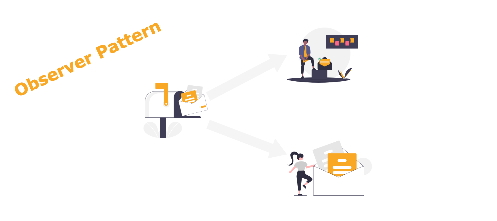
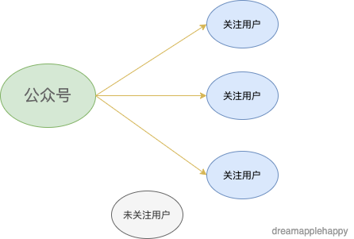
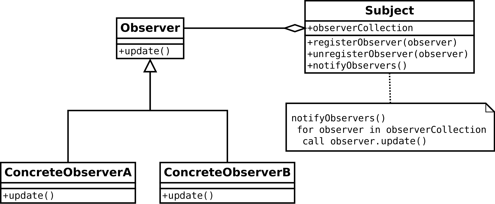

# 设计模式大冒险第一关：观察者模式



最近把之前学习过的这些设计模式又再次温习了一下，觉得还是有很多收获的。确实有了**温故知新**的感觉，所以准备在每个设计模式复习完之后都能够写一篇关于这个设计模式的文章，这样会让自己能够加深对这个设计模式的理解；也能够跟大家一起来探讨一下。

今天我们来一起学习一下**观察者模式**，刚开始我们不需要知道观察者模式的定义是什么，这些我们到后面再去了解。我想先带着大家从生活中的一个小事例开始。**从生活中熟悉的事情入手，会让我们更快速的理解这个模式的用途**。

## 生活中的小例子

相信大家都关注过一些公众号，**那么对于一个公众号来说，如果有新的文章发布的话；那么所有关注这个公众号的用户都会收到更新的通知，如果一个用户没有关注或者关注后又取消了关注，那么这个用户就不会收到该公众号更新的通知**。相信这个场景大家都很熟悉吧。那么如果我们把这个过程抽象出来，用代码来实现的话，你会怎么处理呢？不妨现在停下来思考一下。

通过上面的描述，我们知道这是一个**一对多的关系**。也就是一个公众号对应着许多关注这个公众号的用户。



那么对于这个公众号来说，**它的内部需要有一个列表记录着关注这个公众号的用户**，一旦公众号有了新的内容。那么对于公众号来说，**它会遍历这个列表。然后给列表中的每一个用户发送一个内容跟新的通知**。我们可以通过代码来表示这个过程：

```javascript
// 用户
const user = {
	update() {
		console.log('公众号更新了新的内容');
	},
};

// 公众号
const officialAccount = {
    // 关注当前公众号的用户列表
	followList: [user],
    // 公众号更新时候调用的通知函数
	notify() {
		const len = this.followList.length;
		if (len > 0) {
		    // 通知已关注该公众号的每个用户，有内容更新
			for (let user of this.followList) {
				user.update();
			}
		}
	},
};

// 公众号有新内容更新
officialAccount.notify();
```

运行的结果如下：

```
公众号更新了新的内容
```

上面的代码能够简单的表示，当公众号的内容发生了更新的时候，去通知关注该公众号的用户的过程。但是这个实现是很简陋的，还缺少一些内容。我们接下来把这些缺少的过程补充完整。**对于公众号来说，还需要可以添加新的关注的用户，移除不再关注的用户，获取关注公众号的用户总数等**。我们来实现一下上面的过程：

```javascript
// 公众号
const officialAccount = {
	// 关注当前公众号的用户列表
	followList: [],
	// 公众号更新时候调用的通知函数
	notify() {
		const len = this.followList.length;
		if (len > 0) {
			// 通知已关注该公众号的每个用户，有内容更新
			for (let user of this.followList) {
				user.update();
			}
		}
	},
	// 添加新的关注的用户
	add(user) {
		this.followList.push(user);
	},
	// 移除不再关注的用户
	remove(user) {
		const idx = this.followList.indexOf(user);
		if (idx !== -1) {
			this.followList.splice(idx, 1);
		}
	},
	// 计算关注公众号的总的用户数
	count() {
		return this.followList.length;
	},
};

// 新建用户的类
class User {
	constructor(name) {
		this.name = name;
	}
	// 接收公众号内容更新的通知
	update() {
		console.log(`${this.name}接收到了公众号的内容更新`);
	}
}

// 创建两个新的用户
const zhangSan = new User('张三');
const liSi = new User('李四');

// 公众号添加关注的用户
officialAccount.add(zhangSan);
officialAccount.add(liSi);

// 公众号有新内容更新
officialAccount.notify();
console.log(`当前关注公众号的用户数量是：${officialAccount.count()}`);

// 张三不再关注公众号
officialAccount.remove(zhangSan);

// 公众号有新内容更新
officialAccount.notify();
console.log(`当前关注公众号的用户数量是：${officialAccount.count()}`);
```

输出的结果如下：

```
张三接收到了公众号的内容更新
李四接收到了公众号的内容更新
当前关注公众号的用户数量是：2
李四接收到了公众号的内容更新
当前关注公众号的用户数量是：1
```

上面的代码完善了关注和取消关注的过程，并且可以获取当前公众号的关注人数。我们还实现了一个用户类，能够让我们快速创建需要添加到公众号关注列表的用户。当然你也可以把公众号的实现通过一个类来完成，这里就不再展示实现的过程了。

通过上面这个简单的例子，你是不是有所感悟，有了一些新的收获？**我们上面实现的其实就是一个简单的观察者模式**。接下来我们来聊一聊观察者模式的定义，以及一些在实际开发中的用途。

## 观察者模式的定义

**所谓的观察者模式指的是一种一对多的关系，我们把其中的`一`叫做`Subject`（类比上文中的公众号），把其中的`多`叫做`Observer`（类比上文中关注公众号的用户），也就是观察者。因为多个`Observer`的变动依赖`Subject`的状态更新，所以`Subject`在内部维护了一个`Observer`的列表，一旦`Subject`的状态有更新，就会遍历这个列表，通知列表中每一个`Observer`进行相应的更新。因为有了这个列表，`Subject`就可以对这个列表进行增删改查的操作。也就实现了`Observer`对`Subject`依赖的更新和解绑**。

我们来看一下观察者模式的`UML`图：



从上图我们这可以看到，对于`Subject`来说，它自身需要维护一个`observerCollection`，这个列表里面就是`Observer`的实例。然后在`Subject`内部实现了增加观察者，移除观察者，和通知观察者的方法。其中通知观察者的方式就是遍历`observerCollection`列表，依次调用列表中每一个`observer`的`update`方法。

到这里为止，你现在已经对这个设计模式有了一些了解。那我们学习这个设计模式有什么作用呢？**首先如果我们在开发中遇到这种类似上面的一对多的关系，并且`多`的状态更新依赖`一`的状态；那么我们就可以使用这种设计模式去解决这种问题。而且我们也可以使用这种模式解耦我们的代码，让我们的代码更好拓展与维护**。

当然一些同学会觉得自己在平时的开发中好像没怎么使用过这种设计模式，那是因为我们平时在开发中一般都会使用一些框架，比如`Vue`或者`React`等，**这个设计模式已经被这些框架在内部实现好了。我们可以直接使用，所以我们对这个设计模式的感知会少一些**。

## 实战：实现一个简单的TODO小应用

我们可以使用观察者模式实现一个小应用，这个应用很简单，就是能够让用户添加自己的待办，并且需要显示已添加的待办事项的数量。

了解了需求之后，我们需要确定那些是`一`，哪些是`多`。当然我们知道整个TODO的`状态`就是我们所说的`一`，那么对于`待办列表的展示`以及`待办列表的计数`就是我们所说的`多`。理清了思路之后，实现这个小应用就变得很简单了。

可以在[这里]()提前体验一下这个简单的小应用。

首先我们需要先实现观察者模式中的`Subject`和`Observer`类，代码如下所示。

`Subject`类：

```javascript
// Subject
class Subject {
	constructor() {
		this.observerCollection = [];
	}
	// 添加观察者
	registerObserver(observer) {
		this.observerCollection.push(observer);
	}
	// 移除观察者
	unregisterObserver(observer) {
		const observerIndex = this.observerCollection.indexOf(observer);
		this.observerCollection.splice(observerIndex, 1);
	}
	// 通知观察者
	notifyObservers(subject) {
		const collection = this.observerCollection;
		const len = collection.length;
		if (len > 0) {
			for (let observer of collection) {
				observer.update(subject);
			}
		}
	}
}
```

`Observer`类：

```javascript
// 观察者
class Observer {
	update() {}
}
```

那么接下来的代码就是关于上面待办的具体实现了，代码中也添加了相应的注释，我们来看一下。

待办应用的逻辑部分：

```javascript
// 表单的状态
class Todo extends Subject {
	constructor() {
		super();
		this.items = [];
	}
	// 添加todo
	addItem(item) {
		this.items.push(item);
		super.notifyObservers(this);
	}
}

// 列表渲染
class ListRender extends Observer {
	constructor(el) {
		super();
		this.el = document.getElementById(el);
	}
	// 更新列表
	update(todo) {
		super.update();
		const items = todo.items;
		this.el.innerHTML = items.map(text => `<li>${text}</li>`).join('');
	}
}

// 列表计数观察者
class CountObserver extends Observer {
	constructor(el) {
		super();
		this.el = document.getElementById(el);
	}
	// 更新计数
	update(todo) {
		this.el.innerText = `${todo.items.length}`;
	}
}

// 列表观察者
const listObserver = new ListRender('item-list');
// 计数观察者
const countObserver = new CountObserver('item-count');

const todo = new Todo();
// 添加列表观察者
todo.registerObserver(listObserver);
// 添加计数观察者
todo.registerObserver(countObserver);

// 获取todo按钮
const addBtn = document.getElementById('add-btn');
// 获取输入框的内容
const inputEle = document.getElementById('new-item');
addBtn.onclick = () => {
	const item = inputEle.value;
	// 判断添加的内容是否为空
	if (item) {
		todo.addItem(item);
		inputEle.value = '';
	}
};
```

从上面的代码我们可以清楚地知道这个应用的每一个部分，被观察的`Subject`就是我们的`todo`对象，它的状态就是待办列表。它维护的观察者列表分别是展示待办列表的`listObserver`和展示待办数量的`countObserver`。一旦`todo`的列表新增加了一项待办，那么就会通知这两个观察者去做相应的内容更新。这样代码的逻辑就很直观明了。如果以后在状态变更的时候还要添加新的功能，我们只需要再次添加一个相应的`observer`就可以了，维护起来也很方便。

当然上面的代码只实现了很基础的功能，**还没有包含待办的完成和删除，以及对于未完成和已完成的待办的分类展示。而且列表的渲染每次都是重新渲染的，没有复用的逻辑**。因为我们本章的内容是跟大家一起来探讨一下观察者模式，所以上面的代码比较简陋，也只是为了说明观察者模式的用法。相信优秀的你能够在这个基础上，把这些功能都完善好，快去试试吧。

**其实我们学习这些设计模式，都是为了让代码的逻辑更加清晰明了，能够复用一些代码的逻辑，减少重复的工作，提升开发的效率。让整个应用更加容易维护和拓展。当然不能为了使用而使用，在使用之前，需要对当前的问题做一个全面的了解。到底需不需要使用某个设计模式是一个需要考虑清楚的问题。**

好啦，关于观察者模式到这里就结束啦，大家如果有什么意见和建议可以在文章下面下面留言，我们一起探讨一下。也可以在[这里](https://github.com/dreamapplehappy/blog/issues/15)提出来，我们更好地进行讨论。也欢迎大家关注我的公众号**关山不难越**，随时随地获取文章的更新。
