# 快使用Scriptable自己开发一个iPhone小组件吧

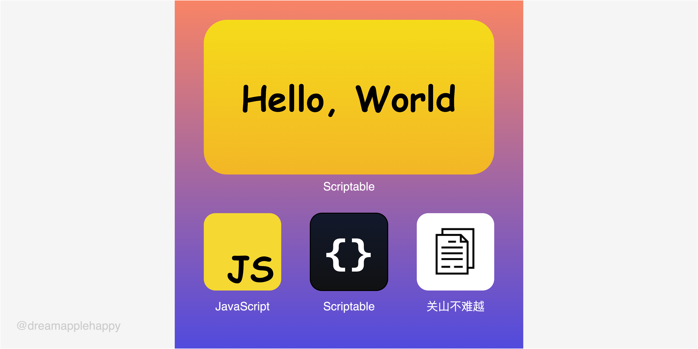

最近苹果的 **iOS** 系统升级到了 **iOS 14**，这次的更新我比较关注的就是升级的**小组件**功能，这次更新我们可以将**小组件**放置在**主屏幕中的任何位置**，可以让我们更加便捷的查看一些信息，从而省去了还需要打开APP去查看消息的步骤，感觉很方便。

看到这里一些同学可能会说，功能是挺不错的，如果我自己也能开发一个小组件展示自己想看的内容就好了。是呀，哪一个小男孩不想拥有一个专属于自己的 **iOS 小组件**。

别慌，最近发现了一个APP可以让我们通过使用**JavaScript**来创建我们自己想要的**小组件**。这个APP的名字就是[**Scriptable**](https://scriptable.app/)，还是验证了[**Jeff Atwood**](https://blog.codinghorror.com/about-me/)那句话，[**任何可以使用JavaScript来编写的应用，最终会由JavaScript编写。**](https://blog.codinghorror.com/the-principle-of-least-power/)作为一个前端有没有感觉很开心，又有一个地方可以让你来大展身手了，那就趁热赶紧来了解一下吧。

## Scriptable的简单介绍

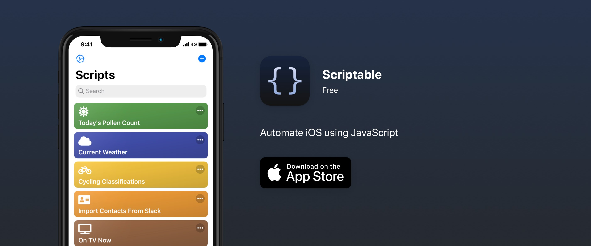

**工欲善其事，必先利其器**，我们先来了解一下[Scriptable](https://scriptable.app/)有哪些作用吧，从上面官网上的介绍我们可以知道，这个APP可以让我们**使用JavaScript来自动化iOS**。这句话是什么意思呢？就是我们可以提前编写好一些代码去执行一些特定的任务，比如：获取**GitHub**上面的**Trending**项目的名字和介绍、了解**Hacker News**的最新资讯、获取自己的最近日程、以及自己的TODO列表等等。当然这都只是一些最基本的使用场景，你肯定有自己的想法，看完这篇文章之后就去自己去实现一个独一无二的小应用吧。

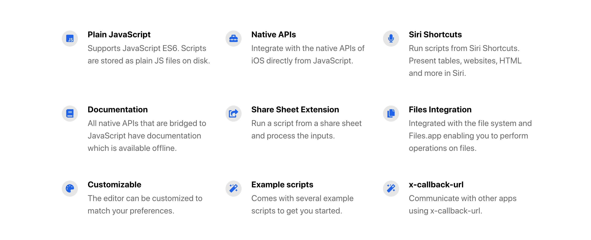


上面列举的是一些**Scriptable**的特性，这些特性包括：

+ **支持ES6语法**
+ **可以使用JavaScript调用一些原生的API**
+ **Siri 快捷方式**
+ **完善的文档支持**
+ **共享表格扩展**
+ **文件系统继承**
+ **编辑器的自定义**
+ **代码样例**
+ **以及通过x-callback-url和其它APP交互**

是不是感觉还是挺不错的，这些特性已经可以让我们去做很多可以自动化的事情了。

## 开始前的准备工作

+ 一台升级到 **iOS 14** 的 **iPhone** 手机
+ 安装 **Scriptable** 应用程序

下载完成之后打开应用，我们可以看到一些已经写好的例子：

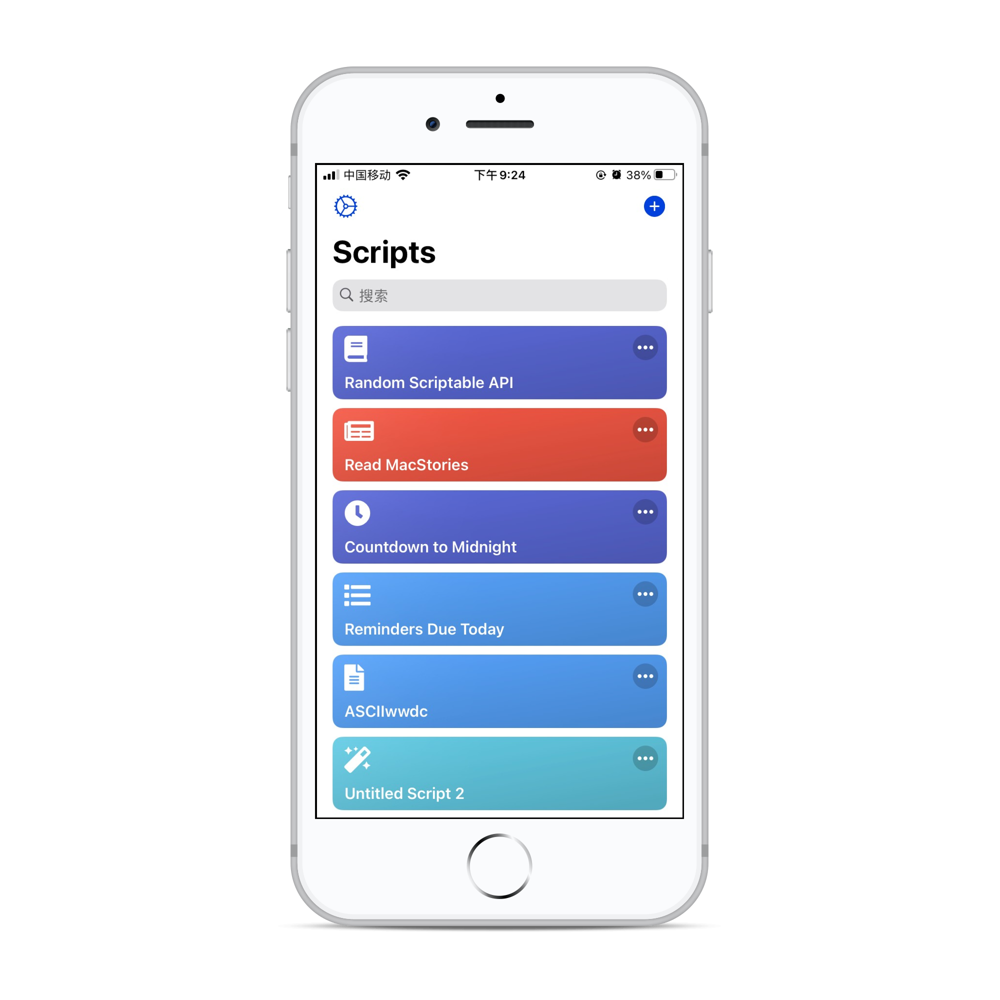

点击小卡片会直接运行相应的程序，点击小卡片右上角的**更多**按钮进入相应程序的代码编辑模式。

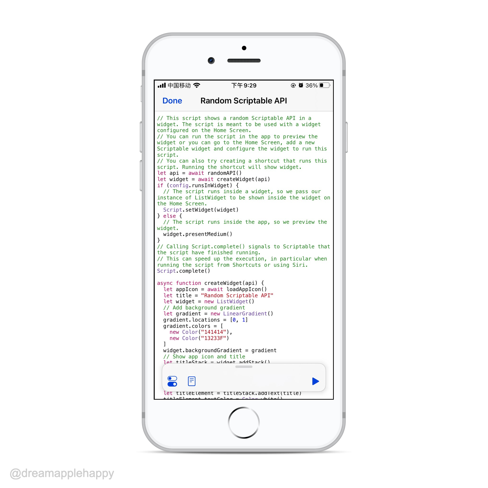

底部有一个悬浮的操作栏，左边第一个按钮是一个设置按钮，你可以为当前的小程序设置图标，颜色，等等：

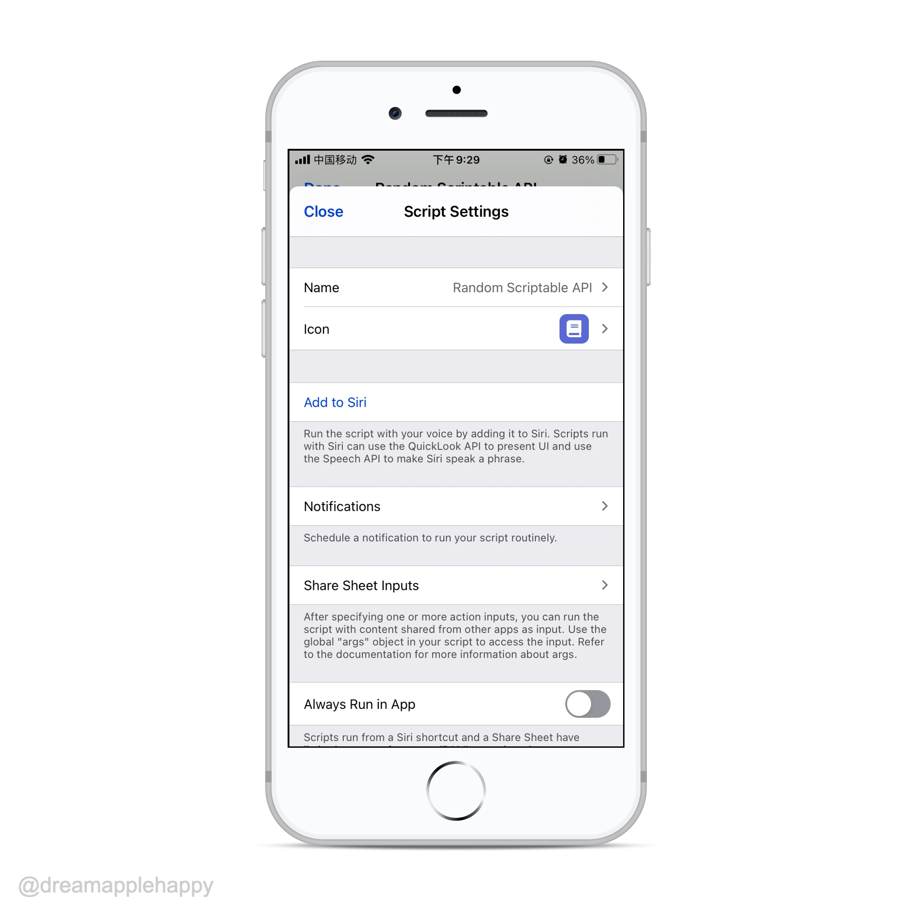

左边第二个按钮是一个文档提示按钮，点击可以搜索想要使用的相关的API：

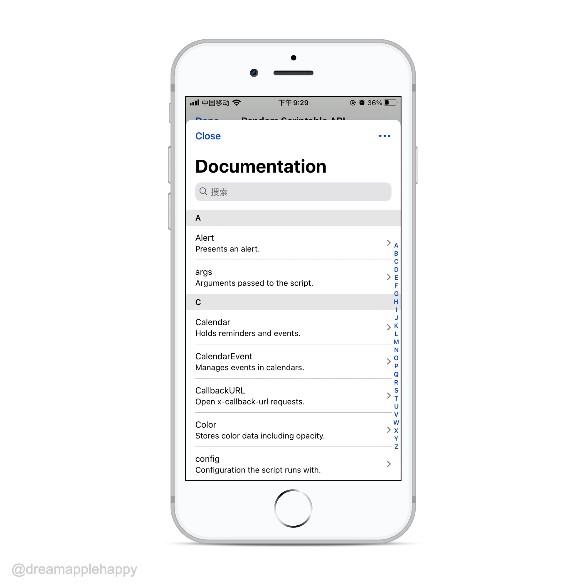

最右边是一个运行按钮，点击会直接在手机上运行你编写的应用程序。这个大家应该一看就知道了：

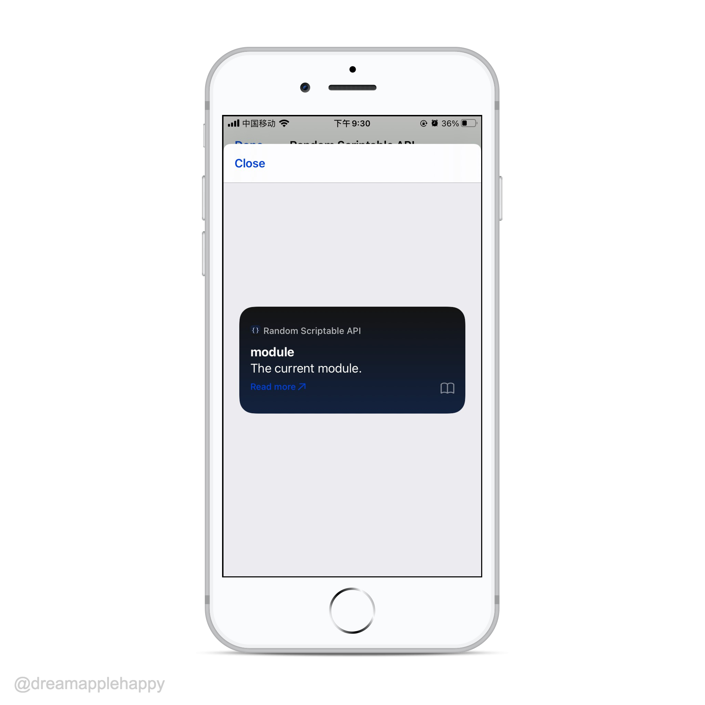

我以为通过在手机上的编辑器进行代码的编写会比较费劲和吃力，但是试了一下发现还好。因为手机上的编辑器也有比较完善的语法提示功能，编写代码的体验虽然不如在电脑上那般舒服，但也是在可以接受的范围之内。

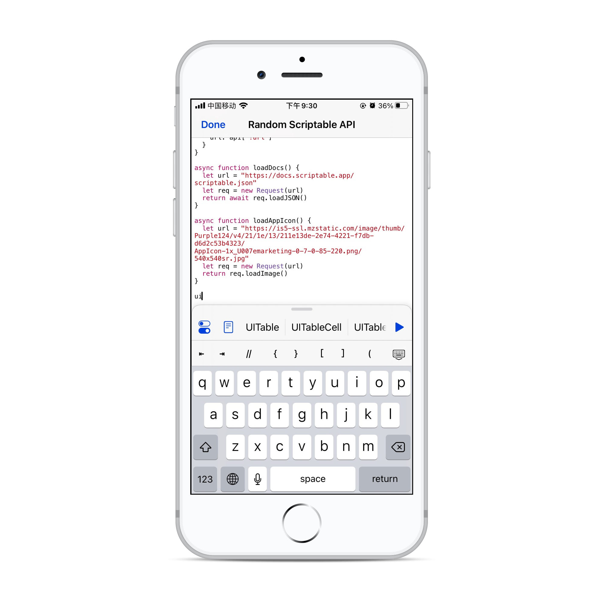

上面是一些关于 **Scriptable** APP的简单的介绍，你可以自己在手机上好好体验一下。我觉得整个APP很简约，但是功能还是很强大的。

## 第一个 Hello World 小组件

我们学习编程语言的第一步就是输出`Hello World`，所以我们使用 **Scriptable** 的第一个小应用就是在主屏幕上展示`Hello Wolrd`。

我个人觉得在你开始真正的开发自己想要的小组件之前，开发一个`Hello World`的小组件还是很有必要的，因为这个过程相对容易一点，可以增加我们的自信心。我们可以通过这个小程序来建立起我们开发小组件的**手感**，并且我们是可以直接在手机的屏幕上看到这个结果的，是不是还蛮有成就感的。

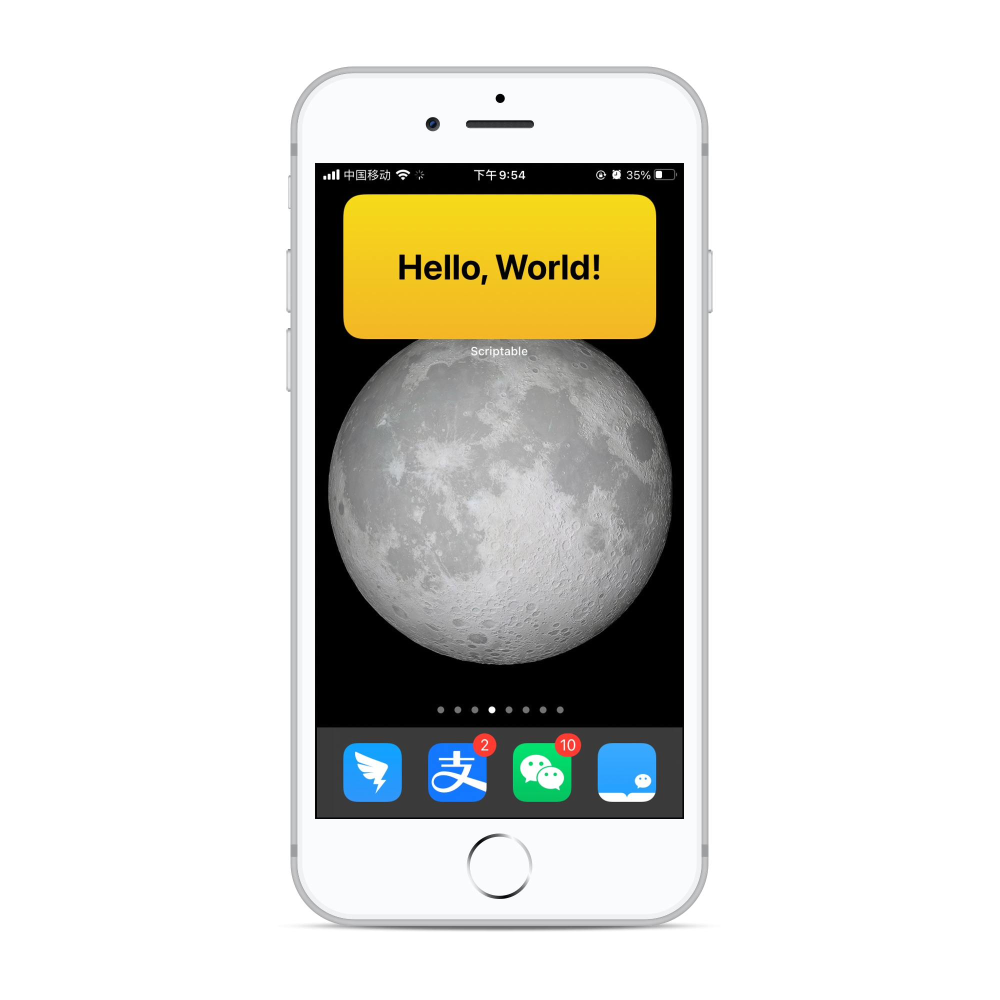

在编码的过程中有几个选择，你可以选择直接在手机的编辑器上进行编码，也可以通过 **Mac 的 iCloud 云盘** 的同步功能，在 **Mac** 电脑上用自己熟悉的编辑器开发。如果你有蓝牙的键盘，可以直接使用蓝牙键盘连接到手机上使用自己的键盘进行编码。根据自己的条件选择一个自己舒服的方式进行编码。

接下来就是`Hello World`小组件的代码了：

```javascript
// Variables used by Scriptable.
// These must be at the very top of the file. Do not edit.
// icon-color: cyan; icon-glyph: greater-than-equal;

// 以下代码仅供学习交流使用

// 判断是否是运行在桌面的组件中
if (config.runsInWidget) {
  // 创建小部件
  const widget = new ListWidget();
  // 添加文本
  const text = widget.addText("Hello, World!");
  text.textColor = new Color("#000000");
  text.font = Font.boldSystemFont(36);
  text.centerAlignText();
  // 添加渐变色背景
  const gradient = new LinearGradient();
  gradient.locations = [0, 1];
  gradient.colors = [new Color("#F5DB1A"), new Color("#F3B626")];
  widget.backgroundGradient = gradient;
  // 设置部件
  Script.setWidget(widget);
}
```

上面的代码还是比较简单的，相信大家看一下就明白了。我再简单介绍一下，最开头的注释是 **Scriptable** 自己生成的，用来设置小卡片的图标和图标颜色；接下来的一个`if`判断表明我们希望接下来的代码是在小组件的条件下运行的，用来生成我们的小组件。

然后接下来的代码就是创建小组件，添加文本，设置本文的颜色、字体以及对齐方式。然后添加了一个渐变的背景，最后把上面生成的小组件通过`Script.setWidget()`进行设置。这样我们的`Hello World`小组件就算完成啦。

## “今天吃点啥”小组件

也许5分钟过后你就开始不满足一个简单的 **Hello World** 小组件了，你知道你的征途是星辰大海，所以你要做出一些有实际应用价值的小组件。但此时的你已经工作到晚上十点多了，十分想给自己点一个夜宵来犒劳一下自己。但是你特别纠结吃啥？

看了看楼下的炒粉干和山东杂粮煎饼以及烤冷面，你十分纠结要吃啥。所以为了节省时间我决定开发一个帮你选择吃什么的小组件。就叫它：“**今天吃点啥**”吧。


看看这个组件的图标是不是就很有食欲？当你不确定要吃啥的时候就点击这个小组件，然后我们编写的程序就会运行，它会在面板上列出你这次要吃的选项，你点击选择，马上就知道自己要吃啥了，是不是解决了你迟迟下不定决心要吃啥的纠结状态。


为了明确告诉你这次的选择是什么，我特意在选择之后给你发送一个选择结果的通知，是不是很人性化😂，你肯定还发现了为什么食物的名字与图片不符合。是的，我是故意这样做的，为了营造一种你即将吃大餐的假象😁。

下面是一张动图，可以提前感受一下这个过程：

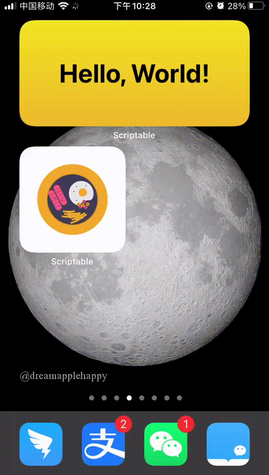

因为我之前有帮助过同事使用`Swift`开发原生 **iOS** 的一些经验，所以这里面跟原生相关的一些API我看着还算熟悉的，也好上手。就算没有相关的开发经验关系也不大，毕竟文档对于相关API的解释都还算清楚的，相信你看一看就可以很快上手的。

因为这个小组件的代码量稍微多一点，就不在这里展示了；大家如果有兴趣的话可以在[scriptable-scripts](https://github.com/dreamapplehappy/scriptable-scripts)看到这个小组件的源码部分，写的时候比较仓促，还有很多可以完善的地方。如果你有什么好的意见也可以提出来，我们一起学习进步。

## 对小组件的一些思考

更新了 **iOS 14** 之后，发现手机上的很多APP都新增了相关的小组件，这让用户可以快速方便的浏览一些关键的信息，也可以快速直达具体的服务。对用户来说还是很有帮助的。

对于开发者来说，这里面也存在一些新的机遇。就算不会原生的 **iOS** 开发，我们也可以借助像**Scriptable**这样的小组件平台，来创造出一些有趣，有价值，有意义的小组件。

有没有发现小组件是不是跟小程序在某些方面很相似？感觉以后应该会出现系统级别的“小程序”平台，如果**Android**和**iOS**再搞一个统一的开发平台，前端开发者又可以扬帆远航了，想想是不是有点小激动呢。。。

## 学习与交流

如果你对使用 **Scriptable** 开发小组件很有兴趣，也欢迎大家进[**Scriptable小组件交流群**](./images/wechat-group.jpg)进行交流讨论。

文章到这里就结束了，如果你有什么意见和建议欢迎给我[留言](https://github.com/dreamapplehappy/blog/issues/16)。你还可以关注我的公众号[**关山不难越**](../../../resource/images/official-account.png)，可以及时获取最新好玩有趣文章的更新。

注：“今天吃点啥”小组件的图标使用的是[https://undraw.co/](https://undraw.co/)网站上的，相关食物的图片来自[https://unsplash.com/](https://unsplash.com/)，每张图片来自哪个创作者在代码的注释中有说明。
