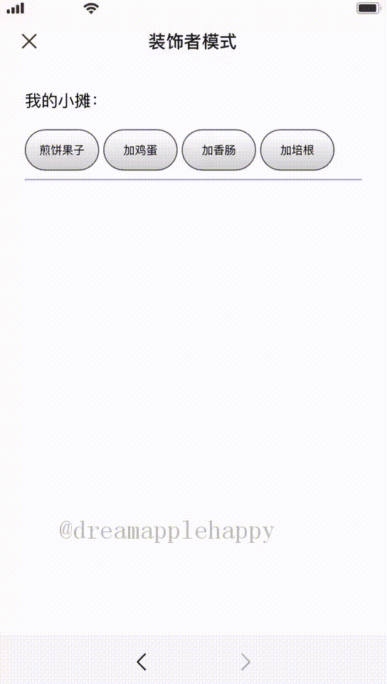

# 设计模式大冒险第二关：装饰者模式，煎饼果子的主场


这是关于设计模式系列的第二篇文章，在这个系列中，我们尽量不使用那些让你一听起来就感觉头大的解释设计模式的术语，那样相当于给大家带去了新的理解难度。我们会使用生活中的场景以及一些通俗易懂的小例子来给大家展示每一个设计模式使用的场景以及要解决的问题。

这篇文章我们来讲解装饰者模式，那么什么是装饰者模式呢？对于名字来说你可能会感到比较陌生，**但是你在生活中肯定经常使用这个模式去解决生活中的一些问题。只是你并不知道它原来是装饰者模式而已**。

## 生活中的装饰着模式

想象一下，夏天到了，你家住在比较低的楼层，一到晚上许多的蚊子就到你家里做客，它们对你的身体进行大快朵颐让你很烦恼。你这时才发现家里的窗户上没有装上窗纱，所以一到晚上如果不及时关闭窗户的话，那么就会有很多蚊子来拜访你。但是你想晚上感受一下微风徐来，又不想被蚊子拜访，那么你要做的就是给窗户装上窗纱。

对，**给窗户装上窗纱就是使用了装饰者模式**。我们没有对原来的窗户做任何的更改，它还是那个窗户，可以打开和关闭，可以透过它观看风景，可以感受微风徐来。增加了窗纱之后，我们的窗户有了新的功能，那就是可以阻止蚊子进入室内了。**这样我们就拓展了窗户的功能，但是没有对原来的窗户做什么改变**。

生活中还有很多这样的例子，这里就不一一列举了，相信你看完这篇文章之后，会对这个设计模式有更深一步的理解。然后能够发现生活中更多这样的例子，进而加强你对这个设计模式的理解与掌握。

那么在开发中我们需要使用这个设计模式来解决什么问题呢？我们要解决的是这样的问题：**在不改变已有对象的属性和方法的前提下，对已有对象的属性和功能进行拓展**。

你会好奇为什么要这样做呢？首先已有的对象可能是你不能够修改的，为什么不能够修改？可能因为这个对象是第三方库引入的，或者是代码中全局使用的，或者是一个你还不是很熟悉和了解的对象。这些情况下，你是不能够轻易在这些对象上添加新的功能的。但是你又不得不对这个对象增加一些新的功能来满足当下的开发需求。所以这时候，使用装饰者模式就可以很好地解决这个问题。我们赶紧来学习一下吧~

## 通过一个例子来实战装饰者模式

楼下卖煎饼果子的老板知道你会编写程序，所以想让你来帮忙写一个点餐的小程序，来方便他给买煎饼果子的客户点餐。报酬就是以后你来买煎饼果子给你打88折，你一听感觉还不错，所以就答应了下来。

当你准备开始的时候，老板告诉你说他的点餐系统已经有一部分代码了，并且希望你不要修改这些代码，因为他不确定这些代码在他的点餐系统中是否有用过。修改之后可能会导致一些问题，所以你只能在之前的基础上添加新的功能。老板的给代码如下：

```javascript
// 煎饼果子
class Pancake {
  constructor() {
    this.name = "煎饼果子";
  }

  //获取煎饼果子的名字
  getName() {
    return this.name;
  }

  // 获取价格
  getPrice() {
    return 5;
  }
}
```

老板要求如下：

+ 不能够修改之前的代码
+ 煎饼果子可以随意搭配鸡蛋，香肠，和培根，并且每一种的数量没有限制
+ 点餐完成之后能够展示当前煎饼果子包含搭配的配料，以及价格

你现在不可以修改已有的代码，但是却要增加新的功能，这对你来说还是有一点点难度的。但是好巧的是你刚刚学习完装饰者模式，使用这个设计模式就可以很好地解决这个问题。而且是在不修改原来的代码的情况下。你马上回到家中开始为你的88折优惠努力开发起来。

## 对原有对象的基本装饰

在开始对原来的对象进行具体的**装饰**之前，我们需要写一个基本的装饰类，如下所示：

```javascript
// 装饰器需要跟被装饰的对象具有同样的接口
class PancakeDecorator {
  // 需要传入一个煎饼果子的实例
  constructor(pancake) {
    this.pancake = pancake;
  }
  // 获取煎饼果子的名字
  getName() {
    return `${this.pancake.getName()}`;
  }
  // 获取煎饼果子的价格
  getPrice() {
    return this.pancake.getPrice();
  }
}
```

我们看一下上面的代码，你会发现`PancakeDecorator`除了构造器需要传递一个`Pancake`的实例之外，其他的方法跟`Pancake`是保持一致的。

这个基本装饰类的目的是为了让我们后面开发的**具体的装饰类跟被装饰的对象具有相同的接口，为了后面的组合和委托功能做好铺垫**。

## 开发具体的装饰类

我们知道老板的配料有**鸡蛋**，**培根**，还有**香肠**。所以我们接下来需要开发三个具体的装饰类，代码如下所示：

```javascript
// 煎饼果子加鸡蛋
class PancakeDecoratorWithEgg extends PancakeDecorator {
  // 获取煎饼果子加鸡蛋的名字
  getName() {
    return `${this.pancake.getName()}➕鸡蛋`;
  }

  getPrice() {
    return this.pancake.getPrice() + 2;
  }
}

// 加香肠
class PancakeDecoratorWithSausage extends PancakeDecorator {
  // 加香肠
  getName() {
    return `${this.pancake.getName()}➕香肠`;
  }

  getPrice() {
    return this.pancake.getPrice() + 1.5;
  }
}

// 加培根
class PancakeDecoratorWithBacon extends PancakeDecorator {
  // 加培根
  getName() {
    return `${this.pancake.getName()}➕培根`;
  }

  getPrice() {
    return this.pancake.getPrice() + 3;
  }
}
```

从上面的代码我们可以看到，每一个具体的装饰类都只对应一种配料，然后每一个具体的装饰类因为继承自`PancakeDecorator`，所以跟被装饰类保持相同的接口。在方法`getName`中，我们首先先获取当前传入进来的`pancake`的名字，然后在后面添加上当前装饰器对应的配料的名字。在`getPrice`方法中，我们使用同样的方法，获取添加这个装饰器指定的配料后的价格。

写完了上面的具体的装饰器之后，我们的工作就基本完成啦。我们来写一些测试代码，来验证一下我们的功能是否满足需求。测试的代码如下：

```javascript
let pancake = new Pancake();
// 加鸡蛋
pancake = new PancakeDecoratorWithEgg(pancake);
console.log(pancake.getName(), pancake.getPrice());
// 加香肠
pancake = new PancakeDecoratorWithSausage(pancake);
console.log(pancake.getName(), pancake.getPrice());
// 加培根
pancake = new PancakeDecoratorWithBacon(pancake);
console.log(pancake.getName(), pancake.getPrice());
```

输出的结果如下：

```
煎饼果子➕鸡蛋 7
煎饼果子➕鸡蛋➕香肠 8.5
煎饼果子➕鸡蛋➕香肠➕培根 11.5
```

结果跟我们的预期是一致的，所以我们上面的代码已经很好地完成了老板的需求。可以马上交给老板去使用了。

## 装饰者模式的组合和委托

也许通过上面的代码你还没有能够完全理解这样做的目的，没关系，我来给大家再展示一个关于这个模式的示例图，相信看过这个实例图你肯定会理解得很深刻的。


+ 第一步：调用`PancakeDecoratorWithSausage`实例的`getPrice`方法。
+ 第二步：因为`PancakeDecoratorWithSausage`实例的`getPrice`方法需要访问`PancakeDecoratorWithEgg`的实例，所以进入第三步。
+ 第三步：因为`PancakeDecoratorWithEgg`实例的`getPrice`方法需要访问`PancakeDecorator`的实例，所以进入第四步。
+ 第四步：因为`PancakeDecorator`实例的`getPrice`方法需要访问`Pancake`的实例，进入第五步。
+ 第五步：通过`Pancake`的实例返回不加料的煎饼果子的价格是5元。
+ 第六步：`PancakeDecorator`实例获取原始的煎饼果子的价格，返回这个价格。
+ 第七步：`PancakeDecoratorWithEgg`实例获取到`PancakeDecorator`返回的价格5元，再加上配料鸡蛋的价格2元，所以返回7元。
+ 第八步：`PancakeDecoratorWithSausage`实例获取到`PancakeDecoratorWithEgg`实例返回的价格7元，再加上配料香肠的价格1.5元，返回价格8.5元。

从上面的这幅图我们可以清楚地看到这个过程的变化，我们通过组合和委托实现了添加不同配料的价格计算。**所谓的委托就是指我们没有直接计算出当前的价格，而是需要委托方法中另外一个实例的方法去获取相应的价格，直到访问到最原始不加料的煎饼果子的价格，再逐次返回委托得到的结果。最终算出加料后的价格**。有没有感觉这个过程跟DOM事件的**捕获**和**冒泡**很相似。

所谓的**组合**，就是指，**我们不需要知道当前的煎饼果子的状态，只需要把这个煎饼果子的实例当做我们具体装饰类的构造函数的参数，然后生成一个新的煎饼果子的实例，这样就可以给传入进来的煎饼果子添加相应的配料**。

怎么样，是不是感觉装饰者模式还挺简单的，而且也很有用。好了，我们需要把这些代码交给煎饼果子的老板了，让他去试用一下，看看怎么样。大家可以在[这里](https://dreamapple.gitee.io/code-examples/20201014/)体验一下这个不完善的煎饼果子点餐系统，下面的动图是一个简单的操作演示，大家可以提前感受一下。



## 对装饰者模式的一些思考

每当学习完一个新的知识之后，我们要学着把这个知识点纳入我们已有的知识系统中；比如学习完了装饰者模式，你可能会想到我应该在什么情况下使用这种设计模式？我现在已经掌握的知识中有没有跟这个相关联的？这种设计模式有没有什么弊端？等等，需要你自己深入的思考沉淀一下。

### 装饰者模式的一些延伸

经常使用`React`来开发应用的小伙伴这个时候是不是想到了`React`的高阶组件？我们看看`React`的文档中是如何描述[**高阶组件**](https://reactjs.org/docs/higher-order-components.html)的：

> A higher-order component (HOC) is an advanced technique in React for reusing component logic. HOCs are not part of the React API, per se. They are a pattern that emerges from React’s compositional nature.

`React`通过高阶组件，可以使用组合的方式复用组件的逻辑，这是一种高级的技巧😁。你现在已经掌握这种高级的技巧了。

如果你对JavaScript的未来发展比较关注的话，那么你肯定知道在以后的JavaScript版本中，可能会在语言的原生层面增加对装饰器的支持。更多详细的资料大家可以在[tc39/proposal-decorators](https://github.com/tc39/proposal-decorators)这里获取。

比如如果在语言的原生层面支持装饰器的话，我们可以写出下面的代码：

```javascript
@annotation
class MyClass { }

function annotation(target) {
   target.annotated = true;
}
```

上面的代码来自[babel-plugin-proposal-decorators](https://babeljs.io/docs/en/babel-plugin-proposal-decorators)的示例。

在上面的代码中，`@annotation`是类`MyClass`的装饰器，这个装饰器给我们的`MyClass`类添加了一个属性`annotated`，并且把这个属性的值设置为`true`。这个过程不需要我们对原来的类`MyClass`做任何修改，就实现了给这个类添加一个属性的功能。是不是很棒~

我们也可以验证一下：

```javascript
console.log(MyClass.annotated);  # true
```

### 装饰者模式适用的场景以及可能存在的问题

**装饰者模式利用组合和委托的特性，能够让我们在不改变原来已有对象的功能和属性的情况下增加新的功能和属性，让我们能够保持代码的低耦合和可扩展性**。是一种很不错的设计模式。

但是使用装饰者模式也有潜在的问题，**因为随着装饰者的增多，代码的复杂性也随之增加了**，所以要确保在合适的场景下使用装饰者模式。

文章到这里就结束了，如果你有什么意见和建议欢迎给我[留言](https://github.com/dreamapplehappy/blog/issues/17)。你还可以关注我的公众号[关山不难越](../../../resource/images/official-account.png)，获取更多关于设计模式的文章讲解以及好玩有趣的前端知识。


相关阅读推荐：

+ [设计模式大冒险第一关：观察者模式](https://mp.weixin.qq.com/s/ehrBQkjtBTyyiuUo8KiBLg)
