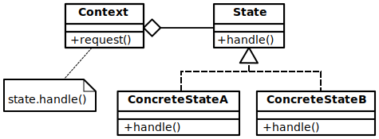

# 设计模式大冒险第五关：状态模式，看我七十二变


这一篇文章是关于[设计模式大冒险系列](https://mp.weixin.qq.com/mp/appmsgalbum?__biz=MzAwMDIzODY5MA==&action=getalbum&album_id=1557269952766771201&scene=173&subscene=0&sessionid=1610180505&enterid=1610180521&from_msgid=2247484071&from_itemidx=1&count=3#wechat_redirect)的第五篇文章，这一系列的每一篇文章我都希望能够通过通俗易懂的语言描述或者日常生活中的小例子来帮助大家理解好每一种设计模式。

今天这篇文章来跟大家一起学习一下[状态模式](https://en.wikipedia.org/wiki/State_pattern)。相信读完这篇文章之后，你会收获很多。**在以后的开发中，如果遇到了类似的情况就知道如何更好地处理，能够少用`if`和`else`语句，以及`switch`语句，写出更已读，扩展性更好，更易维护的程序**。话不多说，我们开始今天的文章吧。

## 开发过程中的一些场景

我们在平时的开发过程中，经常会遇到这样一种情况：就是**需要我们处理一个对象的不同状态下的不同行为**。比如最常见的就是订单，**订单有很多种状态，每种状态又对应着不同的操作，有些操作是相同的，有些操作是不同的**。再比如一个音乐播放器程序，**在播放器缓冲音乐，播放，暂停，快进，快退，终止等的情况下又对应着各种操作。有些操作在某些情况下是允许的，有些操作是不允许的**。还有很多不同的场景，这里就不一一列举了。

那么面对上面说的这些情况我们应该**如何设计我们的程序，才能让我们开发出来的程序更好维护与扩展，也更方便别人阅读呢**？先别着急，我们一步一步来。遇到这种情况我们应该首先把整个操作的状态图画出来，**只有状态图画出来，我们才可以清晰的知道这个过程中会有哪些操作，都发生了哪些状态的改变**。只要我们做了这一步，然后按照状态图的逻辑去实现我们的程序；先不管代码的质量如何，至少可以保证我们的逻辑功能是满足了需求的。

## 生活小例子，我的吹风机

让我们从生活中的一个小例子入手吧。最近我家里新买了一个吹风机，这个吹风机有两个按钮。一个按钮控制吹风机的开关，另一个按钮可以在吹风机打开的情况下切换吹风的模式。**吹风机的模式有三种，分别是热风，冷热风交替，和冷风。并且吹风机打开时默认是热风模式**。

如果让我们来编写一个程序实现上面所说的吹风机的控制功能，我们应该怎么实现呢？**首先先别急着开始写代码，我们需要把吹风机的状态图画出来**。如下图所示：


上面的状态图已经把吹风机的各种状态都表示出来了，**其中圆圈表示了吹风机的状态，带箭头的线表示状态转换**。从这个状态图我们可以很直观的知道：**吹风机从关闭状态到打开状态默认是热风模式，然后这三种模式可以按照顺序进行切换，然后在每一种模式下都可以直接关闭吹风机**。

## 一般的实现方式

当我们知道了整个吹风机的状态转换之后，我们就可以开始写代码了。我们先按照最直观的方式去实现我们的代码。首先我们知道吹风机有两个按钮，一个控制开关，一个控制吹风机的吹风模式。**那么我们的程序中需要有两个变量来分别表示`开关状态`和`吹风机当前所处的模式`**。这一部分的代码如下所示：

```javascript
function HairDryer() {
   // 定义内部状态 0:关机状态 1:开机状态
   this.isOn = 0;
   // 定义模式 0:热风 1:冷热风交替 2:冷风
   this.mode = 0;
}
```

接下来就要实现吹风机的开关按钮的功能了，这一部分比较简单；我们只需要判断当前`isOn`变量，如果是打开状态就将`isOn`设置为关闭状态，如果是关闭状态就将`isOn`设置为打开状态。**需要注意的一点就是在吹风机关闭的情况下需要将吹风机的模式重置为热风模式**。

```javascript
// 切换吹风机的打开关闭状态
HairDryer.prototype.turnOnOrOff = function() {
   let { isOn, mode } = this;
   if (isOn === 0) {
      // 打开吹风机
      isOn = 1;
      console.log('吹风机的状态变为：[打开状态]，模式是：[热风模式]');
   } else {
      // 关闭吹风机
      isOn = 0;
      // 重置吹风机的模式
        mode = 0;
      console.log('吹风机的状态变为：[关闭状态]');
   }
   this.isOn = isOn;
   this.mode = mode;
};

```
在接下来就是实现吹风机的模式切换的功能了，代码如下所示：

```javascript
// 切换吹风机的模式
HairDryer.prototype.switchMode = function() {
   const { isOn } = this;
   let { mode } = this;
   // 切换模式的前提是：吹风机是开启状态
   if (isOn === 1) {
      // 需要知道当前模式
      if (mode === 0) {
         // 如果当前是热风模式，切换之后就是冷热风交替模式
         mode = 1;
         console.log('吹风机的模式改变为：[冷热风交替模式]');
      } else if (mode === 1) {
         // 如果当前是冷热风交替模式，切换之后就是冷风模式
         mode = 2;
         console.log('吹风机的模式改变为：[冷风模式]');
      } else {
         // 如果当前是冷风模式，切换之后就是热风模式
         mode = 0;
         console.log('吹风机的模式改变为：[热风模式]');
      }
   } else {
      console.log('吹风机在关闭的状态下无法改变模式');
   }
   this.mode = mode;
};
```
这一部分的代码也不算难，但是有一些细节需要注意。**首先我们切换模式需要吹风机是打开的状态，然后当吹风机是关闭的状态的时候，我们不能够切换模式**。到这里为止，我们已经把吹风机的控制功能都实现了。接下来就要写一些代码来验证一下我们上面的程序是否正确，测试的代码如下所示：

```javascript
const hairDryer = new HairDryer();
// 打开吹风机，切换吹风机模式
hairDryer.turnOnOrOff();
hairDryer.switchMode();
hairDryer.switchMode();
hairDryer.switchMode();
// 关闭吹风机，尝试切换模式
hairDryer.turnOnOrOff();
hairDryer.switchMode();
// 打开关闭吹风机
hairDryer.turnOnOrOff();
hairDryer.turnOnOrOff();
```
输出的结果如下所示：

```
吹风机的状态变为：[打开状态]，模式是：[热风模式]
吹风机的模式改变为：[冷热风交替模式]
吹风机的模式改变为：[冷风模式]
吹风机的模式改变为：[热风模式]
吹风机的状态变为：[关闭状态]
吹风机在关闭的状态下无法改变模式
吹风机的状态变为：[打开状态]，模式是：[热风模式]
吹风机的状态变为：[关闭状态]
```
从上面测试的结果我们可以知道，上面程序编写的逻辑是没有问题的，实现了我们想要的预期的功能。如果想看上面代码的完整版本可以点击[这里](https://github.com/dreamapplehappy/blog/blob/master/demo/2021/0110/normal.js)浏览。

但是你能从上面的代码中看出什么问题吗？**作为一个优秀的工程师，你肯定会发现上面的代码使用了太多的`if/else`判断，然后切换吹风机模式的代码都耦合在一起。这样会导致一些问题，首先上面代码的可读性不是很好，如果没有注释的话，想要知道吹风机模式的切换逻辑还是有点费力的。另一方面，上面代码的可扩展性也不是很好，如果我们想新增加一种模式的话，就需要修改`if/else`里面的判断，很容易出错**。那么作为一个优秀的工程师，我们该如何重构上面的程序呢？

## 状态模式的介绍，以及使用状态模式重构之前的程序

接下来我们就要进入状态模式的学习过程了，首先我们先不用管什么是状态模式。我们先来再次看一下上面关于吹风机的状态图，我们可以看到吹风机在整个过程中有四种状态，分别是：`关闭状态`，`热风模式状态`，`冷热风交替模式状态`，`冷风模式状态`。然后这四种模式分别都有两个操作，分别是**切换模式**和**切换吹风机的打开和关闭状态**。（注：对于关闭状态，虽然无法切换模式，但是在这里我们也认为这种状态有这个操作，只是操作不会起作用。）

那么我们是不是可以换一种思路去解决这个问题，**我们可以把具体的操作封装进每一个状态里面，然后由对应的状态去处理对应的操作。我们只需要控制好状态之间的切换就可以了。这样做可以让我们把相应的操作委托给相应的状态去做，不需要再写那么多的`if/else`去判断状态，这样做还可以让我们把变化封装进对应的状态中去。如果需要添加新的状态，我们对原来的代码的改动也会很小**。

### 状态模式的简单介绍

那么到这里我们来介绍一下状态模式吧，状态模式指的是：**能够在对象的内部状态改变的时候改变对象的行为**。**状态模式常常用来对一个对象在不同状态下同样操作时产生的不同行为进行封装，从而达到可以让对象在运行时改变其行为的能力**。就像我们上面说的吹风机，在热风模式下，按下模式切换按钮可以切换到冷热风交替模式；但是如果当前状态是冷热风交替模式，那么按下模式切换按钮，就切换到了冷风模式了。更详细的解释可以参考[State pattern](https://en.wikipedia.org/wiki/State_pattern)

我们再来看一下状态模式的UML图，如下所示：



可以看到，**对于状态模式来说，有一个`Context`(上下文)，一个抽象的`State`类，这个抽象类定义好了每一个具体的类需要实现的方法。对于每一个具体的类来说，它实现了抽象类`State`定义好的方法，然后`Context`在需要进行操作的时候，只需要请求对应具体状态类实例的对应方法就可以了**。

### 使用状态模式来重构之前的程序

接下来我们来用状态模式来重构我们的程序，首先是`Context`，对应的代码如下所示：

```javascript
// 状态模式
// 吹风机
class HairDryer {
   // 吹风机的状态
   state;
   // 关机状态
   offState;
   // 开机热风状态
   hotAirState;
   // 开机冷热风交替状态
   alternateHotAndColdAirState;
   // 开机冷风状态
   coldAirState;

   // 构造函数
   constructor(state) {
      this.offState = new OffState(this);
      this.hotAirState = new HotAirState(this);
      this.alternateHotAndColdAirState = new AlternateHotAndColdAirState(
         this
      );
      this.coldAirState = new ColdAirState(this);
      if (state) {
         this.state = state;
      } else {
         // 默认是关机状态
         this.state = this.offState;
      }
   }

   // 设置吹风机的状态
   setState(state) {
      this.state = state;
   }

   // 开关机按钮
   turnOnOrOff() {
      this.state.turnOnOrOff();
   }
   // 切换模式按钮
   switchMode() {
      this.state.switchMode();
   }

   // 获取吹风机的关机状态
   getOffState() {
      return this.offState;
   }
   // 获取吹风机的开机热风状态
   getHotAirState() {
      return this.hotAirState;
   }
   // 获取吹风机的开机冷热风交替状态
   getAlternateHotAndColdAirState() {
      return this.alternateHotAndColdAirState;
   }
   // 获取吹风机的开机冷风状态
   getColdAirState() {
      return this.coldAirState;
   }
}

```

我来解释一下上面的代码，首先我们使用`HairDryer`来表示`Context`，然后`HairDryer`类的实例属性有`state`，这属性就是表示了吹风机当前所处的状态。其余的四个属性分别表示吹风机对应的四个状态实例。

吹风机有`setState`可以设置吹风机的状态，然后`getOffState`，`getHotAirState`，`getAlternateHotAndColdAirState`，`getColdAirState`分别用来获取吹风机的对应状态实例。你可能会说为什么要在`HairDryer`类里面获取相应的状态实例呢？别着急，下面会解释为什么。

然后`turnOnOrOff`方法表示打开或者关闭吹风机，`switchMode`用来表示切换吹风机的模式。还有`constructor`，我们默认如果没有传递状态实例的话，默认是热风模式状态。

然后是我们的抽象类`State`，因为我们的实现使用的语言是`JavaScript`，`JavaScript`暂时还不支持抽象类，所以用一般的类来代替。这个对我们实现状态模式没有太大的影响。具体的代码如下：

```javascript
// 抽象的状态
class State {
   // 开关机按钮
   turnOnOrOff() {
      console.log('---按下吹风机 [开关机] 按钮---');
   }
   // 切换模式按钮
   switchMode() {
      console.log('---按下吹风机 [模式切换] 按钮---');
   }
}

```

`State`类主要是用来定义好具体的状态类应该实现的方法，对于我们这个吹风机的例子来说就是`turnOnOrOff`和`switchMode`。它们分别对应，按下吹风机开关机按钮的处理和按下吹风机的模式切换按钮的处理。

接下来就是具体的状态类的实现了，代码如下所示：

```javascript
// 吹风机的关机状态
class OffState extends State {
   // 吹风机对象的引用
   hairDryer;
   constructor(hairDryer) {
      super();
      this.hairDryer = hairDryer;
   }
   // 开关机按钮
   turnOnOrOff() {
      super.turnOnOrOff();
      this.hairDryer.setState(this.hairDryer.getHotAirState());
      console.log('状态切换: 关闭状态 => 开机热风状态');
   }
   // 切换模式按钮
   switchMode() {
      console.log('===吹风机在关闭的状态下无法切换模式===');
   }
}

// 吹风机的开机热风状态
class HotAirState extends State {
   // 吹风机对象的引用
   hairDryer;
   constructor(hairDryer) {
      super();
      this.hairDryer = hairDryer;
   }
   // 开关机按钮
   turnOnOrOff() {
      super.turnOnOrOff();
      this.hairDryer.setState(this.hairDryer.getOffState());
      console.log('状态切换: 开机热风状态 => 关闭状态');
   }
   // 切换模式按钮
   switchMode() {
      super.switchMode();
      this.hairDryer.setState(
         this.hairDryer.getAlternateHotAndColdAirState()
      );
      console.log('状态切换: 开机热风状态 => 开机冷热风交替状态');
   }
}

// 吹风机的开机冷热风交替状态
class AlternateHotAndColdAirState extends State {
   // 吹风机对象的引用
   hairDryer;
   constructor(hairDryer) {
      super();
      this.hairDryer = hairDryer;
   }
   // 开关机按钮
   turnOnOrOff() {
      super.turnOnOrOff();
      this.hairDryer.setState(this.hairDryer.getOffState());
      console.log('状态切换: 开机冷热风交替状态 => 关闭状态');
   }
   // 切换模式按钮
   switchMode() {
      super.switchMode();
      this.hairDryer.setState(this.hairDryer.getColdAirState());
      console.log('状态切换: 开机冷热风交替状态 => 开机冷风状态');
   }
}

// 吹风机的开机冷风状态
class ColdAirState extends State {
   // 吹风机对象的引用
   hairDryer;
   constructor(hairDryer) {
      super();
      this.hairDryer = hairDryer;
   }
   // 开关机按钮
   turnOnOrOff() {
      super.turnOnOrOff();
      this.hairDryer.setState(this.hairDryer.getOffState());
      console.log('状态切换: 开机冷风状态 => 关闭状态');
   }
   // 切换模式按钮
   switchMode() {
      super.switchMode();
      this.hairDryer.setState(this.hairDryer.getHotAirState());
      console.log('状态切换: 开机冷风状态 => 开机热风状态');
   }
}

```

由上面的代码我们可以看到，对于每一个具体的类来说，都有一个属性`hairDryer`，这个属性用来保存吹风机实例的索引。然后就是对应`turnOnOrOff`和`switchMode`方法的实现。我们可以看到在具体的类中我们设置`hairDryer`的状态是通过`hairDryer`实例的`setState`方法，然后获取状态是通过`hairDryer`对应的获取状态的方法。比如：`this.hairDryer.getHotAirState()`就是获取吹风机的热风模式状态。

在这里我们可以说一下为什么要在`HairDryer`类里面获取相应的状态实例：**因为这样不同的状态类之间相当于解耦了，它们不需要在各自的类中依赖对应的状态，直接从`hairDryer`实例上获取对应的状态实例就可以了。减少了类之间的依赖，使我们代码的可维护性变的更好了**。

接下来就是需要测试一下我们上面通过状态模式重构后的代码有没有实现我们想要的功能，测试的代码如下：

```javascript
const hairDryer = new HairDryer();
// 打开吹风机
hairDryer.turnOnOrOff();
// 切换模式
hairDryer.switchMode();
// 切换模式
hairDryer.switchMode();
// 切换模式
hairDryer.switchMode();
// 关闭吹风机
hairDryer.turnOnOrOff();
// 吹风机在关闭的状态下无法切换模式
hairDryer.switchMode();
```

输出的结果如下所示：

```
---按下吹风机 [开关机] 按钮---
状态切换: 关闭状态 => 开机热风状态
---按下吹风机 [模式切换] 按钮---
状态切换: 开机热风状态 => 开机冷热风交替状态
---按下吹风机 [模式切换] 按钮---
状态切换: 开机冷热风交替状态 => 开机冷风状态
---按下吹风机 [模式切换] 按钮---
状态切换: 开机冷风状态 => 开机热风状态
---按下吹风机 [开关机] 按钮---
状态切换: 开机热风状态 => 关闭状态
===吹风机在关闭的状态下无法切换模式===
```

根据上面的测试结果可以知道，我们重构之后的代码也完美地实现了我们想要的功能。使用状态模式重构后的完整版本可以点击[这里](https://github.com/dreamapplehappy/blog/blob/master/demo/2021/0110/state-pattern.js)浏览。那么接下来我们就来分析一下，使用状态模式与第一种不使用状态模式相比有哪些优势和劣势。

使用状态模式的优势有以下几个方面：

+ **将应用的代码解耦，利于阅读和维护**。我们可以看到，在第一种方案中，我们使用了大量的`if/else`来进行逻辑的判断，将各种状态和逻辑放在一起进行处理。在我们应用相关对象的状态比较少的情况下可能不会有太大的问题，但是一旦对象的状态变得多了起来，这种耦合比较深的代码维护起来就很困难，很折磨人。

+ **将变化封装进具体的状态对象中，相当于将变化局部化，并且进行了封装。利于以后的维护与拓展**。使用状态模式之后，我们把相关的操作都封装进对应的状态中，如果想修改或者添加新的状态，也是很方便的。对代码的修改也比较少，扩展性比较好。

+ **通过组合和委托，让对象在运行的时候可以通过改变状态来改变自己的行为**。我们只需要将对象的状态图画出来，专注于对象的状态改变，以及每个状态有哪些行为。这让我们的开发变得简单一些，也不容易出错，能够保证我们写出来的代码质量是不错的。

使用状态模式的劣势：

+ 当然使用状态模式也有一点劣势，那就是增加了代码中类的数量，也就是增加了代码量。但是在绝大多数情况下来说，这个算不上什么太大的问题。除非你开发的应用对代码量有着比较严格的要求。

## 状态模式的总结

通过上面对状态模式的讲解，以及吹风机小例子的实践，相信大家对状态模式都有了很深入的理解。**在平时的开发工作中，如果一个对象有很多种状态，并且这个对象在不同状态下的行为也不一样，那么我们就可以使用状态模式来解决这个问题。使用状态模式可以让我们的代码条理清楚，容易阅读；也方便维护和扩展**。

为了验证你的确已经掌握了状态模式，这里给大家出个小题目。还是以上面的吹风机为例子，如果现在吹风机新增加了一个按钮，用来切换风速强度的大小。默认风速的强度是弱风，按下按钮变为强风。现在你能修改上面的代码，然后实现这个功能吗，赶快动手试试吧~

文章到这里就结束了，如果大家有什么问题和疑问欢迎大家在文章下面留言，或者在[dreamapplehappy/blog](https://github.com/dreamapplehappy/blog/issues/20)提出来。也欢迎大家关注我的公众号[关山不难越](https://image-static.segmentfault.com/426/094/4260948368-54aad325bf3af665_articlex)，获取更多关于设计模式讲解的内容。

下面是这一系列的其它的文章，也欢迎大家阅读，希望大家都能够掌握好这些设计模式的使用场景和解决的方法。**如果这篇文章对你有所帮助，那就点个赞，分享一下吧~**

+ [设计模式大冒险第四关：单例模式，如何成为你的“唯一”](https://mp.weixin.qq.com/s/95_oTlmPKHqDCmUJaWeg0A)
+ [设计模式大冒险第三关：工厂模式，封装和解耦你的代码](https://mp.weixin.qq.com/s/3SsjPP3bxPiQKASKfvyYag)
+ [设计模式大冒险第二关：装饰者模式，煎饼果子的主场](https://mp.weixin.qq.com/s/KVy81rtB0YMeaHaem1PYMw)
+ [设计模式大冒险第一关：观察者模式](https://mp.weixin.qq.com/s/ehrBQkjtBTyyiuUo8KiBLg)

参考链接：
+ [State pattern](https://en.wikipedia.org/wiki/State_pattern)，文中状态模式的UML图片也来自这里。
+ [Take Control of your App with the JavaScript State Pattern](https://robdodson.me/take-control-of-your-app-with-the-javascript-state-patten/)
+ [The State Design Pattern vs State Machine](https://thomasjaeger.wordpress.com/2012/12/13/the-state-design-pattern-vs-state-machine-2/)
