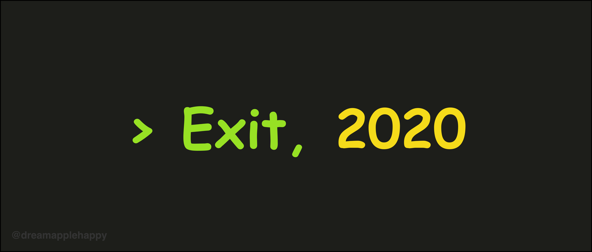
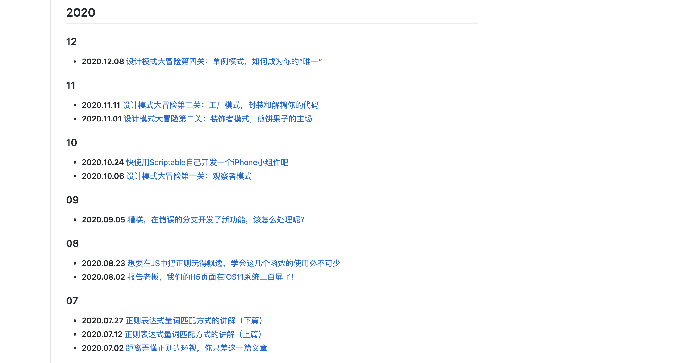
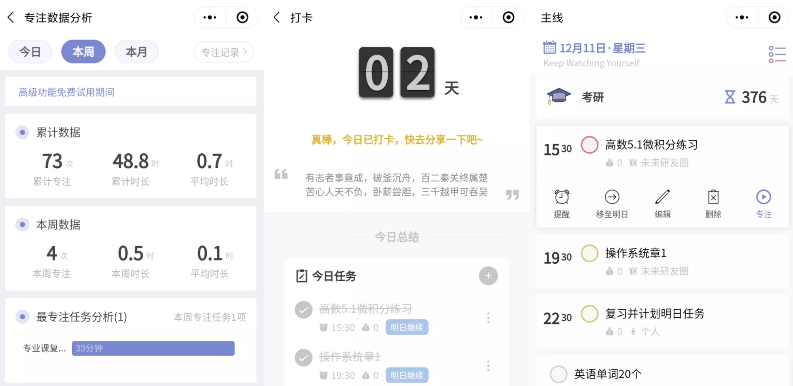
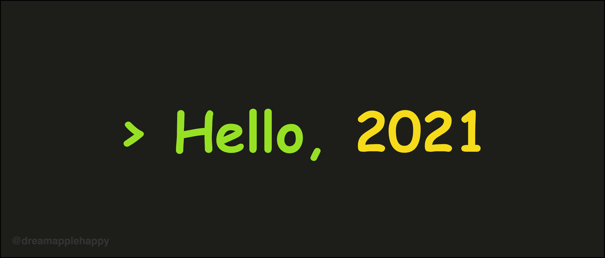

# 2020年，我第一次很正式地写年终总结

好像我一直没有写年终总结的习惯，之前也一直都是看别人写年终总结。有时看别人的年终总结，会感叹别人这一年过的好充实。看了很多书，去了很多地方；或者结识了很多新的朋友，能力得到了很多的提高等等吧。也常常会感觉自己这一年好像没干什么事情，会有那么一点沮丧。

**当我写这篇文章的时候，我突然意识到自己好像已经忘记了2020年定下的什么目标了。不难想象自己当时定下目标的时候肯定是踌躇满志的，没想到已经连定下的什么目标都忘记了**。

所以写一下年终总结对我来说还是很有必要的，**一方面可以记录一下自己这一年做了哪些事情。另一方面也可以记录自己对来年的一个目标，等到下一年再次写年终总结的时候就有了一个对比**。可以知道自己是进步了还是倒退了，可以看看自己之前定下的目标都实现了多少。这样我觉得也挺好的，今年就作为一个开始吧。

## 工作和技术分享，输出了14篇文章

2020年的后半年加入了一家中型的互联网公司，再次开启了自己的职场生涯。我也重拾了自己写博客的习惯。**作为一个开发者，写博客在目前来说依然是一个不错的方式让大家认识和了解你**。对于自己来说，**写博客可以记录和沉淀自己学习过的知识或者解决的问题**。如果自己下次再遇到类似的问题，就知道如何去解决，如果忘记了就查找一下之前的博客。

**写博客也是一个强化自己知识的过程**。很多时候你以为你掌握了，但是真的到把这些知识写成博客，然后想要分享给别人的时候，你会发现自己好像并没有掌握的很牢固，也会有一些不熟练的地方。**而写博客这个过程恰恰就是帮助你把这些不熟悉的地方打通的一个很好的方法**。

关于写博客我自己也有一些心得，想在这里跟大家分享一下。**我觉得写博客最重要的其实是坚持，然后是自己对博客质量的要求，最后是平台的选择**。

先说一下坚持吧，我感觉每一个前端工程师或多或少都倒腾过自己的博客。我最早写博客是在 CSDN 和博客园，后来又转移到思否，掘金和知乎上，也使用过 Hexo，以及 Ghost 搭建过自己的博客。**反正前前后后换了很多平台，但是文章却没留下来几篇**。所以后来我就决定不再纠结在那个平台写博客了。而是把精力放在坚持写博客上，我们可以看看，**基本上那些技术很厉害的大牛也都是专注于自己博客的内容，而不是纠结博客的形式**。所以我后来就把我自己的博客放在了[Github](https://github.com/dreamapplehappy/blog)上，**简简单单的，反而让我有了坚持写下去的动力。看着文章一篇一篇增加，也是会有一点成就感的**。

然后就是博客的质量了，当我们能够坚持写博客之后，接下来就需要专注于我们博客的质量。我们写博客大多是为了**分享给别人或者用做记录以便自己查看**。如果是分享给别人看的话，**如何让大家从你的博客中学习到东西，或者能够吸引大家来看就是一个需要考虑的问题了**。一般来说，只要我们能够把要分享的内容讲清楚，内容逻辑条理清晰。这样下来，文章的质量一般不会太差。如果你的文笔还不错那就又是一个加分项了。

**持续高质量的文章输出很快就会给你带来很多的关注者，也会有很多厉害的人主动跟你联系**。这样下来，你通过写博客不但能够**提升自己的技术，提高自己的知名度，还可以跟优秀的人建立联系**。这些都是你的宝贵财富，也都是可以转换为你自己实实在在的利益的。**更重要的是，你写下的文章随着时间的推移，看到的人会越来越多，会持续给你带来更多收获的**。

最后就是平台的选择了，不同平台用户感兴趣的不一样，用户活跃度也不一样。这个要根据你自己的文章在各个平台的数据来判断，可以选择一两个作为主要的分享平台，其它的作为辅助。选择好一个合适的平台后，可以多跟这个平台的用户保持积极的沟通交流，你会收到来自大家的肯定，这会让你有继续坚持写下去的动力。

**在2020年我一共写了14篇[博客](https://github.com/dreamapplehappy/blog)，不算很多，但是每一篇博客我都写得很用心。我个人在数量和质量上进行权衡的时候，我还是比较看重质量的**。当然在接下来的2021年，我希望自己能够尽量半个月写一篇文章。在质量不下降的情况下，提升写博客的数量。

之前的博客主要围绕两个主题来写的，一个是关于**设计模式**的。我把这个系列称作[设计模式大冒险](https://mp.weixin.qq.com/mp/appmsgalbum?__biz=MzAwMDIzODY5MA==&action=getalbum&album_id=1557269952766771201&scene=173&subscene=0&sessionid=1610180505&enterid=1610180521&from_msgid=2247484071&from_itemidx=1&count=3#wechat_redirect)。另一个系列是关于**正则表达式**的，这个系列最近的更新比较少了。**主要是如果要深入的讲解好正则表达式，需要学习的知识很多；我也不希望自己一知半解的就去写一篇文章。这样是对自己文章和读者的不负责**。在新的一年，如果精力允许的话我还会继续更新关于正则表达式的一些文章，希望大家可以保持关注。

**细心的你也许会发现，我分享的知识都是不限于某一种语言的。我个人认为，学习知识应该学习通用的，适用范围更广的**。比如上面我分享的**设计模式**和**正则表达式**，以及**数据结构**和**算法**，还有**编程的思想**等等。**这些知识一旦掌握了，在每一种编程语言上面都可以使用。用世俗的评判标准就是“性价比”比较高**。

当然我不是说你就不需要对某一种语言，某一个框架，或者某一个方向深入研究了。这些也是很有必要的。**只不过有些类似的东西，你掌握好一个就可以了。你的时间和精力是有限的，要把时间放在更有用的地方**。当然，如果是因为工作的需要的话，那就是另外一回事了。工作的事情还是要做好的，要首先把自己工作需要掌握的知识掌握熟练之后，再考虑去学习其它的提升自己的知识。

上面是关于写博客，学习技术和技术分享的事情。接下来分享一些关于开发过程中的心得。我们在平时的开发中，**如果遇到一些不是很好开发的需求，一定要问一下产品做这个功能的目的是为了什么**。不要上来就去开始写代码了，很多情况下想要实现一个功能有很多种解决办法，产品告诉你的方式也许是一个不好实现的方式。这个时候你就可以跟产品沟通换一种方式是否可行，很多情况下经过我们沟通之后，发现可以用一种简单的方式实现同样的效果。

**多跟产品沟通，多思考为什么要这样做。这样，在以后的开发过程中，你会减少很多不必要的编码劳动，也能够工作的比较舒服一点**。

## 主线程小程序的持续维护

关注我的一些朋友知道我跟我的女朋友在2019年做了一个创业项目，是一个学习打卡类小程序，小程序的名字是[主线程](https://image-static.segmentfault.com/574/622/574622162-5fdb29846af78)，如果你想了解更多可以看一下之前思否的一个小采访，[如果全身心投入1年，但是收入是0，你还愿意做独立开发者吗？](https://segmentfault.com/a/1190000038515517)。

在2020年的4月份我们决定暂停主线程项目的继续开发，只做日常的系统维护工作。因为当时的经济状况已经不允许我们继续投入到这个项目中去了。**这个决定在目前的我们看来还算是一个正确的决定。因为如果继续下去，我们可能会面临一系列的问题和压力。这些问题和压力对于当时的我们来说大概率是解决不了的**。

那么，主线程这个项目成功了吗？这个问题要看你是从哪个角度去看了。**如果单纯从世俗的金钱回报上说，我们肯定是失败了，而且失败得很彻底。不仅没有赚到一分钱（除去一些赞赏），还倒贴了一笔钱。但是如果站在另外一个角度看的话，我觉得对于我们两个来说还是很成功的。首先我们从0到1把这个产品做了出来，并且这个产品也得到了不少用户的好评，一些关于产品的体验评价可以在[这里](https://www.v2ex.com/t/629464)浏览哦。到目前为止，在没有花钱推广的情况下已经有15000+的用户了。也算是一个小小的成就吧**。

每当收到用户对主线程的夸奖的时候，我们那种开心和成就感是用金钱换不来的。其实最重要的收获是在于我们对创业，对产品和看待事情的角度都发生了变化。**以前的角色是作为公司的员工，现在是以一个创业者的身份来看待和处理这些事情，这中间我们学习到了很多**。

**总之我们不后悔花费了一年的时间开发了一个没有盈利的产品，接下来我们还会继续维护这个项目**。如果你有什么关于创业和开发产品的想法想跟我交流的，也欢迎添加我的[个人微信](https://image-static.segmentfault.com/101/469/1014693772-60083db491055)（请备注来意），我们一起沟通交流一下吧。

## 身体健康和读书

去年前半年因为没有上班，所以有比较多的时间锻炼身体。**跑步基本每周有两三次，那段时间经历也还算充沛**。后半年上班之后，时间比较少，再加上冬天也比较冷。跑步的次数就很少了，从Kepp上的记录来看，我后半年关于做俯卧撑的锻炼就只做了13次，因为锻炼比较少。可以明显感觉到每天工作到快晚上下班的时候会比较疲惫。

也因为工作的原因，久坐在办公室，颈椎和腰有时也会感觉到有点不舒服。关于吃饭，好的一点是去年点外卖的次数变少了。去外面小餐馆吃饭的次数变多了。**我个人会觉得出去走动一下挺好的，呼吸一下外面的新鲜空气，给自己换个心情。走路去外面吃个饭也算是一个小小的锻炼吧**。

去年读书没有读很多，**《增长黑客》** 这本书基本读完了，感觉收获很多。对于想创业的朋友应该很有帮助的，推荐感兴趣的可以读一读。还有一本书是 **《丰子恺：无宠不惊过一生》** ，还没读完，不过每次读都会给我一些启发，给我带来一些内心的平静。感兴趣的也可以读一下。

**因为短视频的兴起，感觉自己身边很多的人都没有了读书的习惯了**。很多人可能都没有耐心读完一篇很长的文章了。我个人感觉这不是一个很好的习惯，我之前也有一段时间对抖音比较沉迷，每周在上面花费的时间有4，5个小时。后来我意识到，看这些短视频并不能给我带来什么能力和技术的提升，大部分情况下都只是消耗了我的时间而已。所以我慢慢就不怎么看了，现在手机上的抖音虽然没有被我卸载，但是一直处于待更新的状态。

我觉得，知识的获取需要一个比较完整的体系。**看书或者看一个系列的文章和视频在目前依然还是一个挺好的方式去获取知识。碎片化的知识会让你感觉自己掌握了很多知识，但是这些知识没有成为一个体系，没有融合进你自己的知识系统的话，这些知识是很难被你再次吸收和利用的**。我自己平时比较喜欢在 **《珍新闻》** 上面获取一些资讯，个人感觉里面的文章都还是不错的，大部分能够把一个事情讲明白，讲解完整。很多文章也会带给你一些思考。如果感兴趣的话，可以体验一下。

## 新年的计划

关于去年的一些总结已经写得差不多了，接下来就是对2021的的一些展望了。下面是我列的一些想在2021年完成的一些目标。

+ **阅读12本书，希望自己可以一个月读一本书，书的种类不做限制，先培养自己读书的习惯**。
+ **博客继续更新，希望半个月可以写一篇**。会继续更新[设计模式大冒险](https://mp.weixin.qq.com/mp/appmsgalbum?__biz=MzAwMDIzODY5MA==&action=getalbum&album_id=1557269952766771201&scene=173&subscene=0&sessionid=1610180505&enterid=1610180521&from_msgid=2247484071&from_itemidx=1&count=3#wechat_redirect)系列，和正则表达式系列。应该还会加上数据结构和算法。之前写文章会比较纠结一些细节，导致写一篇文章用的时间比较久，新的一年我要把写文章的流程好好优化一下，争取在原来的基础上再多写几篇高质量的文章。
+ **争取每周可以锻炼一次，不管是跑步，俯卧撑锻炼还是爬山或者其他的运动。把身体搞好是很重要的事情**。
+ **多认识一些新的朋友，多跟不同行业的人沟通交流。提升一下自己的人脉和社交水平**。

上面的这些就是我打算在2021年完成的一些事情了，当然还有一些我现在正在做但是不知道自己能不能坚持下来的事情。如果我坚持下来了，会告诉大家的。希望大家保持关注。

如果你有什么想跟我沟通的，可以添加我的[微信](https://image-static.segmentfault.com/101/469/1014693772-60083db491055)或者关注我的公众号[关山不难越](https://image-static.segmentfault.com/426/094/4260948368-54aad325bf3af665_articlex)，新的一年我们一起加油吧。新的一年祝大家都身体健康，然后定下的目标都能够实现。
