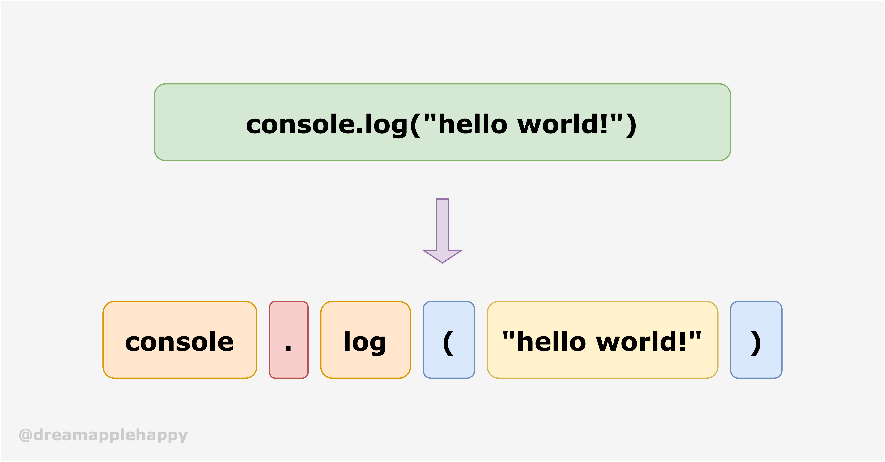
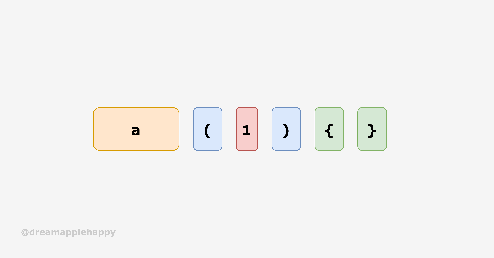

# 动手写一个简单的编译器：在JavaScript中使用Swift的尾闭包语法


首先跟大家说一下我为什么会有这个想法吧，因为最近在空闲时间学习`Swift`和`SwiftUI`的时候会经常使用到这种叫做[`尾闭包`](https://docs.swift.org/swift-book/LanguageGuide/Closures.html)的语法，就觉得很有趣。同时因为很早之前看过[**jamiebuilds**](https://github.com/jamiebuilds)的[**the-super-tiny-compiler**](https://github.com/jamiebuilds/the-super-tiny-compiler)，就想着能不能自己也实现一个类似的有趣好玩简单的编译器。所以就有了[**js-trailing-closure-toy-compiler**](https://github.com/dreamapplehappy/js-trailing-closure-toy-compiler)这个项目，以及今天的这篇文章。

对于不熟悉`Swift`的同学来说，我先来解释一下什么是`尾闭包`。简单来说，就是如果一个函数的最后一个参数也是一个函数，那么我们就可以使用尾闭包的方式来传递最后一个函数。大家可以看下面的代码示例：

```javascript
// 例子中的 a 表示一个函数

// #1:简单版
// Swift 的方式
a(){
  // 尾闭包的内容
}
// JavaScript 的方式
a(() => {})

// #2:函数带参数
// Swift 的方式，这里先忽略参数的类型
a(1, 2, 3){
  // 尾闭包的内容
}
// JavaScript 的方式
a(1, 2, 3, () => {})

// #3:尾闭包带有参数
// Swift 的方式，这里先忽略参数的类型
a(1, 2, 3){ arg1, arg2 in
  // 尾闭包的内容
}
// JavaScript 的方式
a(1, 2, 3, (arg1, arg2) => {})

```

如果关于`Swift`的尾闭包还有什么疑问的话，大家可以看一下官方的文档[Closures](https://docs.swift.org/swift-book/LanguageGuide/Closures.html)，里面解释的也很清楚。

我记得自己很早之前就看过[the-super-tiny-compiler](https://github.com/jamiebuilds/the-super-tiny-compiler)项目的源码，不过当时只是简单的看了一遍。就以为自己掌握了里面的一些知识和原理。但是当我想实现我自己心中的这个想法的时候。却发现之前并没有把这个项目里面实践的一些方法和技巧掌握好。所以我决定先好好的把这个项目的源码看懂，然后自己先实现一个跟原来的项目功能一样的样例之后才开始着手实现自己的小编译器。

**友情提示，接下来的文章内容比较长，建议收藏后再仔细阅读**。

## 编译器的实现过程

从**the-super-tiny-compiler**我们可以了解到，对于一般的编译器来说。主要有四个步骤去完成编译的过程，这四个步骤分别是：

+ **tokenizer：将我们的代码文本字符串转换成一个个有意义的单元（也就是`token`）**。比如`if`，`"hello"`，`123`，`let`，`const`等等。
+ **parser：将上一步获取到的`token`转换成当前语言的抽象语法树，也就是`AST`( Abstract Syntax Tree )**。为什么要这么做呢？因为这样处理之后，我们就知道代码中语句的先后关系和层级关系。也知道运行的顺序，以及上下文等等相关的信息了。
+ **transformer：将上一步获取到的`AST`转换成目标语言的`AST`**。为什么要做这一步呢？对于相同功能的程序语句来说，如果选择实现的语言不一样，那它们的语法大概率也是不一样的。这就导致了它们对应的抽象语法树也是不一样的。所以我们需要做一次转换，为了下一步生成目标语言的代码做好准备。
+ **codeGenerator**：这一步相对来说比较简单，知道了目标语言的语法之后，我们根据上一步骤生成的新的抽象语法树，可以方便快捷的生成我们想要的目标语言的代码。

**上面的步骤就是编译器的大概工作流程了，但是仅仅知道这些流程还是不够的，还需要我们亲自动手实践一下**。如果看到这里你有兴趣的话，可以点击这里[JavaScript Trailing Closure Toy Compiler](https://dreamapple.gitee.io/code-examples/2021/0404/)先体验一下最后实现的效果。如果你对具体的实现过程感兴趣的话，可以继续下面的阅读，相信看过之后你会有很大的收获的，也许会想要自己也实现一个有趣的编译器呢。

### Tokenizer：将代码字符串转换为`token`

**首先我们需要明白为什么要把字符串转换为一个个的`token`，因为如果不做转换，我们就不知道这段程序要表示的是什么意思，因为`token`是理解一段程序的必要条件。**

这就好比`console.log("hello world!")`这个语句来说，我们一眼就知道它是干嘛的，但是我们是怎么思考的呢？是不是首先是`console`我们知道是`console`对象，然后是`.`我们知道是获取对象的属性操作符，再然后是`log`方法，然后方法的调用需要`(`左括号作为开始，然后是`hello world!`字符串为参数，然后遇到了后面的`)`右括号表示结束。



所以把字符串转换成`token`就是为了让我们知道这段程序要表示的是什么意思。因为根据每一个`token`的值，以及`token`所处的位置，我们可以准确知道这个`token`表示的是什么，它有什么作用。

那对于我们这个编译器来说，第一步需要把我们所需要的`token`做一个划分，那么根据上面的代码示例。我们可以知道，我们需要的`token`的类型有这么几种：

+ **数字**：比如`1`，`66`等。
+ **字符串**：比如`"hello"`等。
+ **标识符**：比如`a`，在我们这个编译器的环境下，一般表示函数名或者变量名。
+ **小括号**：`(`和`)`，在这里用来表示函数的调用。
+ **花括号**：`{`和`}`，在这里用来表示函数体。
+ **逗号**：`,`，用来分割参数。
+ **空白符**：` `，用来区分不同的`token`。

因为我们这个编译器暂时只专注于我们想要的尾闭包的实现，所以暂时只需要关注上面这些`token`的类型就可以了。

这一步其实比较简单，就是按照我们的需求，循环读取`token`，代码部分如下所示：

```javascript
// 将字符串解析为Tokens
const tokenizer = (input) => {
    // 简单的正则
    const numReg = /\d/;
    const idReg = /[a-z]/i;
    const spaceReg = /\s/;

    // Tokens 数组
    const tokens = [];

    // 判断 input 的长度
    const len = input.length;
    if (len > 0) {
        let cur = 0;
        while(cur < len) {
            let curChar = input[cur];

            // 判断是否是数字
            if (numReg.test(curChar)) {
                let num = '';
                while(numReg.test(curChar) && curChar) {
                    num += curChar;
                    curChar = input[++cur];
                }
                tokens.push({
                    type: 'NumericLiteral',
                    value: num
                });
                continue;
            }

            // 判断是否是标识符
            if (idReg.test(curChar)) {
                let idVal = '';
                while(idReg.test(curChar) && curChar) {
                    idVal += curChar;
                    curChar = input[++cur];
                }

                // 判断是否是 in 关键字
                if (idVal === 'in') {
                    tokens.push({
                        type: 'InKeyword',
                        value: idVal
                    });
                } else {
                    tokens.push({
                        type: 'Identifier',
                        value: idVal
                    });
                }
                continue;
            }

            // 判断是否是字符串
            if (curChar === '"') {
                let strVal = '';
                curChar = input[++cur];
                while(curChar !== '"') {
                    strVal += curChar;
                    curChar = input[++cur];
                }
                tokens.push({
                    type: 'StringLiteral',
                    value: strVal
                });
                // 需要处理字符串的最后一个双引号
                cur++;
                continue;
            }

            // 判断是否是左括号
            if (curChar === '(') {
                tokens.push({
                    type: 'ParenLeft',
                    value: '('
                });
                cur++;
                continue;
            }

            // 判断是否是右括号
            if (curChar === ')') {
                tokens.push({
                    type: 'ParenRight',
                    value: ')'
                });
                cur++;
                continue;
            }

            // 判断是否是左花括号
            if (curChar === '{') {
                tokens.push({
                    type: 'BraceLeft',
                    value: '{'
                });
                cur++;
                continue;
            }

            // 判断是否是右花括号
            if (curChar === '}') {
                tokens.push({
                    type: 'BraceRight',
                    value: '}'
                });
                cur++;
                continue;
            }

            // 判断是否是逗号
            if (curChar === ',') {
                tokens.push({
                    type: 'Comma',
                    value: ','
                });
                cur++;
                continue;
            }

            // 判断是否是空白符号
            if (spaceReg.test(curChar)) {
                cur++;
                continue;
            }

            throw new Error(`${curChar} is not a good character`);
        }
    }

    console.log(tokens, tokens.length);
    return tokens;
};
```

上面的代码虽然不是很复杂，但是有一些需要注意的点，如果不细心很容易出错或者进入一个死循环。下面是我觉得一些容易出现问题的地方：

+ **外层使用了`while`循环，每次循环开始时会首先获取当前下标对应的字符**。之所以没有使用`for`循环是因为这里关于当前字符的下标`cur`是由里面的判断来推进的，使用`while`更方便一些。
+ **如果读取到字符串，数字以及标识符的话，需要进行内循环进行连续读取，直到下一个字符不是当前想要的类型为止**。因为如果读取的类型可能不止一个字符的话，就需要判断下一个字符是否符合当前的类型。如果不符合的话，就终止当前类型的读取，且需要跳出当前循环，进行下一轮的外循环。
+ **对于字符串来说，在字符串的开头和结尾的`"`需要跳过，不计入字符串的值里面。遇到空白符需要跳过**。

这个过程技术难度不大，需要多一点耐心。实现完成之后，我们可以测试一下：

```javascript
tokenizer(`a(1){}`)
```

可以看到输出的结果如下：

```javascript
(6) [{…}, {…}, {…}, {…}, {…}, {…}]
0: {type: "Identifier", value: "a"}
1: {type: "ParenLeft", value: "("}
2: {type: "NumericLiteral", value: "1"}
3: {type: "ParenRight", value: ")"}
4: {type: "BraceLeft", value: "{"}
5: {type: "BraceRight", value: "}"}
```

可以看到输出的结果是我们想要的结果，到这里我们已经成功了25%了。接下来就是把得到的`token`数组转换为`AST`抽象语法树。


### Parser：将`token`数组转换为`AST`抽象语法树

接下来的步骤就是把`token`数组转换为`AST(抽象语法树)`了，进行了上一个步骤之后，我们把代码字符串，转变为一个个有意义的`token`。当我们得到了这些`token`之后，就可以根据每一个`token`表示的意义进而推导出整个抽象语法树。 

比如我们遇到了`{`，我们就知道在遇到下一个`}`为止，这中间的所有的`token`表示的是一个函数的函数体（暂时不考虑其它情况）。

下图所示的`token`示例：



表示的程序语句应该是：

```javascript
a(1) {
  // block
};
```


那么它所对应的抽象语法树应该是这个样子的：

 ```javascript
{
  "type": "Program",
  "body": [
    {
      "type": "CallExpression",
      "value": "a",
      "params": [
        {
          "type": "NumericLiteral",
          "value": "1",
          "parentType": "ARGUMENTS_PARENT_TYPE"
        }
      ],
      "hasTrailingBlock": true,
      "trailingBlockParams": [],
      "trailingBody": []
    }
  ]
}
 ```

我们可以简单的看一下上面的抽象语法树，首先最外层的类型是`Program`，然后`body`里面的内容就表示我们的代码内容。在这里我们的`body`数组只有一个元素，表示的是`CallExpression`，也就是一个函数调用。

这个`CallExpression`的函数名字是`a`，然后函数第一个参数类型值是`NumericLiteral`，数值是`1`。这个参数的父节点类型是`ARGUMENTS_PARENT_TYPE`，下面还会对这个属性进行解释。然后这个`CallExpression`的`hasTrailingBlock`值为`true`，表示这是一个尾闭包函数调用。然后`trailingBlockParams`表示尾闭包没有参数，`trailingBody`表示尾闭包里面的内容为空。


上面只是一个简单的解释，详细的代码部分如下所示：

```javascript
// 将 Tokens 转换为 AST
const parser = (tokens) => {
    const ast = {
        type: 'Program',
        body: []
    };

    let cur = 0;

    const walk = () => {
        let token = tokens[cur];

        // 是数字直接返回
        if (token.type === 'NumericLiteral') {
            cur++;
            return {
                type: 'NumericLiteral',
                value: token.value
            };
        }

        // 是字符串直接返回
        if (token.type === 'StringLiteral') {
            cur++;
            return {
                type: 'StringLiteral',
                value: token.value
            };
        }

        // 是逗号直接返回
        if (token.type === 'Comma') {
            cur++;
            return;
        }

        // 如果是标识符，在这里我们只有函数的调用，所以需要判断函数有没有其它的参数
        if (token.type === 'Identifier') {
            const callExp = {
                type: 'CallExpression',
                value: token.value,
                params: [],
                hasTrailingBlock: false,
                trailingBlockParams: [],
                trailingBody: []
            };
            // 指定节点对应的父节点的类型，方便后面的判断
            const specifyParentNodeType = () => {
                // 过滤逗号
                callExp.params = callExp.params.filter(p => p);
                callExp.trailingBlockParams = callExp.trailingBlockParams.filter(p => p);
                callExp.trailingBody = callExp.trailingBody.filter(p => p);

                callExp.params.forEach((node) => {
                    node.parentType = ARGUMENTS_PARENT_TYPE;
                });
                callExp.trailingBlockParams.forEach((node) => {
                    node.parentType = ARGUMENTS_PARENT_TYPE;
                });
                callExp.trailingBody.forEach((node) => {
                    node.parentType = BLOCK_PARENT_TYPE;
                });
            };
            const handleBraceBlock = () => {
                callExp.hasTrailingBlock = true;
                // 收集闭包函数的参数
                token = tokens[++cur];
                const params = [];
                const blockBody = [];
                let isParamsCollected = false;
                while(token.type !== 'BraceRight') {
                    if (token.type === 'InKeyword') {
                        callExp.trailingBlockParams = params;
                        isParamsCollected = true;
                        token = tokens[++cur];
                    } else {
                        if (!isParamsCollected) {
                            params.push(walk());
                            token = tokens[cur];
                        } else {
                            // 处理花括号里面的数据
                            blockBody.push(walk());
                            token = tokens[cur];
                        }
                    }
                }
                // 如果 isParamsCollected 到这里还是 false，说明花括号里面没有参数
                if (!isParamsCollected) {
                    // 如果没有参数 收集的就不是参数了
                    callExp.trailingBody = params;
                } else {
                    callExp.trailingBody = blockBody;
                }
                // 处理右边的花括号
                cur++;
            };
            // 判断后面紧接着的 token 是 `(` 还是 `{`
            // 需要判断当前的 token 是函数调用还是参数
            const next = tokens[cur + 1];
            if (next.type === 'ParenLeft' || next.type === 'BraceLeft') {
                token = tokens[++cur];
                if (token.type === 'ParenLeft') {
                    // 需要收集函数的参数
                    // 需要判断下一个 token 是否是 `)`
                    token = tokens[++cur];
                    while(token.type !== 'ParenRight') {
                        callExp.params.push(walk());
                        token = tokens[cur];
                    }
                    // 处理右边的圆括号
                    cur++;
                    // 获取 `)` 后面的 token
                    token = tokens[cur];
                    // 处理后面的尾部闭包；需要判断 token 是否存在 考虑`func()`
                    if (token && token.type === 'BraceLeft') {
                        handleBraceBlock();
                    }
                } else {
                    handleBraceBlock();
                }
                // 指定节点对应的父节点的类型
                specifyParentNodeType();
                return callExp;
            } else {
                cur++;
                return {
                    type: 'Identifier',
                    value: token.value
                };
            }
        }

        throw new Error(`this ${token} is not a good token`);
    };

    while (cur < tokens.length) {
        ast.body.push(walk());
    }

    console.log(ast);
    return ast;
};
```

为了方便大家理解，我把一些关键的地方都添加了一些注释。下面再次对上面的代码做一些简单的解释。

首先我们需要对`tokens`数组进行遍历，我们首先定义了抽象语法树的最外层的结构是：

```javascript
const ast = {
  type: 'Program',
  body: []
};
```

这样定义是为了后续的节点对象能够按照一定的规则添加到我们的抽象语法树上。

然后我们定义了一个`walk`函数用来对`tokens`数组中的元素进行遍历。对于`walk`函数来说，如果直接遇到`数字`，`字符串`，`逗号`的话都是直接返回的。当遇到的`token`是一个标识符的话，需要判断的情况比较多。

对于一个标识符来说，在我们这种情境下有两种处理：

+ **一种情况就是一个单独的标识符，这时候标识符后面紧跟的`token`既不是表示`(`的，也不是表示`{`的**。
+ **另一种情况表示的是一个函数的调用，对于函数的调用来说，我们需要考虑以下这几种情况**：
  + **一种情况是函数只有一个尾闭包，不含有其它的参数**。比如`a{}`；
  + **另一种情况是函数的调用不含有尾闭包，可以含有参数也可以不带参数**。比如`a()`或者`a(1)`;
  + **最后一种就是函数的调用含有尾闭包**。比如`a{}`,`a(){}`,`a(1){}`等等。**对于有尾闭包的情况还需要考虑尾部闭包有没有参数**，比如`a(1){b, c in }`。

接下来主要对`token`是标识符类型的处理做一个简单的解释，如果判断`token`的类型是标识符的话，我们会先定义一个`CallExpression`类型的对象`callExp`，这个对象就是用来表示我们函数调用的语法树对象。这个对象有以下几个属性：

+ **`type`**：表示节点的类型
+ **`value`**：表示节点的名称，这里表示函数名
+ **`params`**：表示函数调用的参数
+ **`hasTrailingBlock`**：表示当前函数调用是否包含尾闭包
+ **`trailingBlockParams`**：表示尾闭包是否含有参数
+ **`trailingBody`**：尾闭包里面的内容

接下来判断标识符后面的`token`类型是什么，如果是函数的调用的话，当前`token`后面的`token`必须是`(`或者是`{`。如果不是的话，我们直接返回这个标识符。

**如果是函数的调用，我们需要做两个事情，一个是收集函数调用的参数，一个是判断函数调用后面是不是含有尾闭包**。对于函数参数的收集比较简单，首先判断当前`token`后面的`token`是不是表示的是`(`，如果是的话，开始收集参数，直到遇到下一个`token`的类型是`)`表示参数收集结束。**还要注意的一点是，因为参数有可能是一个函数，所以我们需要在收集参数的时候再次调用`walk`函数，来帮助我们递归的进行参数的处理**。

接下来就是判断函数调用后面是否含有尾闭包，对于尾闭包的判断有两种情况需要考虑：**一种就是函数的调用含有有参数，在参数的后面含有尾闭包；另一种是函数的调用没有参数，直接就是一个尾闭包。所以我们需要对这两种情况都做一下处理**。

既然有两个地方都要进行是否是尾闭包的判断，我们可以把这部分的逻辑抽离到`handleBraceBlock`函数中，这个函数就是帮助我们来进行尾闭包的处理。接下来来解释一下尾闭包是如何进行处理的。

如果我们判断下一个`token`是`{`那么说明我们需要进行尾闭包的处理了，我们首先把`callExp`对象的`hasTrailingBlock`属性的值设置为`true`；然后需要判断尾闭包是否含有参数，并且需要处理尾闭包的内部内容。

如何收集尾闭包的参数呢？我们需要判断在尾闭包里面是否含有`in`关键字，如果含有`in`关键字，那就说明尾闭包里面含有参数，如果没有就表示尾闭包里不含有参数，只需要处理尾闭包内部的内容即可。

又因为我们刚开始不知道尾闭包中是否含有`in`关键字，所以我们一开始收集的内容可能是尾闭包里面的内容，也有可能是参数；所以当在遇到`}`尾闭包的结束`token`之后，这期间如果没有`in`关键字，那说明我们收集到的都是尾闭包的内容。

无论是收集尾闭包的参数还是内容，我们都需要使用`walk`函数来进行递归操作，因为参数和内容都可能不是基本的数值类型值（为了简化操作，我们这里对尾闭包的参数也使用`walk`来进行递归操作）。

在返回`callExp`对象之前，我们需要使用`specifyParentNodeType`帮助函数额外的做一下处理。第一个处理是去掉表示`,`的`token`，另一个操作就是需要给`callExp`对象的`params`，`trailingBlockParams`和`trailingBody`属性中的节点指定一下父节点的类型，对于`params`和`trailingBlockParams`来说，它们的父节点类型都是`ARGUMENTS_PARENT_TYPE`类型的；对于`trailingBody`来说，它的父节点类型是`BLOCK_PARENT_TYPE`类型的。这样的处理方便我们进行下一步的操作。在进行下面步骤讲解的时候我们会再次对其进行说明。

### Transformer：将旧 AST 转换为目标语言的 AST

接下来就是把我们获取到的原始`AST`转换为目标语言的`AST`，那么我们为什么要做这一步处理呢？这是因为同样的编码逻辑，在不同的宿主语言的表现是不一样的。所以我们要把原始的`AST`转换成我们目标语言的`AST`。

那我们怎么进行操作呢？原始的`AST`是一个树形的结构，我们需要对这个树形的结构进行遍历；遍历需要使用深度优先的遍历，因为对于一个嵌套的结构来说，只有将里面的内容确定了之后，外面的内容才能够随之确定。

这里对树形结构的遍历我们会用到一种设计模式，那就是[**访问者模式**](https://en.wikipedia.org/wiki/Visitor_pattern)。我们需要一个访问者对象对我们的树形对象进行深度优先的遍历，这个访问者对象有针对不同类型节点的处理函数，当遇到一个节点的时候，我们就会根据当前节点的类型，从访问者对象身上获取相应的处理函数对这个节点进行处理。

我们首先看一下如何对原始的树形结构进行遍历，对于原来的树形结构来说，每一个节点要么是一个具体类型的对象，要么是一个数组。所以我们要对这两种情况分别进行处理。我们首先确定如何进行树形结构的遍历，这部分的代码如下所示：

```javascript
// 遍历节点
const traverser = (ast, visitor) => {
    const traverseNode = (node, parent) => {

        const method = visitor[node.type];
        if (method && method.enter) {
            method.enter(node, parent);
        }

        const t = node.type;
        switch (t) {
            case 'Program':
                traverseArr(node.body, node);
                break;
            case 'CallExpression':
                // 处理 ArrowFunctionExpression
                // TODO 考虑body 里面存在尾部闭包
                if (node.hasTrailingBlock) {
                    node.params.push({
                        type: 'ArrowFunctionExpression',
                        parentType: ARGUMENTS_PARENT_TYPE,
                        params: node.trailingBlockParams,
                        body: node.trailingBody
                    });
                    traverseArr(node.params, node);
                } else {
                    traverseArr(node.params, node);
                }
                break;
            case 'ArrowFunctionExpression':
                traverseArr(node.params, node);
                traverseArr(node.body, node);
                break;
            case 'Identifier':
            case 'NumericLiteral':
            case 'StringLiteral':
                break;
            default:
                throw new Error(`this type ${t} is not a good type`);
        }

        if (method && method.exit) {
            method.exit(node, parent);
        }
    };
    const traverseArr = (arr, parent) => {
        arr.forEach((node) => {
            traverseNode(node, parent);
        });
    };
    traverseNode(ast, null);
};
```

我来简单解释一下这个`traverser`函数，这个函数内部定义了两个函数，一个是`traverseNode`，一个是`traverseArr`。`traverseArr`函数的作用是，如果当前的节点是一个数组的话，我们需要对数组里面的每一个节点分别进行处理。

节点的主要处理逻辑都在`traverseNode`里面，我们来看一下这个函数都做了哪些事情？首先根据节点的类型，从`visitor`对象上获取对应节点的处理方法。然后对接点类型进行判断，如果节点的类型是基本类型的话，就不做处理；如果节点的类型是`ArrowFunctionExpression`箭头函数的话，需要依次遍历这个节点的`params`和`body`属性。如果节点的类型是`CallExpression`的话，表示当前的节点是一个函数调用节点，那么我们就需要判断这个函数调用是否包含尾闭包，如果包含尾闭包的话，那就说明我们原来的函数调用需要额外添加一个参数，这个参数是一个箭头函数。所以会有下面这样一段代码进行判断：

```javascript
// ...
if (node.hasTrailingBlock) {
    node.params.push({
        type: 'ArrowFunctionExpression',
        parentType: ARGUMENTS_PARENT_TYPE,
        params: node.trailingBlockParams,
        body: node.trailingBody
    });
    traverseArr(node.params, node);
} else {
    traverseArr(node.params, node);
}
// ...
```

然后就是对这个`CallExpression`节点的`params`属性进行遍历。当函数的调用包含尾闭包的时候，我们往节点的`params`属性里添加了一个类型是`ArrowFunctionExpression`的对象，而且这个对象的`parentType`的值是`ARGUMENTS_PARENT_TYPE`，因为这样我们就知道这个对象的父节点类型，方便我们下面进行语法树转换时使用。

再接下来就是定义访问者对象上面不同节点类型的处理方法了，具体的代码如下：

```javascript
const transformer = (ast) => {
    const newAst = {
        type: 'Program',
        body: []
    };

    ast._container = newAst.body;

    const getNodeContainer = (node, parent) => {
        const parentType = node.parentType;
        if (parentType) {
            if (parentType === BLOCK_PARENT_TYPE) {
                return parent._bodyContainer;
            }
            if (parentType === ARGUMENTS_PARENT_TYPE) {
                return parent._argumentsContainer;
            }
        } else {
            return parent._container;
        }
    };

    traverser(ast, {
        NumericLiteral: {
            enter: (node, parent) => {
                getNodeContainer(node, parent).push({
                    type: 'NumericLiteral',
                    value: node.value
                });
            }
        },
        StringLiteral: {
            enter: (node, parent) => {
                getNodeContainer(node, parent).push({
                    type: 'StringLiteral',
                    value: node.value
                });
            }
        },
        Identifier: {
            enter: (node, parent) => {
                getNodeContainer(node, parent).push({
                    type: 'Identifier',
                    name: node.value
                });
            }
        },
        CallExpression: {
            enter: (node, parent) => {
                // TODO 优化一下
                const callExp = {
                    type: 'CallExpression',
                    callee: {
                        type: 'Identifier',
                        name: node.value
                    },
                    arguments: [],
                    blockBody: []
                };
                // 给参数添加 _container
                node._argumentsContainer = callExp.arguments;
                node._bodyContainer = callExp.blockBody;
                getNodeContainer(node, parent).push(callExp);
            }
        },
        ArrowFunctionExpression: {
            enter: (node, parent) => {
                // TODO 优化一下
                const arrowFunc = {
                    type: 'ArrowFunctionExpression',
                    arguments: [],
                    blockBody: []
                };
                // 给参数添加 _container
                node._argumentsContainer = arrowFunc.arguments;
                node._bodyContainer = arrowFunc.blockBody;
                getNodeContainer(node, parent).push(arrowFunc);
            }
        }
    });
    console.log(newAst);
    return newAst;
};
```

我们首先定义了新的`AST`的外层属性，然后是`ast._container = newAst.body`，这个操作的作用是将旧的`AST`和新的`AST`最外层进行关联，因为我们遍历的是旧的`AST`。这样我们就可以通过`_container`属性指向新的`AST`。这样我们向`_container`里面添加元素的时候，实际上就是在新的`AST`上添加对应的节点。这样处理对我们来说相对比较简单一点。

然后就是`getNodeContainer`函数，这个函数的作用就是获取当前节点的父节点的`_container`属性，如果当前节点的`parentType`属性不为空，那说明当前节点的父节点表示的可能是函数调用的参数，也有可能是尾闭包里面的内容。这时可以根据`node.parentType`的类型进行判断。如果当前节点的`parentType`属性为空，那就说明当前节点的父节点的`_container`属性就是父节点的`_container`属性。

接下来就是`visitor`对象上面不同节点类型的处理方法了，对于基本类型还是直接返回对应的节点就可以了。如果是`CallExpression`和`ArrowFunctionExpression`类型的话，就需要一些额外的处理了。

首先对于`ArrowFunctionExpression`类型节点来说，首先声明了一个`arrowFunc`对象，然后将对应节点的`_argumentsContainer`属性指向`arrowFunc`对象的`arguments`属性；将节点的`_bodyContainer`属性指向`arrowFunc`对象的`blockBody`属性。然后获取当前节点的父节点的`_container`属性，最后将`arrowFunc`添加到这个属性上。对于节点类型是`CallExpression`的节点的处理跟上面的类似，只不过定义的对象多了一个`callee`属性，表明函数调用的函数名称。

到此为止将旧的`AST`转换为新的`AST`就完成了。

### CodeGenerator：遍历新的 AST 生成代码

这一步就比较简单了，根据节点的类型拼接对应类型的代码就可以了；详细的代码如下所示：

```javascript
const codeGenerator = (node) => {
    const type = node.type;
    switch (type) {
        case 'Program':
            return node.body.map(codeGenerator).join(';\n');
        case 'Identifier':
            return node.name;
        case 'NumericLiteral':
            return node.value;
        case 'StringLiteral':
            return `"${node.value}"`;
        case 'CallExpression':
            return `${codeGenerator(node.callee)}(${node.arguments.map(codeGenerator).join(', ')})`;
        case 'ArrowFunctionExpression':
            return `(${node.arguments.map(codeGenerator).join(', ')}) => {${node.blockBody.map(codeGenerator).join(';')}}`;
        default:
            throw new Error(`this type ${type} is not a good type`);
    }
};
```

需要注意的可能就是对于`CallExpression`和`ArrowFunctionExpression`节点的处理了，对于`CallExpression`需要添加函数的名称，然后接下来就是函数调用的参数了。对于`ArrowFunctionExpression`来说，需要处理箭头函数的参数以及函数体的内容。相比上面的三个步骤来说，这个步骤还是相对比较简单的。

接下来就是将这四个步骤组合一下，这个简单的编译器就算完成了。具体的代码如下所示：

```javascript
// 组装
const compiler = (input) => {
    const tokens = tokenizer(input);
    const ast = parser(tokens);
    const newAst = transformer(ast);
    return codeGenerator(newAst);
};

// 导出对应的模块
module.exports = {
    tokenizer,
    parser,
    transformer,
    codeGenerator,
    compiler
};
```

### 简单总结

如果你有耐心看完的话，你会发现完成一个简单的编译器其实也没有很复杂。**我们需要把这四个过程要做什么理清楚，然后注意一些特殊的地方需要做特殊的处理，还有一个就是需要一点耐心了**。

当然我们这个版本的实现只是简单的完成了我们想要的那部分功能，实际上真正的编译器要考虑的东西是非常多的。上面这个版本的代码有很多地方也不是很规范，当初实现的时候先考虑如何实现，细节和可维护性没有考虑太多。如果你有什么好的想法，或者发现了什么错误欢迎给这个小项目提[Issues](https://github.com/dreamapplehappy/js-trailing-closure-toy-compiler/issues)或者[Pull Request](https://github.com/dreamapplehappy/js-trailing-closure-toy-compiler/pulls)，让这个小项目变得更好一点。也欢迎大家在文章下面留言，看看是不是能碰撞出什么新的思路与想法。

一些同学可能会说，学习这种东西有什么作用？**其实用途有很多，首先我们现在前端的构建基本上离不开[Babel](https://babel.dev/)对`JavaScript`新特性的支持，而`Babel`的作用其实就是一个编译器的作用，把我们语言新的特性转换成目前的浏览器可以支持的一些语法，让我们可以方便的使用新的语法，也减轻了前端开发的一些负担**。

另一方面你如果知道这些原理，你不仅可以很容易看懂一些`Babel`的语法转换插件的源代码，你还可以自己亲自动手实现一个简单的语法转换器或者一些有意思的插件。这会让你的前端能力有一个大的提升。

时间过得好快，距离上次发布文章已经过去两个月了😂，这篇文章也是过完年后的第一篇文章，希望以后还能够持续的输出一些高质量的文章。当然之前的[**设计模式大冒险系列**](https://mp.weixin.qq.com/mp/appmsgalbum?__biz=MzAwMDIzODY5MA==&action=getalbum&album_id=1557269952766771201&scene=173&subscene=0&sessionid=1610180505&enterid=1610180521&from_msgid=2247484071&from_itemidx=1&count=3#wechat_redirect)还会持续更新，也欢迎大家继续保持关注。

今天的文章到这里就结束了，如果你对这篇文章有什么意见和建议，欢迎在文章下面留言，或者在[这里](https://github.com/dreamapplehappy/js-trailing-closure-toy-compiler/issues)提出来。也欢迎大家关注我的公众号[**关山不难越**](https://image-static.segmentfault.com/426/094/4260948368-54aad325bf3af665_articlex)，如果你觉得这篇文章写的不错，或者对你有所帮助，那就点赞分享一下吧~

参考：
+ [the-super-tiny-compiler](https://github.com/jamiebuilds/the-super-tiny-compiler)
