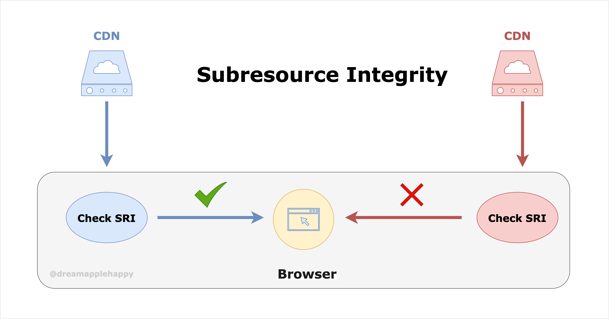
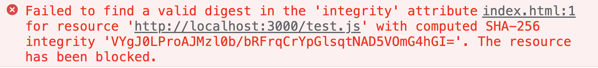
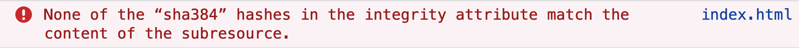
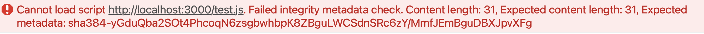

# Web页面子资源完整性校验详细指南



时间过得好快，距离上一篇文章[**动手写一个简单的编译器：在JavaScript中使用Swift的尾闭包语法**](https://github.com/dreamapplehappy/blog/tree/master/2021/04/05)发布已经过去快半年了，这半年时间也一直在想着按时更新文章；但是因为工作和生活的琐事，没有能够坚持下来。有点惭愧，感觉之前年初立下的[计划](https://github.com/dreamapplehappy/blog/tree/master/2021/01/21)快要实现不了了。希望接下来的这一段时间能够坚持更新文章吧。

这次要跟大家分享的是关于[**Subresource Integrity**](https://developer.mozilla.org/en-US/docs/Web/Security/Subresource_Integrity)（子资源完整性）的内容。如果平时对Web安全关注不是很多的话，可能没怎么听过这个术语。不知道也没关系，接下来我会跟大家一起来研究讨论一下这个内容，相信在看完这篇文章之后，你能够深入的理解什么是**SRI**，为什么要使用**SRI**，以及在有这方面需求的情况下如何在项目中实践使用**SRI**。

## SRI是什么，以及解决了什么问题

**SRI**是**Subresource Integrity**的简写，表示的是子资源的完整性。比如对于我们在页面中通过`link`和`script`标签引入的样式文件或者引入使用的第三方库就是页面的的子资源。比如像下面这样：

```html
<link rel="stylesheet" 
      href="https://stackpath.bootstrapcdn.com/bootstrap/3.4.1/css/bootstrap.min.css"  
      crossorigin="anonymous">

<script src="https://cdn.jsdelivr.net/npm/vue/dist/vue.js" 
        crossorigin="anonymous"></script>
```

**一般情况下，为了提高网页的响应速度以及性能，我们通常会把这些子资源放到CDN上**。对于大的互联网公司来说，一般会有自己的云服务，也基本会有自己的CDN服务。但是对于小公司来说，一般会使用云服务厂商提供的**CDN**功能。这里就会有一个问题，如果我们托管在云服务厂商的CDN上的资源万一被篡改了，那么就会对我们的业务产生一些影响。虽然这种事情一般情况下不会发生，但是如果我们的业务对安全要求很高的话，那么还是要对这种情况做好防范处理。

**SRI** 就是应对这个问题的一个解决方案。那么具体是通过什么方式来解决的呢？首先对于一个文件，我们如何知道这个文件的内容有没有被篡改呢？**我们可以对这个文件进行一个`哈希计算`然后通过`base64`编码生成一段跟文件内容关联的唯一的字符串。如果文件的内容发生了变化，那么通过相同的方式生成的字符串，跟原来的文件生成的字符串是不一样的。这样我们就知道文件被篡改了**。关于这一点如果大家对区块链有了解的话，应该比较容易理解的。

对于每一个引入的第三方资源，我们只需要在对应的标签上加上`integrity`属性，`integrity`属性的值是一个字符串，形式如下面这样：

```html
<script src="https://example.com/example-framework.js"
        integrity="sha384-oqVuAfXRKap7fdgcCY5uykM6+R9GqQ8K/uxy9rx7HNQlGYl1kPzQho1wx4JwY8wC"
        crossorigin="anonymous"></script>
```

其中`sha384-oqVuAfXRKap7fdgcCY5uykM6+R9GqQ8K/uxy9rx7HNQlGYl1kPzQho1wx4JwY8wC`就是`integrity`的值，这个字符串以`sha384`开头，表示的是对应安全散列算法的名称，还有`sha256`和`sha512`；接着是一个短横线`-`，用来分割算法名称和后面通过这个算法生成的`base64`编码的值；最后的`oqVuAfXRKap7fdgcCY5uykM6+R9GqQ8K/uxy9rx7HNQlGYl1kPzQho1wx4JwY8wC`表示的就是对应的文件经过计算后产生的字符串。

**当浏览器下载了带有`integrity`属性的子资源的时候，不会立刻执行里面的代码；或者应用里面的样式。浏览器会首先根据`integrity`属性值中指定的相应算法以及下载的文件的内容计算一下这个文件的哈希值是否跟标签中的那个值一样，只有两者一样的情况下才会应用对应的样式或者执行相应的代码。如果两者不一样，那么浏览器就会拒绝执行对应的代码，以及拒绝应用对应的样式。也会在控制台报错，提醒我们当前下载的子资源存在问题。**

这样我们就通过**SRI**这种方法保证了我们的页面不会使用从CDN上下载的被篡改了内容的资源。保证了我们的页面的安全。

## 如何使用SRI

上面简单介绍了**SRI**的作用，那么具体怎么实践呢？下面我们来一起实践一下如何使用**SRI**。

首先我们随便创建一个`index.html`，然后在里面添加如下内容：

```html
<script src="http://localhost:3000/test.js"
        integrity="sha384-yGduQba2SOt4PhcoqN6zsgbwhbpK8ZBguLWCSdnSRc6zY/MmfJEmBguDBXJpvXFg"
        crossorigin="anonymous"></script>
```

然后创建一个`test.js`文件，里面内容如下：

```javascript
document.write("Hello World!");
```

然后在本地使用`Node.js`的`express`框架或者其他的工具，让`test.js`能够在本地通过`http://localhost:3000/test.js`访问。

对于上面`script`标签的`integrity`属性，我们可以通过[如下的命令](https://developer.mozilla.org/en-US/docs/Web/Security/Subresource_Integrity#tools_for_generating_sri_hashes)，通过`openssl`工具获取对应的`sha384`算法生成的字符串：

```bash
cat test.js | openssl dgst -sha384 -binary | openssl base64 -A
```

如果是Windows环境的话，需要使用[另外的方式](https://developer.mozilla.org/en-US/docs/Web/Security/Subresource_Integrity#tools_for_generating_sri_hashes)获取对应的字符串。

然后在浏览器中打开`index.html`，你会看到页面上展示：`Hello World!`。如果我们这个时候把`test.js`的内容更改一下，在原来的基础上，把`Hello World!`后面的感叹号去掉，如下所示：

```javascript
document.write("Hello World");
```

那么这个时候页面就是空白的，不再展示`Hello World`。对应的控制台也会报错，不过不同的浏览器报错信息不一样：

+ Chrome报错如下：

  

+ Firefox报错如下：

  

+ Safari报错如下：

  

总之都会提醒你，**当前下载的子资源通过计算后的哈希字符串，跟标签上的不一致，浏览器拒绝执行对应的代码**。

这里还有一些需要注意的地方，**如果我们的`test.js`资源跟我们的`index.html`是不同的源，那么还需要在标签上添加`crossorigin="anonymous"`，表明这个资源的请求是需要跨源资源共享的。不然浏览器会报错如下**：


如果对跨源资源共享还不是很明白的同学可以参考[Cross-Origin Resource Sharing](https://developer.mozilla.org/en-US/docs/Web/HTTP/CORS)。

当然对应的服务端也需要设置对应的响应头部：`Access-Control-Allow-Origin: *`，如果是使用`express`的话，可以使用[**cors**](https://github.com/expressjs/cors)来简单的设置一下。具体如下所示：

```javascript
// ...
app.use(
    cors({
        origin: "*",
    })
);
// ...
```

## 如何在框架中使用SRI

+ 对于**Vue**项目来说，通过使用[`Vue CLI`](https://cli.vuejs.org/zh/)我们可以很简单的就使用这个功能。通过在`vue.config.js`中增加一个配置：`integrity: true`，我们就可以在构建的时候后看到，打包后的`index.html`中引入的资源都是带有`integrity`属性的，如下面所示：

```html
<!-- ... -->
<link href="/css/app.fb0c6e1c.css" rel="stylesheet"
          integrity="sha384-1Ekc46o2fTK9DVGas4xXelFNSBIzgXeLlQlipQEqYUDHkR32K9dbpIkPwq+JK6cl">
<!-- ... -->
<script src="/js/chunk-vendors.0691b6c2.js"
        integrity="sha384-j7EDAmdSMZbkzJnbdSJdteOHi77fyFw7j6JeGYAf4O20/zAyQq1nJ91iweLs6NDd"></script>
<script src="/js/app.290d19ae.js"
        integrity="sha384-S3skbo1aIjA4WCmQH6ltlpwMgTXWrakI5+aloQEnNKpEKRfbNyy1eq6SrV88LGOh"></script>
<!-- ... -->
```

+ 对于其他框架来说，如果打包工具使用的是`Webpack`的话，可以直接使用对应的插件[`webpack-subresource-integrity`](https://github.com/waysact/webpack-subresource-integrity)，相关的安装和使用说明可以参考[这里](https://github.com/waysact/webpack-subresource-integrity/tree/main/webpack-subresource-integrity#readme)。

## 关于Integrity的一些细节

在实际的使用过程中，还有很多细节需要注意的，下面给大家再深入的介绍一下。

+ **目前使用计算资源文件哈希值的算法有`sha256`，`sha384`，`sha512`，这些都是属于`SHA-2`的安全散列算法**。
+ **目前已经不推荐使用`MD5`和`SHA-1`的计算哈希值的算法**。

+ **首先`Integrity`的值可以存在多个，每个值之间使用空格分隔开**。
    + 如果多个值分别使用的是**不同**的安全散列算法，比如如下所示：

  ```html
  <script src="http://localhost:3000/test.js"
          crossorigin="anonymous"
          integrity="
          sha256-LsK9lSOT7mZ9iEbLTm9cwaKTfuBdypNn2ID1Z9g7ZPM=
          sha384-yGduQba2SOt4PhcoqN6zsgbwhbpK8ZBguLWCSdnSRc6zY/MmfJEmBguDBXJpvXFg
          sha512-2qg2xR+0XgpsowJp3VCqWFgQalU9xPbqNTV0fdM9sV9ltHSSAcHni2Oo0Woo6aj860KvFu8S1Rdwb8oxJlMJ2Q==
  "></script>
  ```

  那么这个时候浏览器是根据那个安全散列算法来进行处理的呢？还是说只要有一个匹配就可以了呢？

  答案是：**浏览器首先会选择安全性最高的那个计算方式，如果是上面这个例子的话，浏览器会选择`sha512`这种计算哈希值的算法。因为`sha512`的安全性大于`sha384`，`sha384`的安全性大于`sha256`，然后会忽略掉其余通过其他方式计算出的哈希值。这个时候需要注意的是，如果浏览器根据`sha512`计算出来的哈希字符串跟提供的不一样的话，那么不管`sha384`或者`sha256`提供的哈希值是否正确，浏览器都会认为这个资源计算出来的哈希值跟提供的哈希值不一样。所以不会执行对应的代码。**

    + 如果多个值分别使用的是**相同**的安全散列算法，比如如下所示：

  ```html
  <script src="http://localhost:3000/test.js"
          crossorigin="anonymous"
          integrity="
          sha384-yGduQba2SOt4PhcoqN6zsgbwhbpK8ZBguLWCSdnSRc6zY/MmfJEmBguDBXJpvXFg
          sha384-c+xXeW2CdZ1OuDKSrMpABg4MrVFWi3N5VKDC6CTgSRRnPr0dgprowjuFPomHgXlI
          sha384-E6ULLMoeKAMASZMjQ00AvU+3GzK8HPRhL/bM+P4JdcHLbNqGzU14K9ufSPJCnuex
  "></script>
  ```

  **那么这个时候只要有一个值跟浏览器计算的结果是一样的，那么这个资源就可以被认为是没有被篡改的；资源的内容是可以被执行的。**

+ **`Integrity`属性暂时只支持`link`和`script`标签，以后会支持更多的关于子资源的标签，比如：`audio`， `embed`，`iframe`，`img`等**。

## 总结

关于**Web页面子资源完整性校验**的分享到这里也就算结束了，相信如果大家仔细看过一遍的话应该都会有一些收获的。如果大家看完后有什么建议和反馈都可以在[这里](https://github.com/dreamapplehappy/blog/issues/22)留言，或者在文章底部留言。

如果大家想自己快速实践一下的话，可以参考[**sri-demo**](https://github.com/dreamapplehappy/sri-demo/tree/integrity)这个项目，文章中的部分例子可以在这个项目中进行实践。当然你也可以自己写一些例子去实践。毕竟自己亲身实践一下会把相应的知识记得更牢固。

也欢迎大家关注我的公众号[**关山不难越**](https://image-static.segmentfault.com/426/094/4260948368-54aad325bf3af665_articlex)，如果你觉得这篇文章写的不错，或者对你有所帮助，那就点赞分享一下吧~

参考：
+ [Subresource Integrity](https://developer.mozilla.org/en-US/docs/Web/Security/Subresource_Integrity)
+ [A CDN that can not XSS you: Using Subresource Integrity](https://frederik-braun.com/using-subresource-integrity.html)
+ [Subresource Integrity](https://w3c.github.io/webappsec-subresource-integrity/)
+ [What is the best SRI hash size?](https://stackoverflow.com/questions/52101501/what-is-the-best-sri-hash-size)
