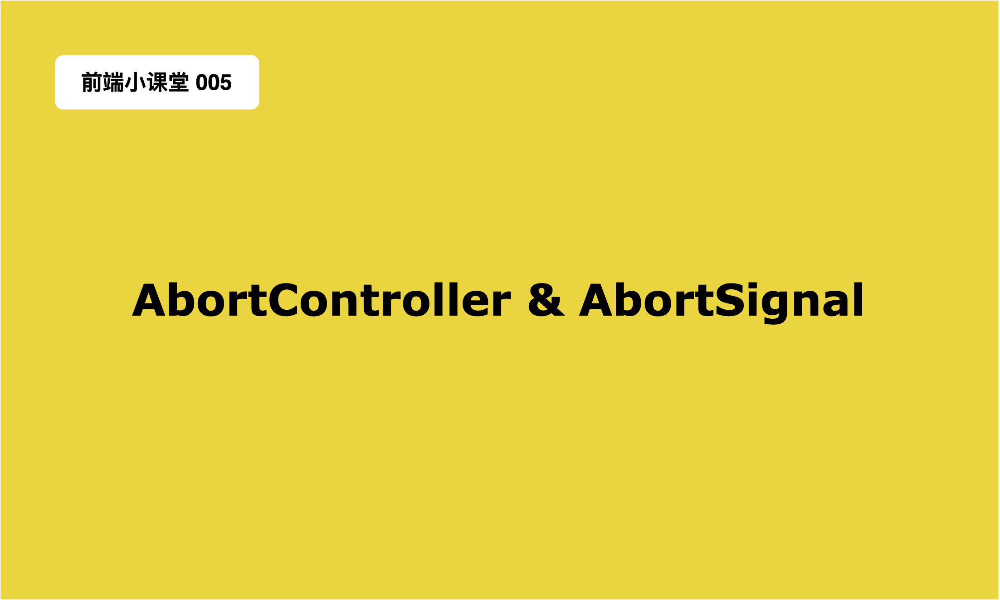

## 如何优雅地中断 Promise？来试试 AbortController 吧！



> 欢迎大家来到 [前端小课堂](https://space.bilibili.com/6542528/channel/seriesdetail?sid=2411314&ctype=0) 的第五期，今天我们来聊一聊如何终止正在进行中的 **Fetch** 以及 **Promise**。文中会跟大家详细介绍这里面的两个关键知识点 **AbortController** 和 **AbortSignal**。对动手实践比较感兴趣的同学还可以看对应的视频版本。


大家在平时的开发过程中估计不会经常碰到需要主动取消一个 **Fetch** 请求的需求，所以一部分同学可能对这一块知识不是很了解。没有关系，看完这篇文章你就能够掌握关于如何终止一个 **Fetch** 请求或者一个 **Promise** 的全部技能了。那我们赶快开始吧~

这篇文章比我预期要花费的时间和精力还要多，所以文章比较长，大家现在没时间浏览的可以先收藏起来，以后慢慢看。如果觉得这篇文章不错的话，也可以帮忙点个赞，转发支持一下。
### 使用 AbortController 终止 Fetch 请求
在 `fetch` 之前，我们请求后端的资源使用的方式是通过 `XMLHttpRequest` 这个构造函数，创建一个 `xhr` 对象，然后通过这个 `xhr` 对象进行请求的发送以及接收。
```javascript
const xhr = new XMLHttpRequest();
xhr.addEventListener('load', function (e) {
  console.log(this.responseText);
});
xhr.open('GET', 'https://jsonplaceholder.typicode.com/todos/1');
xhr.send();

```
这个 `xhr` 上也存在一个 `abort` 方法用来进行请求的终止操作。但是需要注意的是，这个 `abort` 的执行过程是比较模糊的。 我们不清楚 `abort` 在什么时候可以不进行或终止对应的网络请求，又或者如果在调用 `abort` 方法和获取到请求的资源之间存在竞争条件的时候会发生什么。我们可以通过简单的代码来实践一下：
```javascript
// ... 省略掉上面的代码
setTimeout(() => {
  xhr.abort();
}, 10);
```
通过添加一个延时，然后取消掉对应的请求；在控制台可以看到，有时请求已经获取到结果了，但是却没有打印出对应的结果；有时请求没有获取到对应的结果，但是查看对应的网络的状态却是成功的。所以这里面有很多的不确定性，跟我们的感觉是比较模糊的。
等到 `fetch` 出来的时候，大家就在讨论关于如何正确，清楚地取消一个 `fetch` 请求。最早的讨论可以看这里 [Aborting a fetch #27](https://github.com/whatwg/fetch/issues/27) ，那已经是7年前（2015年）的事情了，可以看到当时的讨论还是比较激烈的。大家感兴趣的话可以看看当时大家都主要关注的是哪些特性。

最终，[新的规范](https://dom.spec.whatwg.org/#interface-abortcontroller) 出来了，通过 `AbortController` 和 `AbortSignal` 我们可以方便，快捷，清楚地终止一个 `fetch` 请求。要注意的是，这个规范是一个 **DOM** 层面的规范，不是 **JavaScript** 语言层面的规范。现在绝大多数的浏览器环境和新版本的 **Node.js** 环境也都支持这个特性了。关于 `AbortController` 的兼容性，大家可以参考这里 [AbortController#browser_compatibility](https://developer.mozilla.org/en-US/docs/Web/API/AbortController#browser_compatibility)

下面文章中的代码例子基本上都可以直接复制粘贴到控制台运行的，所以感兴趣的同学阅读到对应的部分可以直接打开浏览器的控制台去运行一下，然后看看对应的结果。加深一下自己对相关知识点的记忆。

#### 终止正在进行中的单个请求

我们先通过一段代码来给大家展示一下如何实现这个功能

```javascript
const ac = new AbortController();
const { signal } = ac;

const resourceUrl = 'https://jsonplaceholder.typicode.com/todos/1';
fetch(resourceUrl, { signal })
  .then(response => response.json())
  .then(json => console.log(json))
  .catch(err => {
    // 不同浏览器的返回结果不同
    console.log(err);
  });

// 可以立即终止请求，或者设置一个定时器
// ac.abort();
setTimeout(() => {
  ac.abort();
}, 10);

```
大家感兴趣的话也可以把上面的代码复制粘贴到浏览器的控制台运行一下，上面代码的运行结果如下所示：

![0][0]
![1][1]

可以看到控制台的 **Console** 的输出是：**DOMException: The user aborted a request.**
对应的 **Network** 展示的是一个取消状态的请求。这说明我们刚才发送的请求被终止取消掉了。
**能够在一些特定的情况下主动地取消相关的请求对我们应用来说是很重要的，这能够减少我们用户的流量使用以及我们应用的内存使用。**

#### AbortController 的深入剖析

接下来我们来讲解一下上面的代码，第一行通过 `AbortController` 创建了一个 `AbortController` 类型的实例 `ac`，这个实例上有一个 `abort` 方法和一个 `AbortSignal` 类型的 `signal` 实例。然后我们通过 `fetch` 方法去请求一个资源路径，传递给 `fetch` 的选项把 `ac` 的 `signal` 对象传递进去。`fetch` 方法如果获取到了资源就会把资源打印到控制台，如果网络发生了问题，就会捕获异常，然后把异常打印到控制台。最后，通过一个 `setTimeout` 延时，调用 `ac` 的 `abort` 方法终止 `fetch` 请求 。

`fetch` 的 `options` 选项允许我们传递一个 `signal` 对象；**`fetch` 的内部会监测这个对象的状态，如果这个对象的状态从未终止的状态变为终止的状态的话，并且 `fetch` 请求还在进行中的话，`fetch` 请求就会立即失败。其对应的 `Promise` 的状态就会变为 `Rejected`**。

如何改变 `signal` 的状态呢？我们可以通过调用 `ac` 的 `abort` 方法去改变 `signal` 的状态。一旦我们调用了 `ac.abort()` 那么与之关联的 `signal` 的状态会立刻从起始状态（非终止状态）转变为终止状态。

我们上面只是简单地使用了 `signal` 对象，这个对象是 `AbortSignal` 类的实例，对于 `AbortSignal` 我们下面会做深入的讲解，这里暂时只需要知道 `signal` 可以作为一个信号对象传递给 `fetch` 方法，可以用来终止 `fetch` 的继续进行。
另外，在不同的浏览器中打印的结果可能略有不同，这个跟不同浏览器的内部实现有关系。比如在 **Firefox** 中的结果如下：

![2][2]
![3][3]

在 **Safari** 中的结果如下：

![4][4]
![5][5]

当然如果我们没有终止 `fetch` 请求的话，控制台的打印将会是：

![6][6]

另外大家如果需要一些模拟的数据接口的话可以试试 [JSONPlaceholder](https://jsonplaceholder.typicode.com/) ，还是很方便使用的。

#### 批量取消多个 fetch 请求

值得注意的是，我们的 `signal` 对象可以同时传递给多个请求，在需要的情况下可以同时取消多个请求；我们来看看如何进行这样的操作。代码如下所示：

```javascript
const ac = new AbortController();
const { signal } = ac;

const resourcePrefix = 'https://jsonplaceholder.typicode.com/todos/';
function todoRequest (id, { signal } = {}) {
  return fetch(`${resourcePrefix}${id}`, { signal })
    .then(response => response.json())
    .then(json => console.log(json))
    .catch(e => console.log(e));
}

todoRequest(1, { signal });
todoRequest(2, { signal });
todoRequest(3, { signal });

// 同时终止多个请求
ac.abort();

```
运行代码后可以在控制台看到如下结果：

![7][7]
![8][8]

如果我们需要同时对多个请求进行终止操作的的话，使用上面这种方式非常简单方便。

如果我们想自定义终止请求的原因的话，可以直接在 `abort` 方法里传递我们想要的原因，这个参数可以是任何 `JavaScript` 类型的值。传递的终止的原因会被 `signal` 接收到，然后放在它的 `reason` 属性中。这个我们下面会讲到。

`AbortController` 的相关属性和方法

![9][9]

### 详细介绍 AbortSignal

#### AbortSignal 的属性和方法

`AbortSignal` 接口继承自 [EventTarget](https://developer.mozilla.org/en-US/docs/Web/API/EventTarget) ，所以 `EventTarget` 对应的属性和方法，`AbortSignal` 都继承下来了。当然还有一些自己特有的方法和属性，我们下面会一一讲解到的。需要注意的是，`AbortSignal` 部分属性有兼容性问题，具体的兼容性大家可以参考这里 [AbortSignal#browser_compatibility](https://developer.mozilla.org/en-US/docs/Web/API/AbortSignal#browser_compatibility) 。

##### 静态方法 abort 和 timeout

这两个方法是 `AbortSignal` 类上的静态方法，用来创造 `AbortSignal` 实例。其中 `abort` 用来创造一个已经被终止的信号对象。我们来看下面的例子：

```javascript
// ... 省略 todoRequest 函数的定义
// Safari 暂时不支持， Firefox 和 Chrome 支持
// abort 可以传递终止的原因
const abortedAS = AbortSignal.abort();
// 再发送之前信号终止，请求不会被发送
todoRequest(1, { signal: abortedAS });
console.warn(abortedAS);

```

运行代码，控制台的输出结果如下：

![10][10]

对应的请求甚至都没有发送出去

![11][11]

我们也可以给 `abort` 方法传递终止的原因，比如是一个对象：

```javascript
// ...
const abortedAS = AbortSignal.abort({
  type: 'USER_ABORT_ACTION',
  msg: '用户终止了操作'
});
// ...
```
那么输出的结果就如下图所示：

![12][12]

`signal` 的 `reason` 属性就变成了我们自定义的值。

同样的，大家看到 `timeout` 应该很容易想到是创造一个多少**毫秒**后会被终止的 `signal` 对象。代码如下：

```javascript
// ... 省略部分代码
const timeoutAS = AbortSignal.timeout(10);
todoRequest(1, { signal: timeoutAS }).then(() => {
  console.warn(timeoutAS);
});
console.log(timeoutAS);

```
代码的运行结果如下：

![13][13]

可以看到我们打印了两次 `timeoutAS`，第一次是立即打印的，第二次是等到请求被终止后打印的。可以看到第一打印的时候，`timeoutAS` 的状态还是没有被终止的状态。当请求被终止后，第二次打印的结果表明 `timeoutAS` 这个时候已经被终止了，并且 `reason` 属性的值表明了这次请求被终止是因为超时的原因。

##### 属性 aborted 和 reason

`AbortSignal` 实例有两个属性；一个是 `aborted` 表示当前信号对象的状态是否是终止的状态，`false` 是起始状态，表示信号没有被终止，`true` 表示信号对象已经被终止了。

`reason` 属性可以是任何的 `JavaScript` 类型的值，如果我们在调用 `abort` 方法的时候没有传递终止信号的原因，那么就会使用默认的原因。默认的原因有两种，一种是通过 `abort` 方法终止信号对象，并且没有传递终止的原因，那么这个时候 `reason` 的默认值就是： `DOMException: signal is aborted without reason`；如果是通过 `timeout` 方法终止信号对象，那么这个时候的默认原因就是：`DOMException: signal timed out`。如果我们主动传递了终止的原因，那么对应的 `reason` 的值就是我们传递进去的值。

##### 实例方法 throwIfAborted

这个方法通过名称大家也能猜出来是什么作用，那就是当调用 `throwIfAborted` 的时候，如果这个时候 `signal` 对象的状态是终止的，那么就会抛出一个异常，异常的值就是对应 `signal` 的 `reason` 值。可以看下面的代码例子：

```javascript
const signal = AbortSignal.abort();
signal.throwIfAborted();

// try {
//   signal.throwIfAborted();
// } catch (e) {
//   console.log(e);
// }

```
运行后在控制台的输出如下：

![14][14]

可以看到直接抛出异常，这个时候我们可以通过 `try ... catch ...` 进行捕获，然后再进行对应的逻辑处理。这个方法也是很有帮助的，我们在后面会讲到。当我们实现一个自定义的可以主动取消的 `Promise` 的时候这个方法就很有用。

##### 事件监听 abort

对于 `signal` 对象来说，它还可以监听 `abort` 事件，然后我们就可以在 `signal` 被终止的时候做一些额外的操作。下面是事件监听的简单例子：

```javascript
const ac = new AbortController();
const { signal } = ac;

// 添加事件监听
signal.addEventListener('abort', function (e) {
  console.log('signal is aborted');
  console.warn(e);
});

setTimeout(() => {
  ac.abort();
}, 100);

```

运行后在控制台的输出如下：

![15][15]

可以看到在 `signal` 被终止的时候，我们之前添加的事件监听函数就开始运行了。其中 `e` 表示的是接收到的事件对象，然后这个事件对象上的 `target` 和 `currentTarget` 表示的就是对应的 `signal` 对象。

#### 实现一个可以主动取消的 Promise

当我们对 `AbortController` 以及 `AbortSignal` 比较熟悉的时候，我们就可以很方便的构造出我们自定义的可以取消的 `Promise` 了。下面就是一个比较简单的版本，大家可以看一下：

```javascript
/**
 * 自定义的可以主动取消的 Promise
 */

function myCoolPromise ({ signal }) {
  return new Promise((resolve, reject) => {
    // 如果刚开始 signal 存在并且是终止的状态可以直接抛出异常
    signal?.throwIfAborted();

    // 异步的操作，这里使用 setTimeout 模拟
    setTimeout(() => {
      Math.random() > 0.5 ? resolve('ok') : reject(new Error('not good'));
    }, 1000);

    // 添加 abort 事件监听，一旦 signal 状态改变就将 Promise 的状态改变为 rejected
    signal?.addEventListener('abort', () => reject(signal?.reason));
  });
}

/**
 * 使用自定义可取消的 Promise
 */

const ac = new AbortController();
const { signal } = ac;

myCoolPromise({ signal }).then((res) => console.log(res), err => console.warn(err));
setTimeout(() => {
  ac.abort();
}, 100); // 可以更改时间看不同的结果

```

这次的代码稍微多了一点，不过相信大家还是很容易就知道上面的代码要表示的是什么意思。

首先我们自定义了 `myCoolPromise` 这个函数，然后函数接收一个非必传的 `signal` 对象；然后立即返回一个新构建的 `Promise`，这个 `Promise` 的内部我们添加了一些额外的处理。首先我们判断了 `signal` 是否存在，如果存在就调用它的 `throwIfAborted` 方法。因为有可能这个时候 `signal` 的状态已经是终止的状态了，需要立即将 `Promise` 的状态变更为 `rejected` 状态。

如果此时 `signal` 的状态还没有改变，那么我们可以给这个 `signal` 添加一个事件监听，一旦 `signal` 的状态改变，我们就需要立即去改变 `Promise` 的状态。

当我们下面的 `setTimeout` 的时间设置为100毫秒的时候，上面的 `Promise` 总是拒绝的状态，所以会看到控制台的打印结果如下：


![16][16]

如果我们把这个时间修改为**2000毫秒**的话，那么控制台输出的结果可能是 **ok** 也可能是一个 **not good** 的异常捕获。

![17][17]
![18][18]

有同学看到这里可能会说，好像不需要 `signal` 也可以实现主动取消的 `Promise`，我可以使用一个普通的 `EventTarget` 结合 `CustomEvent` 也可以实现类似的效果。当然我们也可以这样做，但是一般情况下我们的异步操作是包含网络请求的，如果网络请求使用的是 `fetch` 方法的话，那么就必须使用 `AbortSignal` 类型的实例 `signal` 进行信号的传递；因为 `fetch` 方法内部会根据 `signal` 的状态来判断到底需不需要终止正在进行的请求。

`AbortSignal` 的相关属性和方法：

![19][19]

### 开发中其他场景的使用举例

#### 取消事件监听的一种便捷方法

一般情况下，如果我们对文档中的某个 **DOM** 元素添加了事件监听，**那么当这个元素被销毁或者移除的时候，也需要相应的把对应的事件监听函数移除掉，不然很容易出现内存泄漏的问题**。所以一般情况下我们会按照下面的方式添加并且移除相关的事件监听函数。

```html
<button class="event">事件监听按钮</button>
<button class="cancel">点击后取消事件监听</button>
```

```javascript
const evtBtn = document.querySelector('.event');
const cancelBtn = document.querySelector('.cancel');

const evtHandler = (e) => {
  console.log(e);
};
evtBtn.addEventListener('click', evtHandler);
// 点击 cancelBtn 移除 evtBtn 按钮的 click 事件监听
cancelBtn.addEventListener('click', function () {
  evtBtn.removeEventListener('click', evtHandler);
});

```

这种方式是最通用的方式，但是这种方式需要我们保留对应事件监听函数的引用，比如上面的 `evtHandler`。一旦我们丢失了这个引用，那么后面就没有办法取消这个事件监听了。

另外，有些应用场景需要你给某个元素添加很多事件处理函数，取消的时候就需要一个一个去取消，很不方便。这个时候我们的 `AbortSignal` 就可以派上用场了，我们可以使用 `AbortSignal` 来同时取消很多事件的事件监听函数。就像我们同时取消很多个 `fetch` 请求一样。代码如下：

```javascript
// ... HTML 部分参考上面的内容

const evtBtn = document.querySelector('.event');
const cancelBtn = document.querySelector('.cancel');

const evtHandler = (e) => console.log(e);
const mdHandler = (e) => console.log(e);
const muHandler = (e) => console.log(e);

const ac = new AbortController();
const { signal } = ac;

evtBtn.addEventListener('click', evtHandler, { signal });
evtBtn.addEventListener('mousedown', mdHandler, { signal });
evtBtn.addEventListener('mouseup', muHandler, { signal });

// 点击 cancelBtn 移除 evtBtn 按钮的 click 事件监听
cancelBtn.addEventListener('click', function () {
  ac.abort();
});

```

这样的处理方式是不是就很方便，也非常的清楚明了。

```javascript
addEventListener(type, listener, options);
```

`addEventListener` 的第三个参数可以是一个 `options` 对象，这个对象可以让我们传递一个 `signal` 对象用来作为事件取消的信号对象。就像上面我们使用 `signal` 对象来取消 `fetch` 请求那样。

![20][20]

从上面的兼容性来说，这个属性的兼容性还是可以的；目前只有 **Opera Android** 和 **Node.js** 暂时还不支持，如果想要使用这个新的属性，需要针对这两个平台和运行环境做一下兼容处理就好了。

#### 一种值得借鉴的处理复杂业务逻辑的方法

我们有时开发中会遇到一些比较复杂的处理操作，比如你要先通过好几个接口获取数据，然后组装数据；然后再把这些数据异步地绘制渲染到页面上。如果用户主动取消了这个操作或者因为超时了，我们要主动取消这些操作。对于这种场景，使用 `AbortController` 配合 `AbortSignal` 也有不错的效果，下面举一个简单的例子：

```javascript
// 多个串行或者并行的网络请求
const requestUserData = (signal) => {
  // TODO
};
// 异步的绘制渲染操作 里面包含了 Promise 的处理
const drawAndRenderImg = (signal) => {
  // TODO
};
// 获取服务端数据并且进行数据的绘制和渲染
function fetchServerDataAndDrawImg ({ signal }) {
  signal?.throwIfAborted();
  // 多个网络请求
  requestUserData(signal);
  // 组装数据，开始绘制和渲染
  drawAndRenderImg(signal);
  // ... 一些其他的操作
}

const ac = new AbortController();
const { signal } = ac;

try {
  fetchServerDataAndDrawImg({ signal });
} catch (e) {
  console.warn(e);
}

// 用户主动取消或者超时取消
setTimeout(() => {
  ac.abort();
}, 2000);

```

上面是一个简化的例子，用来表示这种复杂的操作；我们可以看到，如果用户主动取消或者因为超时取消操作；我们上面的代码逻辑可以很方便的处理这种情况。也不会因为少处理了一些操作而导致可能发生的内存泄漏。

一旦我们想重新开始这个操作，我们只需要再次调用 `fetchServerDataAndDrawImg` 并且传递一个新的 `signal` 对象就可以了。这样处理后，重新开始和取消的逻辑就非常清楚了。如果大家在自己的项目中有类似的这种操作，不妨可以试试这种处理方法。

#### 在 Node.js 中的使用

我们不仅可以在浏览器环境中使用 `AbortController` 和 `AbortSignal`，还可以在 `Node.js` 环境中使用这两个功能。对于 `Node.js` 中的 `fs.readFile`，`fs.writeFile`，`http.request`，`https.request` 和 `timers` 以及新版本支持的 `Fetch API` 都可以使用 `signal` 来进行操作的取消。下面我们来举一个简单的例子，关于读取文件的操作：

```javascript
const fs = require('fs');

const ac = new AbortController();
const { signal } = ac;

fs.readFile('data.json', { signal, encoding: 'utf8' }, (err, data) => {
  if (err) {
    console.error(err);
    return;
  }
  console.log(data);
});

ac.abort();

```
运行代码可以看到终端的输出如下：

![21][21]

经常使用 `Node.js` 进行业务开发的同学可以尝试使用这个新的特性，应该对开发会很有帮助的。

### 反馈和建议

这篇文章到这里就算结束啦，不知道有多少同学坚持读完了这篇文章；希望读完的同学都能够掌握好这篇文章中讲解的知识。如果这篇文章帮到了你，或者打开了你的新世界；欢迎点赞转发。

如果你对这篇文章有什么建议和意见，欢迎大家在文章下面留言评论，我们一起讨论一下，一起进步呀。

#### 往期精彩推荐

- [【前端小课堂004 - 如何写一个拖垮你页面性能的正则表达式】](https://www.bilibili.com/video/BV1JY4y1A7CT?share_source=copy_web&vd_source=b871b2f283babd6b02f4a1141a90cb5b)
- [【前端小课堂003 - 少年，不来试试用正则处理数字的千分位吗？】](https://www.bilibili.com/video/BV1sB4y1k7uG?share_source=copy_web&vd_source=b871b2f283babd6b02f4a1141a90cb5b)
- [【前端小课堂002 - JavaScript如何序列化含有循环引用的对象】](https://www.bilibili.com/video/BV1qB4y1W7zX?share_source=copy_web&vd_source=b871b2f283babd6b02f4a1141a90cb5b)
- [【前端小课堂001 - WeakMap一点也不weak】](https://www.bilibili.com/video/BV1N94y1R7bk?share_source=copy_web&vd_source=b871b2f283babd6b02f4a1141a90cb5b)
#### 参考的相关网址

- [MDN - AbortController](https://developer.mozilla.org/en-US/docs/Web/API/AbortController)
- [DOM Living Standard - Interface AbortController](https://dom.spec.whatwg.org/#abortcontroller)
- [How to Cancel Promise with AbortController](https://leanylabs.com/blog/cancel-promise-abortcontroller/)
- [Using AbortController as an Alternative for Removing Event Listeners](https://css-tricks.com/using-abortcontroller-as-an-alternative-for-removing-event-listeners/)
- [The complete guide to AbortController in Node.js](https://blog.logrocket.com/complete-guide-abortcontroller-node-js/)
- [AbortController is your friend](https://whistlr.info/2022/abortcontroller-is-your-friend/)
- [Fetch: Abort](https://javascript.info/fetch-abort)
- [Abortable fetch](https://developer.chrome.com/blog/abortable-fetch/)
- [EventTarget.addEventListener()](https://developer.mozilla.org/en-US/docs/Web/API/EventTarget/addEventListener)
- [MDN - fetch()](https://developer.mozilla.org/en-US/docs/Web/API/fetch)

[0]:images/0.png
[1]:images/1.png
[2]:images/2.png
[3]:images/3.png
[4]:images/4.png
[5]:images/5.png
[6]:images/6.png
[7]:images/7.png
[8]:images/8.png
[9]:images/9.png
[10]:images/10.png
[11]:images/11.png
[12]:images/12.png
[13]:images/13.png
[14]:images/14.png
[15]:images/15.png
[16]:images/16.png
[17]:images/17.png
[18]:images/18.png
[19]:images/19.png
[20]:images/20.png
[21]:images/21.png
