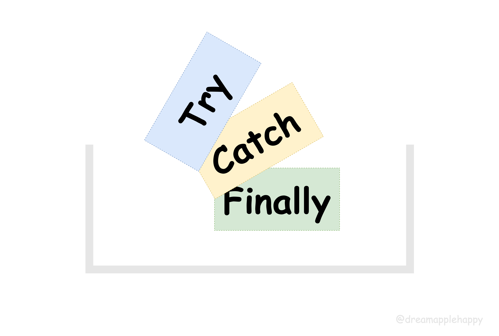

# try/catch/finally：“前端的好厚米，我觉得你们不够了解我呀~”



这篇文章想跟大家一起重新温习一下关于使用 `try...catch` 进行异常捕获的一些知识点。
为了提升大家的阅读兴趣，我们先来做三个小练习题，如果你都做对的话，那么表明你这一部分的知识掌握的很熟练，可以不用读这篇文章啦~
如果做错了某道题的话，说明我们还有一些知识点需要再次巩固一下，话不多说，我们先来看看这三道题：

```javascript
function doTask () {
    try {
        console.log('1 in try block');
        throw '2 test error';
        return 3;
    } catch (e) {
        console.log('4 in catch block');
        console.log(e);
        return 5;
    } finally {
        console.log('6 in finally block');
        return 7;
    }
}
// 控制台输出的结果是什么呢？
console.log(doTask());
```

```javascript
function doWork () {
  try {
    console.log(1);
    try {
      console.log(2);
      throw 3;
    } finally {
      console.log(4);
    }
    console.log(5);
  } catch (e) {
    console.log(e);
  }
}
// 控制台输出的结果是什么呢？
doWork();
```

```javascript
function doRepeat () {
  for (let i = 0; i < 2; i++) {
    try {
      if (i === 1) {
        continue;
      }
      console.log(`${i} in try`);
    } finally {
      console.log(`${i} in finally`);
    }
  }
}
// 控制台的输出结果是什么呢？
doRepeat();
```

上面的每一道题目都有它的小心思，一不小心就容易出错。大家可以把自己测试的结果在评论区晒一晒。
如果你做错了某道题，没有关系，通过这篇文章我们一起再来复习一下相关的知识点。看到就是学到，让我们开始吧。

### try/catch/finally 的各种形式

#### try...catch

这种形式应该是我们在开发中最经常使用的形式了，当我们需要执行一些可能会抛出错误的方法或者语句的时候，就会使用 **`try`** 将
要执行的语句包裹起来，然后紧跟着 **`catch`** 去捕获对应的异常。形式大概如下所示：

```javascript
try {
  // 有概率抛出异常的操作
  someErrorProneFn();
} catch (e) {
  // 打印并且上报接日志
  logAndReportError(e);
}
```

我们也可以判断 **`e`** 的类型，进而根据不同的错误类型进行不同的操作。

还有一点需要注意的是，**`catch`** 也是可以不接收异常信息的。如下所示：

```javascript
try {
    // 有概率抛出异常的操作
    someErrorProneFn();
} catch {
    // 不管上面的操作出现了什么问题，都直接通知用户
    remindUser();
}
```

这种形式大家在平时开发中用的比较多，所以用起来是没有什么大问题的。

#### try...finally

```javascript
try {
  connectChannel();
  doSomething();
} finally {
  // 最后做一些清理的工作
  cleanup();
}
```

第二种形式就是 **`try...finally`**，这种形式估计大家平时用的比较少；这种形式一般用于执行一个操作，
一般情况下这个操作可能是占用内存比较高，或者是操作完需要进行内存回收或者关闭连接或者是关闭数据库之类的。
但是我们可能不是很关注操作过程中出现的异常。 那么我们就可以在操作完成的时候，进行一些尾部的处理工作。

当前 **`try`** 代码块里面的异常还是会抛出到外部的，需要外部进行捕获和处理。
这一点知识点跟上面的第二、第三题有一些关联，我们稍后会详细跟大家讲解一下。


#### try...catch...finally

这种形式是异常捕获最全的一种形式，我们通过 **`try`** 代码块执行容易出错的代码，通过 **`catch`** 代码块捕获异常，
根据异常的类型分别进行不同的处理；通过 **`finally`** 代码块执行最后的操作，一般用来做一些清理的工作。

**`try...catch...finally`** 我们以这种最全的形式作为基础，来讲解几个核心的知识点。

+ **`try`** 代码块的执行是最先执行，只有当 `try` 代码块抛出了异常，才会进入 `catch` 代码块。
+ **`try...finally` 中，如果 `try` 代码块中抛出了异常，那么这个异常会被外层最近的 `catch` 代码块捕获。**
+ **`finally` 代码块总是会执行的，不管 `try` 代码块是否抛出异常，以及 `catch` 代码块是否执行。**
+ **`finally` 代码块的执行时机：如果 `try`/`catch` 代码块中包含流程控制语句（例如：`return`，`break`，`continue`，`throw`），
  那么 `finally` 代码块会在这些流程控制语句之前执行。如果不包含流程控制语句，则在对应的代码块执行完成之后开始执行。** 如果 `finally` 代码块
  包含流程控制语句，那么 `finally` 代码块的流程控制语句就会先执行，进而替换掉原来 `try`/`catch` 中的流程控制语句。这个需要注意。

如果上面的文字描述对你来说还是有一点不是很理解，那么我们可以看下面这个我制作的流程图，希望可以加强你对这一块知识的理解。


上面这些知识点很重要， 如果你知道上面这些知识点的话，那么上面那三道题对你来说是很容易的事情啦。我们来详细讲解一下上面的三道题目

#### 第1道题目

+ 首先运行 `doTask` 函数，进入 `try` block，打印 `1 in try block`；然后执行 `throw '2 test error'`，后面的 `return 3` 不会再执行，
  所以 `try` block 就只打印了 `1 in try block`。
+ 因为 `try` block 抛出了异常，所以会进入 `catch` block，然后打印 `4 in catch block`，接着打印 `e`，也就是 `2 test error`，接着准备
  开始执行 `return 5`，因为 `return 5` 是流程控制语句，所以接下来开始执行后面的 `finally` block。
+ 接着打印 `6 in finally block`，又因为这个 `finally` block 含有流程控制语句，所以会替换掉 `catch` 里面的 `return 5`。
+ 最后打印 `doTask` 函数的返回值：`7`

所以最终的运算输出的结果是：

```
1 in try block
4 in catch block
2 test error
6 in finally block
7
```

#### 第2道题目

+ 运行 `doWork` 函数，进入 `try` block，开始打印：`1`；
+ 进入内部的 `try` block，打印：`2`；开始执行 `throw 3` 之前，首先运行 `finally` block 里面的语句，打印：`4`；
+ 然后开始执行 `throw 3`，后面的 `console.log(5)`执行不到，直接跳过。异常被最近的外层 `catch` 捕获，打印：`3`。

所以最终的运算输出结果是：

```
1
2
4
3
```

#### 第3道题目

+ 运行函数 `doRepeat`，进入第一次循环，`i` 的值为 0；第一次循环 `try`/`finally` block 都执行，所以先打印：`0 in try`，然后打印：`0 in finally`；
+ 第二次循环，`try` block 中遇到了 `continue`，因为 `continue` 是流程控制语句，所以接下来先执行 `finally` block 的语句，打印：`1 in finally`；
  然后执行 `continue`，循环结束。

所以最终的运算输出结果是：

```
0 in try
0 in finally
1 in finally
```

前端的好厚米，关于 `try/catch/finally` 的内容到这里就结束啦，如果你有什么建议和意见欢迎在文章下面评论和留言；如果这篇文章你觉得对你有帮助，那就帮忙点赞转发一下，我们下次再见。

参考链接：
+ [Exception handling statements](https://developer.mozilla.org/en-US/docs/Web/JavaScript/Guide/Control_flow_and_error_handling#exception_handling_statements)
+ [try...catch](https://developer.mozilla.org/en-US/docs/Web/JavaScript/Reference/Statements/try...catch)
